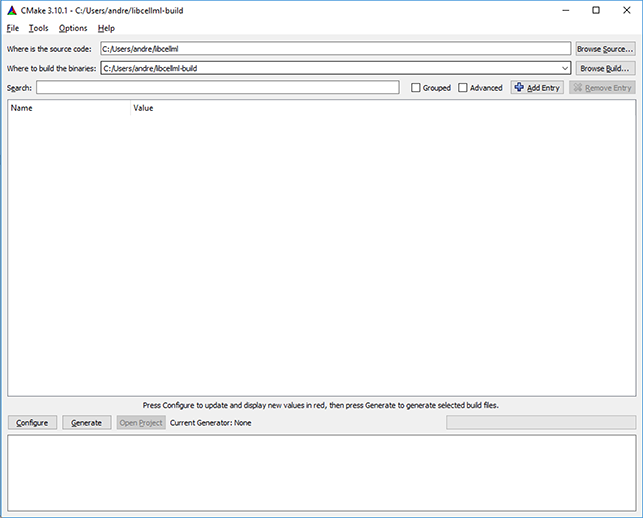
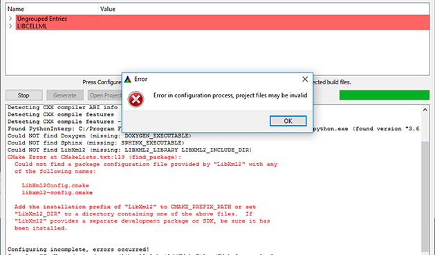
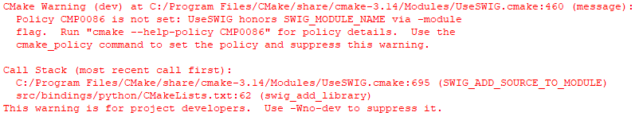
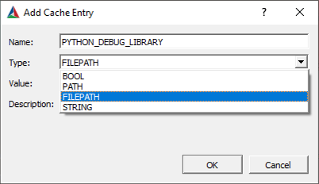

.. _dev_building:

==================================
Configuring and building libCellML
==================================

This document covers building libCellML from source.  

It is assumed that you already have the codebase downloaded and ready for building.  
If not, please see the :ref:`Development Setup <dev_setup>` page for instructions.

The variable :code:`LIBCELLML_SRC` shall be used to refer to the directory containing the :code:`LICENSE` file for libCellML.

.. contents::

It is best to build libCellML outside of the source tree.
To this end, create a build directory that is not the :code:`LIBCELLML_SRC` directory.
A sibling directory of :code:`LIBCELLML_SRC` is a good choice, named something like :code:`build` or :code:`libcellml-build`.
The variable :code:`LIBCELLML_BUILD` is used to refer to this build directory.

Configure with CMake
====================
The first step is to use :cmake:`CMake<>` to configure and generate build files for the libCellML library.  
Linux and MacOS use a command line interface, and under Windows there is an optional GUI.  
Note that CMake version 3.2 or later is required to configure libCellML.  
Instructions and information about installing CMake can be found in the :ref:`Setup <dev_setup_cmake>` section.

Command line Linux, MacOS
-------------------------
CMake can either be run through a simple text-based executable called :code:`ccmake`, or through the command line directly.  
There are instructions for both available from :cmake:`CMake directly</runningcmake/>`.  
Building libCellML requires that you set the configuration parameters as in the table below.

.. include:: dev_configuration_options.rst

The command line options can be set with the :code:`-D` flag, like so :code:`-DBUILD_TYPE Release`.
From the command line (bash shell), libCellML can be configured to create an optimised shared object library like so::

  cd $LIBCELLML_BUILD
  cmake -DBUILD_TYPERelease $LIBCELLML_SRC
  

Windows command line  
--------------------
Note that CMake is also available on Windows as a GUI (instructions below).  
This section describes how to use CMake on Windows directly from the command line.   
Instructions for running CMake through the command line can be found on the :cmake:`CMake site</runningcmake/>` under the heading "Running CMake from the command line". 

For Windows only the location of the libXML2 library must be specified through the command line by adding the parameter::

  -DLibXml2_DIR "C:\Program Files\libxml2 2.9.6\lib\cmake"

to the configuration command.  
This library is built into Linux and MacOS systems, so this step is only needed on Windows.

This assumes that the recommended LibXml2 binaries have been installed to the default location :code:`C:\Program Files\libxml2 2.9.6`.  
Please note that libCellML will only work with a 64-bit installation of libXML2.  
A pre-built 64-bit installer is available from the :opencmiss_repo:`OpenCMISS repository<>` ; 32-bit binaries or 32-bit builds will not work with libCellML.

Windows CMake-GUI
-----------------
The CMake-GUI gives slightly different options - chief among these being that the config variables are prefixed with :code:`LIBCELLML_`.  
Also, in Windows note that neither :code:`MEMCHECK` nor :code:`COVERAGE` testing options are available.

.. include:: dev_configuration_options_gui.rst

As with any CMake session we first set the location of the source files (your :code:`LIBCELLML_SRC` directory) and a location for the generated build files (your :code:`LIBCELLML_BUILD` directory).  
Don’t worry about setting the options at this stage, you can just push *Configure* and CMake will try and find what it needs.  
You can edit anything you need to in the next step.  

.. _fig_devBuilding_windowsCMakeGUISourceBuildDirs:

   CMake-GUI with source and build directories set for user *andre*.
   
After the initial configuration attempt, CMake lists any *changed* values in red.  
This done not mean that there's anything wrong with them!  
If CMake does not find the entries in the table above you will need to enter them manually and push the *Configure* button again. 
To find out what's missing, read the output from the configuration step.  
Some common messages and their required actions are listed below.

.. _fig_devBuilding_windowsCmakeGUIInitialConfigureAttempt:

.. figure:: ./images/libCellMLBuilding-CMakeOptionsInRed.png
   :align: center
   :alt: CMake-GUI with initial values shown in red.
   
   CMake-GUI with initial values shown in red.

The first time you push the *Configure* button you will probably encounter an error like the one shown below.  
   
.. _fig_devBuilding_windowsCMakeConfigurationError:

   CMake-GUI showing configuration error after initial configuration attempt.
   
   
To fix the issue, check that:

- you have installed libXML2 according to the directions on the :ref:`Setup page <dev_setup>`;
- there is a variable called :code:`LibXml2_DIR` listed in your CMake variables (use the *Add entry* button to create it if not);
- that the path specified in the :code:`LibXml2_DIR` variable points to the :code:`cmake` directory inside your libXML2 installation;
- that your installed version is 64-bit.   

.. container:: nb

   If after pushing the *Configure* button your path to the LibXml2 directory is lost, make sure that your LibXml2 is the required 64-bit version.  
   If CMake finds a 32-bit version in the location specified, it just ignores it and continues to return the "unfound" error.  
 
Once you’ve checked and set this path, push *Configure* again. 
The configuration process should run successfully now, but there may be a few extra things you need to check before proceeding to generate the build files.  
These are listed below.

Troubleshooting
===============

Policy CMP0086 is not set
-------------------------
Despite being in red and repeated multiple times, this is a warning which can safely be ignored.  
It's caused by a version mis-match between SWIG and libCellML and will be addressed in the next release.

.. _fig_devBuilding_libcellml_cmp0086:

   CMake-GUI showing CMP0086 error.

On Windows without Python debug libraries
-----------------------------------------
Even if CMake reports that it has found Python at the beginning of its configuration output, it may still report that it has not found the debug library later on.  
To address this you need to manually set the location of the Python library using the :code:`PYTHON_DEBUG_LIBRARY` flag.  
This can be done through the interface by clicking the *Add entry* button, entering :code:`PYTHON_DEBUG_LIBRARY` in the Name field, and selecting :code:`FILEPATH` in the Option field.  
Then simply browse to find the file in your Python installation called something like :code:`python35_d.lib` (for Python3.5), probably in the :code:`libs` directory of your Python folder.

.. _fig_devBuilding_PythonDebugLibrary:

   
   Set the location of the debug library using the :code:`PYTHON_DEBUG_LIBRARY` tag
   

Could not find SWIG (missing: SWIG_DIR, SWIG_EXECUTABLE)
--------------------------------------------------------
SWIG is go-between software used by libCellML to generate bindings for Python and other languages.  
If you have the CMake option :code:`LIBCELLML_BINDINGS_PYTHON` set to :code:`true` then SWIG is required.  
Follow the instructions for :ref:`setting up SWIG <dev_setup_swig>`.
You may need to restart your computer after installation, and then re-launch CMake.

Could NOT find Sphinx (missing: SPHINX_EXECUTABLE)
--------------------------------------------------
`Sphinx <http://www.sphinx-doc.org/en/master/>`_ is a documentation generator used by libCellML to collect documentation on Python bindings, which requires Python 3.5.2 or later in order to run.  
Please see the installation instructions on the `installation page <http://www.sphinx-doc.org/en/master/usage/installation.html>`_ and then restart CMake.  
If you do not need to generate bindings for Python then simply un-tick the CMake option :code:`LIBCELLML_BINDINGS_PYTHON`, and push *Configure* again. 

Build the library
=================

Once the build scripts have been generated by CMake as above, it’s time to build the library.  

Build from the command line Linux, MacOS, or Windows
----------------------------------------------------

For :code:`Makefile`-based configurations, the command is simply::

  make

If testing is enabled, run the tests using the test target::

  make test

or using the `ctest <https://cmake.org/cmake/help/latest/manual/ctest.1.html>`_ application::

  ctest

For a more verbose output, run::

  ctest -V

Build in Windows and Visual Studio
----------------------------------

Once you have used CMake to configure and generate your project files, either push the *Open Project* button to launch the project, or locate and open the solution :code:`*.sln` file inside your build folder. You should see the collection of projects which make up the libCellML library listed.  Just use the build menus as normal to compile, link and build them.  Some issues and their solutions are listed below.  

Fatal error: Cannot open include file Python.h
++++++++++++++++++++++++++++++++++++++++++++++

If you've included Python bindings in your CMake configuration, but get this error in Visual Studio at build time, it's because the path to the Python installation was not set correctly in the CMake step.  Re-running the CMake configuration with a manually-specified path to the Python installation will solve the problem.  See `ERROR: On Windows without Python debug libaries` for instructions.

Cannot access xxx  
+++++++++++++++++

This is probably a permissions error related to the locations of your libraries or your :code:`LIBCELLML_BUILD` directory.  
You could launch Visual Studio as an administrator by right-clicking on its icon in the Start Menu (see below), or create your :code:`LIBCELLML_BUILD` directory somewhere your user has default permission to access.

.. _fig_devBuilding_runAsAdministrator:

.. figure:: ./images/libCellMLBuilding-WindowsRunAsAdmin.png
   :align: center
   :alt: Right-click the VS icon in your start menu and select "Run as administrator"
	
   Right-click the VS icon in your start menu and select "Run as administrator"

The code execution cannot proceed because libcellmld.dll was not found
++++++++++++++++++++++++++++++++++++++++++++++++++++++++++++++++++++++

.. _fig_devBuilding_dllNotFound:

.. figure:: ./images/libCellMLBuilding-dllNotFound.png
   :align: center
   :alt: System error when dll is not found.

   System error when dll is not found.

You need to add location of the file(s) to the environment path of the project.
To do this, right-click the project and open the Properties editor.  
Under the menu Configuration Properties > Debugging > Environment click the Edit button, and add the path to your libcellmldl.dll file.  You should find this file in your build directory in the :code:`\src\Debug` folder.  

- The statement should begin with :code:`PATH` and then contain a list of semicolon-separated directories.
- The statement should end with :code:`%PATH%` in order to include elements included from elsewhere.
- Note that if your path contains spaces you must surround it with double quotation marks, eg:
      :code:`"C:\My path\has\a\space";` compared to :code:`C:\My_path\has\no\spaces;`
- Note that the end of each path item must be a folder name (not a slash) and terminated with a semi-colon.

You may need to repeat this process for the :code:`gtest.dll` and :code:`gtest_main.dll` files as well.  
These are found in your build directory, under :code:`tests\gtest\Debug` or similar.
