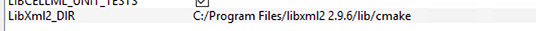

==================================
Configuring and Building libCellML
==================================

This document covers building libCellML from source.
It is assumed that you already have the codebase downloaded and ready for building.  If not, please see the `Development Setup <https://libcellml.readthedocs.io/en/latest/dev_setup.html>`_ page for instructions.

The variable ``LIBCELLML_SRC`` shall be used to refer to the directory containing the ``LICENSE`` file for libCellML.

Information including links to downloads and instructions for each of the packages referred to here is available from the earlier `Setup <https://libcellml.readthedocs.io/en/latest/dev_setup.html>`_ page.  

-------------------
Directory structure
-------------------

It is best to build libCellML outside of the source tree.  To this end, create a build directory that is not the ``LIBCELLML_SRC`` directory.  A sibling directory of ``LIBCELLML_SRC`` is a good choice, named something like ``build`` or ``libcellml-build``. The variable ``LIBCELLML_BUILD`` shall be used to refer to the build directory.

--------------------
Configure with CMake
--------------------

The first step is to use `CMake <https://cmake.org/>`_ to configure and generate build files for the library.  Linux and MacOS use a command line interface, and under Windows there is an optional GUI.  Note that CMake version 3.2 or later is required to configure libCellML.  Instructions and information about installing CMake can be found on the `Setup <https://libcellml.readthedocs.io/en/latest/dev_setup.html>`_ page.

Command Line: Linux, MacOS
++++++++++++++++++++++++++

CMake can either be run through a simple text-based executable called ccmake, or through the command line directly.  There are instructions for both available from `here <https://cmake.org/runningcmake/>`_.  Building libCellML requires that you set the configuration parameters as in the table below.

.. include:: dev_configuration_options.rst

The command line options can be set with the ``-D`` flag, like so ``-DBUILD_TYPE Release``.
From the command line (bash shell), libCellML can be configured to create an optimised shared object library like so::

  cd $LIBCELLML_BUILD
  cmake -DBUILD_TYPERelease $LIBCELLML_SRC
  

Windows Command Line  
++++++++++++++++++++

Note that CMake is also available on Windows as a GUI (instructions below).  This section describes how to use CMake on Windows directly from the command line.  

First, the location of the libXML2 library must be specified through the command line by adding the parameter::

  -DLibXml2_DIR"C:\Program Files\libxml2 2.9.6\lib\cmake"

to the configuration command.

This assumes that the recommended LibXml2 binaries have been installed to the default location ``C:\Program Files\libxml2 2.9.6``.  Please note that libCellML will only work with a 64-bit installation of libXML2.  A pre-built 64-bit installer is available from the `OpenCMISS repository <https://github.com/OpenCMISS-Dependencies/libxml2/releases>`_; 32-bit binaries or 32-bit builds will not work.

Windows CMake-GUI
+++++++++++++++++

In Windows the CMake options are slightly different.  Please note that in CMake GUI Configuration applications, the config variable is prefixed with ``LIBCELLML_``, and in Windows that neither ``MEMCHECK`` nor coverage testing is available.

Config	Default	Description
LIBCELLML_BUILD_TYPE	Release	The type of build Release, Debug etc.
LIBCELMML_BUILD_SHARED	ON	Build shared libraries (so, dylib, DLLs).
LIBCELLML_TREAT_WARNINGS_AS_ERRORS	ON	Treat warnings as errors.
LIBCELLML_INSTALL_PREFIX		Install path prefix.
UNIT_TESTS	ON	Enable tests.
LibXml2_DIR		Path to the ‘cmake’ directory within your installation directory for libXML2.  
Note that the COVERAGE and MEMCHECK options should be set to OFF or simply left out for a Windows build; these options will only run on Linux.

When we use the CMake-GUI application on Windows, we first set the location of the source files and the location for the generated build files.  Don’t worry about setting the options at this stage, you can just push *Configure* and CMake will try and find what it needs.  You can edit anything you need to in the next step.
.. _fig_devBuilding_windowsCMakeGUISourceBuildDirs:

.. figure:: images/libCellMLBuilding-CMakeGUISourceBuildDirs.png
   :align: center
   :alt: CMake-GUI with initial values for source and build directories set.

   CMake-GUI with source and build directories set for user *andre*.
After the initial configuration attempt, CMake lists any changed values in red.  Don’t be alarmed, this is just a chance for you to check that they’re correct before continuing.  If CMake does not find the entries in the table above you will need to enter them manually and push the *Configure* button again.

.. _fig_devBuilding_windowsCmakeGUIInitialConfigureAttempt:

.. figure:: images/libCellMLBuilding-CMakeOptionsInRed.png
   :align: center
   :alt: CMake-GUI with initial values shown in red.

If the *Generate* button is no longer greyed out, click it, then click *Open Project* to launch Visual Studio.  You can now move to the Build section of these instructions, given below.
If the *Generate* button remains grey this means that configuration attempt was not successful, as shown in :numref:`fig_devBuilding_windowsCMakeConfigurationError` for user *andre*.
.. _fig_devBuilding_windowsCMakeConfigurationError:

.. figure:: images/libCellMLBuilding-CMakeWindowsConfigurationError.png
   :align: center
   :alt: CMake-GUI on Windows showing configuration error after initial configuration attempt.

   CMake-GUI showing configuration error after initial configuration attempt.
The most likely reason for this is that libXML2 library was not found or is a 32-bit version.  Double check that:
the path specified in the ``LibXml2_DIR`` variable is correct (you may need to adjust this based on your local installation)
that it points to the cmake directory inside your libXML2 installation, and
that your installed version is 64-bit.   If after pushing the *Configure* button your path to the LibXml2 directory is lost, make sure that your LibXml2 is the required 64-bit version.  If CMake finds a 32-bit version in the location specified, it just ignores it and continues to return the "unfound" error.  Simply download and run the *.exe 64-bit installer from the `OpenCMISS repository <https://github.com/OpenCMISS-Dependencies/libxml2/releases/>`_, and check that your paths and settings above match the location of this installation.   

Once you’ve changed the path, push *Configure* again.  (:numref:`fig_devBuilding_windowsCMakeLibXml2DirSet` shows a successfully configured ``LibXml2_DIR`` variable) from which build files may be generated using the *Generate* button.
.. _fig_devBuilding_windowsCMakeLibXml2DirSet:

Build the library
Once the build scripts have been generated by CMake as above, it’s time to build the library.  
Linux, MacOS, or command line Windows
For ``Makefile``-based configurations, the command is simply::

  make

If testing is enabled, run the tests using the test target::

  make test

or using the `ctest <https://cmake.org/cmake/help/latest/manual/ctest.1.html>`_ application::

  ctest

For a more verbose output, run::

  ctest -V

Windows and Visual Studio

Before building on Windows you may need to download and install `Graphvis <https://graphviz.gitlab.io/_pages/Download/Download_windows.html>`_ and add it to your PATH.  This is used by the documentation creator, Doxygen, to generate graphs of the dependencies between classes. You may also need to restart your computer so that it recognises your Doxygen installation.

Windows CMake-GUI
++++++++++++++++++

Build in Windows and Visual Studio

Once you have used CMake to configure and generate your project files, just push the Open project button to launch the project in your Visual Studio IDE.  This is the equivalent of opening the solution *.sln file inside your build folder.  The libCellML solution is a library of different projects and each of uses slightly different configurations. 

Possible issues

"The code execution cannot proceed because libcellmld.dll was not found.  Reinstalling the program may fix this problem."

.. _fig_devBuilding_libcellml_dll_not_found:

.. figure:: images/libcellml_dll_not_found.png
   :align: center
   :alt: System error when dll is not found.

Solution:  You need to add location of the file(s) to the environment path of the project.  To do this, right-click the project and open the Properties editor.  Under the menu Configuration Properties > Debugging > Environment click the Edit button, and add the path to your libcellmldl.dll file.  You should find this file in your build directory in the  `\\src\\Debug` folder.  

- The statement should begin with "PATH" and then contain a list of semicolon-separated directories.
- The statement should end with "%PATH%" in order to include elements included from elsewhere.
- Note that if your path contains spaces you must surround it with double quotation marks.
- Note that the end of each path item must be a folder name (not a slash) and terminated with a semi-colon.

You may need to repeat this process for the gtest.dll and gtest_main.dll files as well.  These are found in your build directory, under "tests\\gtest\\Debug" or similar.

      

