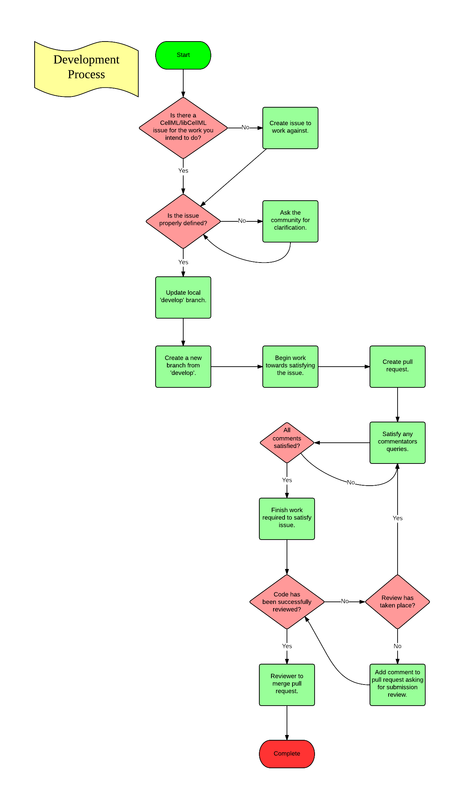
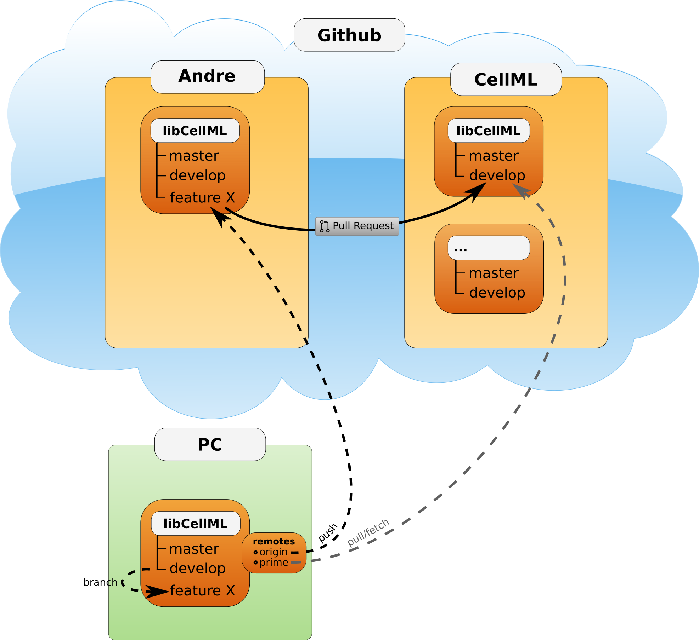

.. _dev_contribution:

=========================
Contributing to libCellML
=========================

This document covers the process to follow for getting your changes into the :term:`prime repository`.
While there are many types of contribution, this section is focussed on contributions made through :github:`GitHub<>` and :git:`Git<>` to assets that are managed using the version control system.
It is assumed that :ref:`Setup <dev_setup>` and :ref:`Building <dev_building>` have already been read and followed.

Overview
========

For any body of work intended for contribution to the :term:`prime repository`, first start with a Github issue.
The issue can be used to discuss the topic and clarify any problems related to it.
Once progress has been made towards addressing the issue, a pull request is created that references the issue.

Reviewers provide feedback on the changes by adding comments to the pull request or associated commits.
The :buildbot:`Buildbot<>` :code:`build/test` procedure will run each time changes are pushed to the pull request's branch, and the results are displayed in the pull request view.

Once all the changes and reviews are complete, one of the :term:`prime repository` owners will merge the pull request into the prime repository, onto the :code:`develop` branch.

Note that a bug is just a type of issue, and that resolving the bug should have both the implementation to fix the bug and a test that triggers the bug.

:numref:`Figure %s <libcellml-development-process>` gives a graphical overview of the developer contribution process.
For more details, see the text below.

.. _libcellml-development-process:

   Developer contribution process.

GitHub issues
=============

If an issue does not exist for the required work (e.g. implementation of a feature, fixing of a bug), then create a new one.
The issue is the place to discuss the particulars related to the issue, discussions on determining the scope of the issue or clarification of any points that are unclear.

To create a new issue, go to the :libcellml_repo:`libCellML repository` GitHub page, and select the :code:`Issues` tab.
Use the green button on the right hand side to create a new issue.  
You will need to add a description of what you've encountered, as well as any small snippets of code that help describe it.

Labels
------
A Github issue may be assigned labels by the project administrators to help identify its status at a glance.
General labels currently used for libCellML are: **TODO These are not current?**

* **Bug**: the issue identifies a malfunction in the current codebase.
* **Feature**: the issue constitutes a request or plan for a new feature.
* **Needs tests**: the issue requires test(s) to be complete.
  This may refer to a bug report, contributed code, comments, etc. in the issue.
* **Needs documentation**: the issue requires documentation to be complete.
  This may refer to a bug report, contributed code, comments, etc. in the issue.
* **Needs reviewing**: the issue requires further review from project participants to be complete.
  This may refer to a bug report, contributed code, comments, etc. in the issue.

In addition, a **Platform** label may be used to identify the issue as specific to a given platform.
**Milestone** labels may be used to project when a feature is expected to be complete and/or indicate the priority of a given issue.
Higher priority issues will take precedence and therefore be assigned a more immediate (lower) milestone number.

Topic branches
==============

A topic or feature branch is a branch that is local to you (and anyone you collaborate with), it is a branch that will not be available from the :term:`prime repository`.
All development work should be carried out on a topic branch, for example any major feature that you work on or minor bug fix.
Before creating a local topic branch, pull the latest changes from the :term:`prime repository` :code:`develop` branch, to make sure that you're working from the most up-to-date version of the code.

.. _libcellml-branching:

   Git branching illustration.

Following this process will make it easier to have multiple topic branches at once and keep them in-sync with the :term:`prime repository` :code:`develop` branch, which will in turn make it easier to manage multiple pull requests.

The following Git commands show an example of how to create a topic branch for fixing a (hypothetical) bug described in `issue #123`::

  git fetch prime develop
  git checkout develop # Not required if already on develop branch
  git merge prime/develop
  git checkout -b issue123

Test-driven development
=======================
Test-driven development entails writing a test (or suite of tests) that covers the intended functionality, and no more.
The tests will require some skeleton implementation so that they can compile, but in the first instance they probably won't pass.
Writing the test(s) first shows the other developers the new behaviour that you intend to implement.
By making a pull request containing only these tests, other developers can then comment and discuss until everyone is happy with the new behaviour.
Following this contribution process allows for corrections before time is spent on the functional code.

It may be necessary to refactor the current design to enable the easiest possible way to add the new feature.
This is a good thing as the quality of the design improves and this makes it easier to work with in the future.
Refactoring means improving the code without adding features, and the tests provide validation that the refactored code performs as well as before.

For simple or obvious bugs, which have fallen through the testing gaps, just the implementation is fine.
**TODO** KRM I don't understand this sentence?

GitHub pull requests
====================
Once some changes have been made and local commits committed, push your changes to your Github libCellML repository (refer to :numref:`Figure %s <libcellml-branching>`).
From there, create a pull request from your topic branch to the :term:`prime repository` :code:`develop` branch.
When creating the pull request, make sure to add in the comment :code:`Addresses issue #123` (of course, replace the number 123 with the actual number of the issue you are addressing), or something to that effect.
This will create a link between the issue and the pull request enabling other people to see that you are working on this issue and comment on your work.

The following Git commands show an example of how to add all files, commit the changes, and push them to a Github repository for the first time::

  git add .
  git commit -m "Descriptive message about the changes made."
  git push -u origin issue123

The :code:`git add` and :code:`git commit` commands should be obvious, the :code:`git push` command sets the local branch :code:`issue123` to be linked with the remote branch :code:`issue123` in the origin (the default shorthand for your libCellML repository on Github) repository.
This branch will be created in the origin repository if it does not already exist.

To create a pull request from one Github repository to another, follow the instructions for :github_help:`creating Github pull requests</articles/creating-a-pull-request/>`.

Reviewing
=========
It may happen that submitted work is not reviewed immediately or the work is finished before any comments have been made.
If this is the case add a comment to the pull request asking for the submission to be reviewed.
An email will be sent out to the repository owners who will respond and review the submission, please remember that everyone is busy and it may not happen right away.

Satisfying the feedback
=======================
It is important to respond to all feedback appropriately, the review process will check to make sure that all comments have been dealt with.
Feel free to respond to comments as appropriate, e.g. through code changes, posting a direct reply, etc.
Where you need to change code in response to a comment, be sure to include the commit code (a 7 digit hex number) in your reply, so that others can see where and how the changes were made. 

Completing
==========
To complete the process, it is required to have two owners of the :term:`prime repository` comment on the pull request that they are satisfied that the work on the issue is complete and also that the feedback has been addressed, in essence that they are happy to merge the submission.
For small submissions, it is sufficient for the second owner to show satisfaction by performing the merge.
For larger submissions one of the owners will post a comment on the issue notifying subscribers that they intend to merge the pull request.
If no further objections are raised, the pull request will be merged and closed.

A little reminder for the repository owners to check that the :ref:`Review Process <dev_review>` has been followed before merging the pull request.
