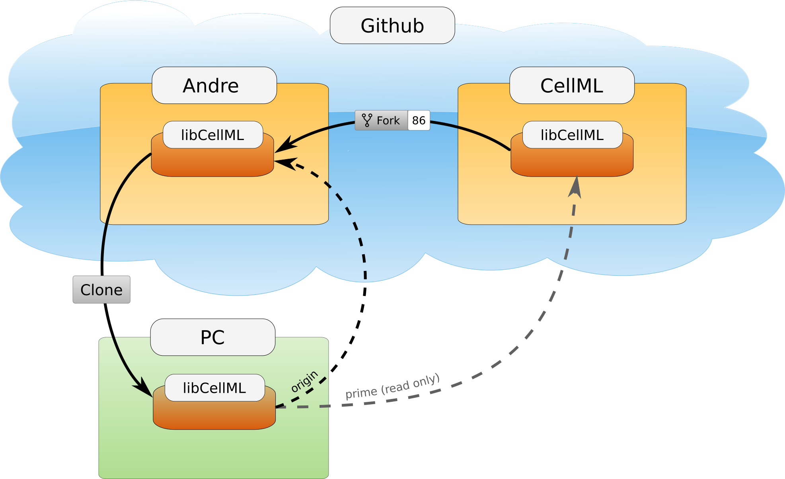
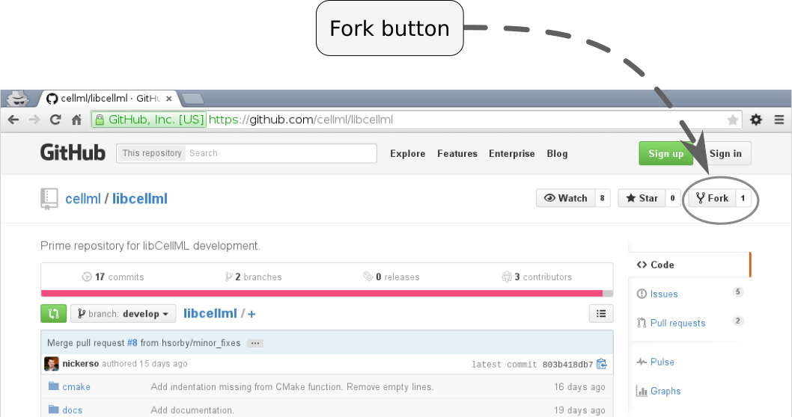

.. Developer Setup for libCellML

=================
Development Setup
=================

This section describes how someone wanting to contribute to the libCellML project should set up their *working copy* for developing libCellML.

.. contents::

Overview
========

The libCellML codebase is hosted on GitHub and therefore Git is used to track changes in the codebase.  Before you begin you will need to have a few prerequisites satisfied:

#. GitHub user account (for the rest of this document we will call our user *andre*)
#. Git installed

This document doesn't cover the process of satisfying these prerequisites, it is left as an exercise for you (Google is your friend).  The remainder of this document assumes that these prerequisites have been met.  This document covers setup from the command line if you are using a GUI like 'GitHub for Windows' then you will need to adjust the commands for the GUI you are using.

The goal here is to get a working copy of source code, tests, and documentation onto your PC so that you can begin development.  To make this happen you will need to fork the :term:`prime libCellML repository`, make a clone onto your PC, and set up the Git remotes.  In :numref:`fig_devSetup_githubRepos` you can see a pictorial representation of what we are aiming to achieve.

.. _fig_devSetup_githubRepos:

   Setup of repositories for development

The four steps to getting set up are detailed below.

Forking your own copy
=====================

Login to GitHub using your credentials and go to::

   https://github.com/cellml/libcellml

Use the fork button to create a libcellml repository under your own account, see :numref:`fig_devSetup_githubFork` for locating this button.

.. _fig_devSetup_githubFork:

   Fork button for libCellML repository

Clone
=====

You now need to clone the libCellML repository to your PC.  You do this by going to your fork (in this example user *andre*'s fork) at::

   https://github.com/andre/libcellml

.. warning::

   Don't try and clone this location substitute your GitHub username for *andre*.  In all likelihood it doesn't exist.

On the right hand side of the webpage on your fork of the repository you can get the link for cloning the repository to your PC, in our example::

        git@github.com:andre/libcellml.git

Now clone the repository::

        cd <somewhere/you/keep/development/code>
        git clone git@github.com:andre/libcellml.git

Note: Again, don't clone this location substitute your username for *andre*.

Set Git remotes
===============

You now need to setup a read-only remote connection to the prime repository.  Given that you are still in the directory where you cloned the libCellML repository from do the following::

   cd libcellml
   git remote add prime git@github.com:cellml/libcellml.git
   git config remote.prime.pushurl "you really didn't want to do that"

You have now added a new remote named **prime** and set origin as the default fetch and push location to point at repositories under your control on GitHub.  Here **prime** is a reference to the main definitive repository where releases are made from for the libCellML project.  You have also set the **prime** repository as read-only by setting an invalid push url.

Finally
=======

You are all done and ready to start development, read :doc:`Building <dev_building>` on how to build libCellML then read :doc:`Contribution <dev_contribution>` to get your changes into libCellML's prime repository.

