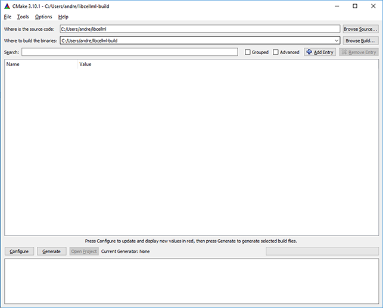
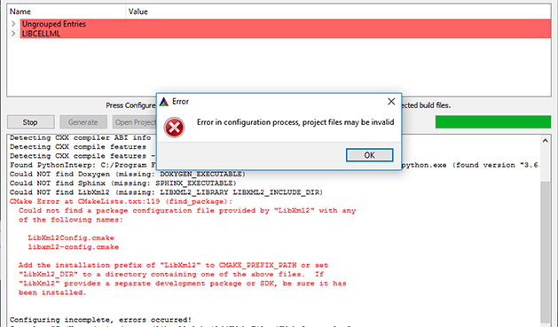
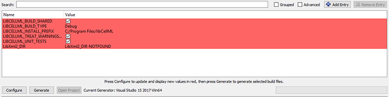
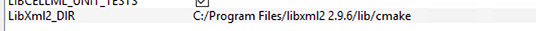

.. _dev_building:

==================
Building libCellML
==================

This document covers the process of building libCellML from source once
the steps for development setup outlined in the :ref:`Development setup`
page have been completed.

The variable ``LIBCELLML_SRC`` refers to the directory containing the
``LICENSE`` file for libCellML.

Creating a build directory
==========================
It is best to build libCellML outside of the source tree.  To this end, create
a build directory that is not the ``LIBCELLML_SRC`` directory.  A sibling
directory of ``LIBCELLML_SRC`` is a good choice, named something like ``build``
or ``libcellml-build``.  We'll use the term ``LIBCELLML_BUILD`` to refer to
this build directory.

Configuration using CMake
=========================
The libCellML library uses the :cmake:`Cmake <>` build configuration tool for
its configuration, with a minimum version of 3.2.  If you don't have CMake
installed yet, please follow the
:ref:`installation instructions for CMake<cmake_installation>`.

The configuration options for the library are detailed in the following table.

The command line options can be set with the ``-D`` flag, like so
``-DBUILD_TYPE=Release``.  Please note that in :cmake:`Cmake <>` GUI
Configuration applications, the config variable is prefixed with
``LIBCELLML_``.

.. include:: dev_configuration_options.rst

.. Select a generator that is appropriate for your system, or let the CMake
   configuration application locate it for you

From the command line (bash shell), libCellML can be configured to create an
optimised shared object library like so::

  cd $LIBCELLML_BUILD
  cmake -DBUILD_TYPE=Release $LIBCELLML_SRC

Windows
-------

When configuring libCellML on Windows, you may need to set the location of the
:libxml2:`LibXML2 <>` library, which is dependent on the computer's environment
settings. This can be done during the configuration process by specifying the
location using the parameter::

  -DLibXml2_DIR="C:\Program Files\libxml2 2.9.6\lib\cmake"

added to the configuration command.

This assumes that the recommended binaries have been installed to the default
location ``C:\Program Files\libxml2 2.9.6``.  Please note that this method will
only work with the recommended LibXML2 binaries downloaded from the
requirements repository.  Please see the
:ref:`libXML2 installation notes<libxml2_installation>` for details.

Windows CMake-GUI
+++++++++++++++++

When we use the CMake-GUI application on Windows, we first set the location
of the source files and the location for the generated build files.
:numref:`fig_devBuilding_windowsCMakeGUISourceBuildDirs` shows the source files
directory and the build directory set for user *andre*.

.. _fig_devBuilding_windowsCMakeGUISourceBuildDirs:

   CMake-GUI with source and build directores set for user *andre*.

When we press the *Configure* button, CMake performs an initial configuration.
This initial configuration is likely to encounter an error because CMake is not
able to find libXML2.  We can see in
:numref:`fig_devBuilding_windowsCMakeConfigurationError` that this has happened
for user *andre*.

.. _fig_devBuilding_windowsCMakeConfigurationError:

   CMake-GUI showing configuration error after initial configuration attempt.

We can resolve this error easily if we set the value of the ``LibXml2_DIR``
variable to the location of the :libxml2:`LibXML2 <>` ``cmake`` directory.
:numref:`fig_devBuilding_windowsCMakeLibXml2DIRNotFound` shows the
``LibXml2_DIR`` variable with the value of ``LibXml2_DIR-NOTFOUND``.

.. _fig_devBuilding_windowsCMakeLibXml2DIRNotFound:

   ``LibXml2_DIR`` variable with a value of ``LibXml2_DIR-NOTFOUND``.

Setting the value of ``LibXml2_DIR`` to
``C:\Program Files\libxml2 2.9.6\lib\cmake`` and configuring again will
result in a successful configuration
(:numref:`fig_devBuilding_windowsCMakeLibXml2DirSet` shows a successfully
configured ``LibXml2_DIR`` variable) from which build files may be generated
using the *Generate* button.

.. _fig_devBuilding_windowsCMakeLibXml2DirSet:

   ``LibXml2_DIR`` variable with a value of ``C:\Program Files\libxml2 2.9.6\lib\cmake``.

If :libxml2:`LibXML2 <>` was not installed to
``C:\Program Files\libxml2 2.9.6`` then you will need to adjust the path to
match your situation.

Build
=====

Building the library
--------------------
Once the build scripts have been generated by CMake, invoke the build with the
appropriate command:

For ``Makefile``-based configurations, the command is simply::

  make

This build process is likely to be quite time-consuming, so you can investigate
your local options for using multiple cores to build by typing
:code:`make --help` and selecting the flag option which allows more than one
job to be submitted at once.

Testing the library
-------------------
If testing is enabled, run the tests using the test target::

  make test

or using the `ctest <https://cmake.org/cmake/help/latest/manual/ctest.1.html>`_ application::

  ctest

For a more verbose output, run::

  ctest -V

Testing the code format
-----------------------
If Clang format testing is enabled, run the test using::

  make test_clang_format

Building the documentation
--------------------------
To build your local documentation, use the command::

  make docs

This will populate a folder with the HTML files that you can access through
the "docs" folder in your build directory.

