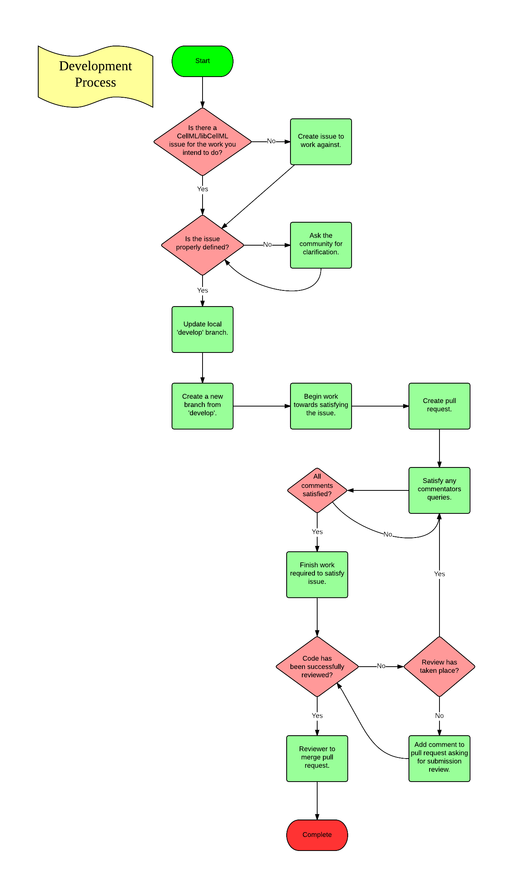
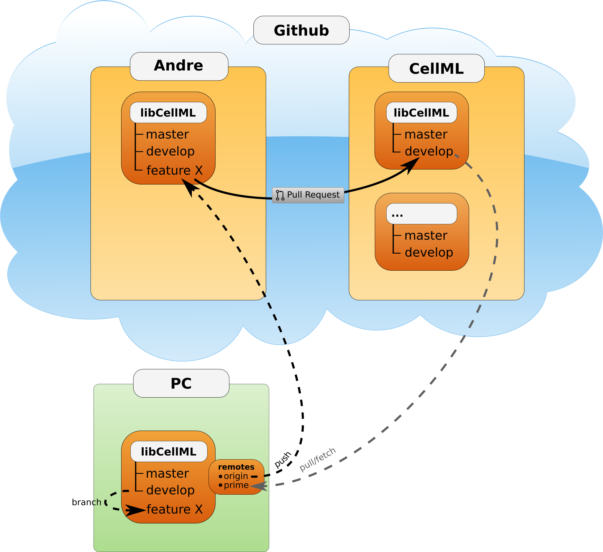

.. Contribution documentation for libCellML

.. _dev_contribution:

============
Contributing
============

This document covers the process to follow for getting your changes into the
:libcellml_repo:`libCellML prime repository <>`.  While there are many types of
contribution, this section focuses on contributions made through
:github:`Github <>` and :git:`Git <>`, or in other words assets that are
managed using the version control system.
It is assumed that :doc:`Setup <dev_setup>` and :doc:`Building <dev_building>`
have already been read and followed.

.. contents::

Overview
========

* For any body of work intended for the prime repository, first start by
  creating a :github:`Github <>` issue.  The issue can be used to discuss
  the topic and clarify any problems related to it.

* Once progress has been made towards addressing the issue, create a pull
  request which includes a reference to it.

* The `Buildbot <https://buildbot.net/>`_ `build/test` procedure will run
  each time changes are pushed to the pull request's branch, and the results
  are displayed in the pull request view.

* Reviewers can provide feedback on the changes by adding comments to the pull
  request or its associated commits.

* Once all the changes and reviews are complete, one of the prime libCellML
  administrators will merge the pull request into the prime repository, onto
  the `develop` branch.

* Note that a bug is just a type of issue, and that resolving the bug should
  have both the implementation to fix the bug and a test that triggers the bug.

:numref:`Figure %s <libcellml-development-process>` gives a graphical overview
of the developer contribution process, and more details on each step are given
below.

.. _libcellml-development-process:

   Developer contribution process.

GitHub Issue
============
If an issue does not exist for the required work (for example, the
implementation of a feature, or fixing of a bug), then create a new
one.  The issue is the place to discuss the particulars related to
the issue, to determine its scope, and clarify any points that are
unclear.

Labels
------
An issue may be assigned labels by the project
administrators to help identify its status at a glance.
General labels currently used for libCellML are:

* **Bug**: the issue identifies a malfunction in the current codebase.
* **Feature**: the issue constitutes a request or plan for a new feature.
* **Needs tests**: the issue requires test(s) to be complete.
  This may refer to a bug report, contributed code, comments, etc. in the
  issue.
* **Needs documentation**: the issue requires documentation to be complete.
  This may refer to a bug report, contributed code, comments, etc. in the
  issue.
* **Needs reviewing**: the issue requires further review from project
  participants to be complete.  This may refer to a bug report, contributed
  code, comments, etc. in the issue.
* **Platform**: used to identify the issue as specific to a given platform
  (Windows/Linux/MacOS)
* **Milestone**: used to project when a feature is expected to be complete
  and/or indicate the priority of a given issue.  Higher priority issues will
  take precedence and therefore be assigned a more immediate (lower) milestone
  number.

Topic Branch
============
A topic or feature branch is a branch that is local to you (and anyone with
whom you collaborate).  It is a branch that will not be available from the
prime repository.  All development work should be carried out on a topic
branch, for example any major feature that you work on or minor bug fix.
Before creating a local topic branch, pull the latest changes from the
prime repository `develop` branch.

.. _libcellml-branching:

   Git branching illustration.

Following this process will make it easier to have multiple topic branches
at once and keep them in-sync with the prime repository `develop` branch,
which will in turn make it easier to manage multiple pull requests.

The following :git:`Git <>` commands show an example of how to create a
topic branch for fixing a (hypothetical) bug described in `issue #123`::

  git fetch prime develop
  git checkout develop # Not required if already on develop branch
  git merge prime/develop
  git checkout -b issue123

Test-driven development
=======================
*Test-driven development* entails writing a test that covers the intended
functionality (this may require a suite of tests to be written) and no more.
The tests will require some skeleton implementation so that they can
compile but by definition they won't pass; their failure is what highlights
the issue. The purpose of this is two-fold:

1. Write the test(s) first, set out the intended design that can be shared
   through a pull request; and
#. Implement the skeleton that will include the documentation clearly
   describing the intended purpose.

Following this contribution process allows others to comment and make
any corrections before you need to spend time on the functional code.

*Refactoring* means improving the code without adding features.  In this
situation the tests provide validation that the refactored code performs
as well as it did before.
It may be necessary to refactor the current design to enable new features
to be added in the easiest possible way. This is a good thing as the quality
of the design improves, making it easier to work with in the future.

For simple or obvious bugs, which have fallen through the testing gaps, just
the implementation is fine.
**TODO** I don't understand this?^^

Making a pull request
=====================
* Once some changes have been made committed locally, push your changes to
  **your** Github libCellML repository (refer to
  :numref:`Figure %s <libcellml-branching>`).
* From there, create a pull request from your topic branch to the prime
  repository `develop` branch.  When creating the pull request, make sure to
  add in the comment `Addresses issue #123` (of course, replace the number 123
  with the actual number of the issue you are addressing), or something to that
  effect. This will create a link between the issue and the pull request
  enabling other people to see that you are working on this issue and comment
  on your work.

The following git commands show an example of how to:

* add all files,
* commit the changes, and
* push them to a Github repository for the first time::

    git add .
    git commit -m "Descriptive message about the changes made."
    git push -u origin issue123

The ``git add`` and ``git commit`` commands should be obvious, the ``git push`` command sets the local branch ``issue123`` to be linked with the remote branch ``issue123`` in the origin (the default shorthand for your libCellML repository on :github:`Github <>`) repository.
This branch will be created in the origin repository if it does not already exist.

To create a pull request from one :github:`Github <>` repository to another, follow the instructions `here <https://help.github.com/articles/creating-a-pull-request/>`_.

Satisfy Comments
================

It is important to respond to all feedback appropriately, the review process will check to make sure that all comments have been dealt with.
Feel free to respond to comments as appropriate, e.g. through code changes, posting a direct reply, etc.

Review
======

It may happen that submitted work is not reviewed immediately or the work is finished before any comments have been made.
If this is the case add a comment to the pull request asking for the submission to be reviewed.
An email will be sent out to the repository owners who will respond and review the submission, please remember that everyone is busy and it may not happen right away.

Completion
==========

To complete the process, it is required to have two owners of the prime repository comment on the pull request that they are satisfied that the work on the issue is complete and also that the feedback has been addressed, in essence that they are "happy" to merge the submission.
For small submissions, it is sufficient for the second owner to show satisfaction by performing the merge.
For larger submissions one of the owners will post a comment on the issue notifying subscribers that they intend to merge the pull request.
If no further objections are raised, the pull request will be merged and closed.

A little reminder for the repository owners to check that the :doc:`Review Process <dev_review>` has been followed/(is going to be followed) when merging the pull request.
