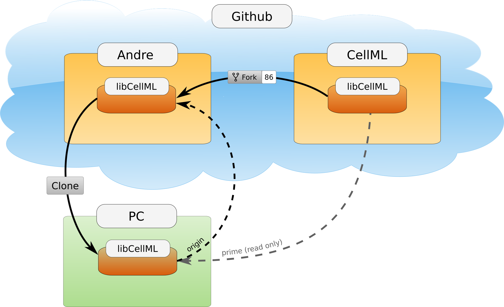
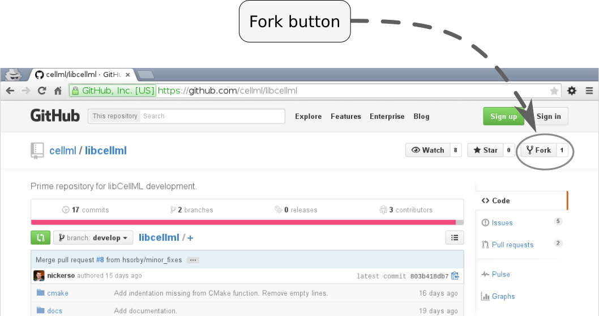

.. Developer Setup for libCellML

.. _dev_setup:

=================
Development setup
=================

This section describes how someone wanting to contribute to the libCellML project should set up their *working copy* for developing libCellML.

.. contents::

Prerequisites needed
====================
This section will walk you through the setup of the following requirements:

1. A :github:`Github <>` user account (for the rest of this document we will call our user *andre*).
#. :git:`Git <>` installed on your local machine.
#. :cmake:`Cmake <>`.
#. A toolchain for building software (dependent on the operating system).
#. :libxml2:`LibXML2 <>`.
#. If you intend to build bindings for Python, then you'll also need :python:`Python <>` as well as :swig:`SWIG <>`.

Some optional tools can also be used to speed up compilation:

7. :ninja:`Ninja<>` (an alternative to :code:`make`).
#. A compilation cache such as :clcache:`clcache <>` (on Windows) or :ccache:`ccache <>` (on Linux and MacOS).

Git: Version control
--------------------
Creating a :github:`Github <>` user account is straightforward.
Please follow the link to create an account for yourself if you do not already have one.
Github is the remote storage linked to a Git client on your own local computer.
There are several different programs which could be used depending on your operating system.
Installing a :git:`Git <>` client is particular to each operating system and some pointers are offered below:

* Git for Windows is available from a variety of vendors.
  We commonly use :git_windows:`Git for Windows <>`, but other popular implementations are:

  - :github_desktop:`GitHub Desktop <>`,
  - :git_kracken:`GitKracken <>`,
  - :git_scm:`Git SCM <>`.

* Git for Ubuntu (and other Linux distributions) can be installed using the package manager with the command:code:`sudo apt-get install git`.
* Git for MacOS is pre-installed and available from the command line.

.. _cmake_installation:

CMake: Custom makefiles and setup
---------------------------------
:cmake:`CMake <>` is the cross-platform family of tools designed to build, test and package software.
It's used to control the software compilation process using simple platform and compiler independent configuration files, and to generate native makefiles and workspaces that can be used in the compiler environment of your choice.

Again, installation of CMake is particular to each operating system.

* CMake for Linux can be installed using the package manager with the command :code:`sudo apt-get install cmake`.
* CMake for Windows and MacOS can be installed using binaries provided on their website. 
  Please visit the :cmake:`CMake download page <download/>`, choose the binary appropriate for your operating system and follow the installation instructions.

.. note::

    Please note that a minimum version of 3.2 is required.

Toolchain: The compiler you'll use to build libCellML
-----------------------------------------------------
The toolchain specifies the compiler that you will use to build libCellML.
Toolchains are highly dependent on the operating system.  
libCellML has been tested on:

* Windows using :visualstudio:`Visual Studio <>`.
  We currently test with Visual Studio 2015 (version 14), but later versions are known to work. 
  The *Community* edition is more than sufficient for the needs of libCellML, and to minimise the size of the installation, you need install only the C++ compiler.
  This component and its requirements are sufficient for building libCellML.
* Ubuntu Linux using :gcc:`GCC <>` **TODO** need version info here?
* MacOS using :clang:`Clang <>` **TODO** need version info here?

We recommend using these compilers on these systems, but feel free to use a different toolchain.
We sometimes use the :intel_c_compiler:`Intel C++ compiler <>` to build libCellML, but at the time of writing we do not test with it.

.. _libxml2_installation:

Libxml2
-------
:libxml2:`LibXML2 <>` is a library used for parsing :xml_help:`XML <>` files, of which the CellML file format is a subset.

* On MacOS libXML2 is already installed, so no further action is required.
* For Windows use the recommended implementation available from :libxml2_download:`the dependency repository <>`. 
* For Ubuntu Linux use :code:`sudo apt install libxml2-dev`.

Python bindings
---------------
Optional Python bindings are provided using :swig:`SWIG <>`.
If you are not intending to build Python bindings then you can safely skip this section.  
Creation of Python bindings can be enabled/disabled at configuration time.

To compile the bindings, a SWIG installation is required, as well as a Python 3 installation (including the development packages on Linux systems, for example:code:`python-dev`).

* For Windows, installation packages are available from the :python:`Python download page <downloads/windows/>` and from the :swig:`SWIG download page <download.html>`.
* Linux distributions often include SWIG already so no further action is needed, but read the page for MacOS below in case it's missing.
* For MacOS please follow the instructions on the :swig:`SWIG installation instructions page <Doc4.0/Preface.html#Preface_installation>`.

Optional tools
==============

Ninja
-----
:ninja:`Ninja <>` is a replacement for `make`.

* For Windows, download the package manager from :ninja_download:`the Ninja download site <>` and follow the instructions.
* For Linux, it can be installed using the package manager with the command :code:`sudo apt install ninja-build`.
* For MacOS, it can be installed using :homebrew:`Homebrew <>` with the command :code:`brew install ninja`.

clcache / ccache
----------------
Compiler caches may be used to shorten compilation times.
The first time they are used, compilation will be slower than normal, but subsequent compilations will be significantly faster.

* For Windows users of Microsoft Visual Studio, :clcache:`clcache <>` can be downloaded and installed from :clcache:`the clcache download page <releases/>`.

  .. container: gotcha 
    
    Note that it will only work with paths that do *not* contain spaces.
    You will need to check your installation of :libxml2:`LibXML2 <>` and perhaps move it if it is located in a path containing spaces.
    If you do move it, remember to update your :code:`PATH` accordingly. 

* For Linux users, :ccache:`ccache <>` can be installed using the package manager with the command :code:`sudo apt install ccache`.
  Alternatively, the latest version is available at :ccache:`the ccache download page </download.html>`. 
  After downloading you will need to build and install it yourself:

  .. code:

    ./configure --prefix=/usr
    make -j
    sudo make install

* For MacOS users, :ccache:`ccache <>` can be installed using :homebrew:`Homebrew <>` with the command :code:`brew install ccache`.

Setting up the codebase
=======================
The remainder of this document assumes that the above pre-requisites have been met, and covers setup from the command line.

If you are using Git through a graphical user interface GUI like :github_desktop:`GitHub Desktop <>` then you will need to follow the instructions for how to use that software.
The underlying commands will be the same.

The goal here is to get a working copy of source code, tests, and documentation onto your computer so that you can begin development.
To make this happen, you will need to fork the :term:`prime libCellML repository`, make a clone onto your computer, and set up the Git remotes.
In :numref:`fig_devSetup_githubRepos`, you can see a pictorial representation of what we are aiming to achieve.

.. _fig_devSetup_githubRepos:

   Setup of repositories for development.

The four steps to getting set up are detailed below.

Forking libcellml to your own repository
----------------------------------------
Login to :github:`Github <>` using your credentials and navigate to :libcellml_repo:`libCellML's prime repository <>`.

Use the "fork" button to create a libcellml repository under your own account, see :numref:`fig_devSetup_githubFork` for locating this button.

.. _fig_devSetup_githubFork:

   Fork button for libCellML repository.

You should now see your new libCellML repository in your own Github account, at a location similar to :code:`https://github.com/your_username_here/libcellml` but with your Github username inserted.

Cloning your repository to your computer
----------------------------------------
You now need to clone your libCellML repository to a local copy on your computer.

.. container:: gotcha

   Make sure that you navigate from your own account, not the user *andre*'s one, as it probably doesn't exist ...

On the right hand side of the webpage, on your fork of the repository, you can get the link for cloning the repository to your computer.
In our example this is:

.. code:: terminal

  https://github.com/andre/libcellml.git

Now clone the repository.  
First navigate into a directory where you'd like the code to go, and then use the :code:`git clone` command to retrieve it:

.. code:: terminal

  cd <somewhere/you/keep/development/code>
  git clone https://github.com/andre/libcellml.git

Note: Again, be sure to substitute your own username for *andre*.

You should now see a folder called "libcellml" has been added to your directory.

Set Git remotes
---------------
You now need to setup a read-only remote connection to the original prime libCellML repository.

Make sure you are still in the directory where you cloned the libCellML repository above, then do the following::

  cd libcellml
  git remote add prime https://github.com/cellml/libcellml.git
  git config remote.prime.pushurl "You really did not want to do that!"

You have now added a new remote connection to the original :libcellml_repo:`libCellML <>` repository, named it :code:`prime` and set it to be the default location for your fetch and push commands.
You have also set the :code:`prime` repository as read-only by setting an invalid push URL.

Next steps
==========

Once you have completed these steps you're nearly ready to start development.
Further reading:

- Read the :ref:`Building page<dev_building>` for instructions on how to build libCellML,
- If you'd like to add your own code back into libCellML, please read the :ref:`Contribution page <dev_contribution>` for information about how to get your changes into libCellML's prime repository.
