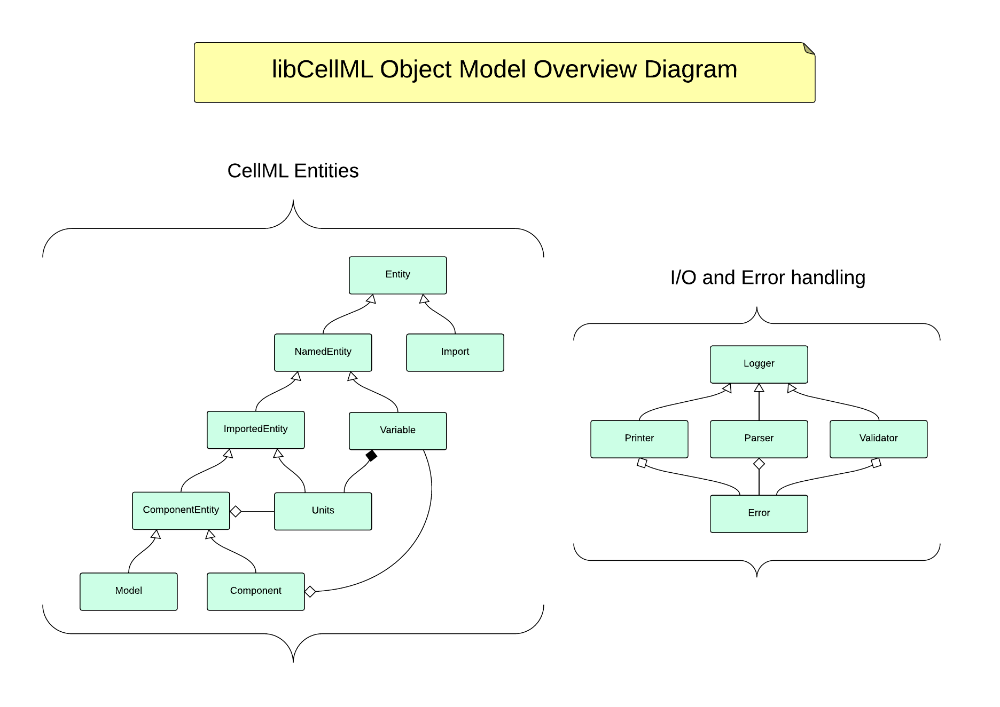
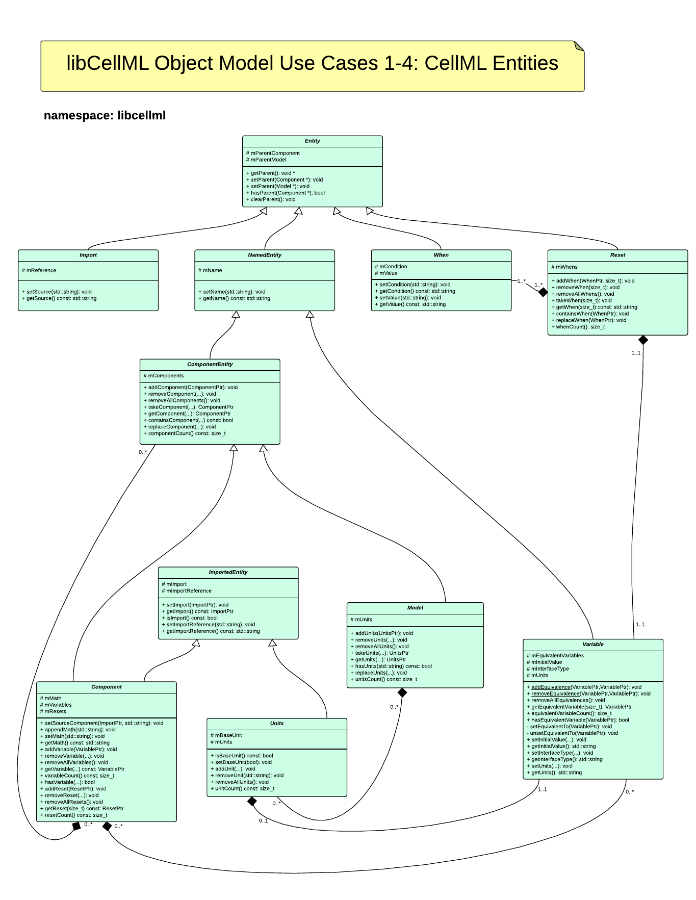
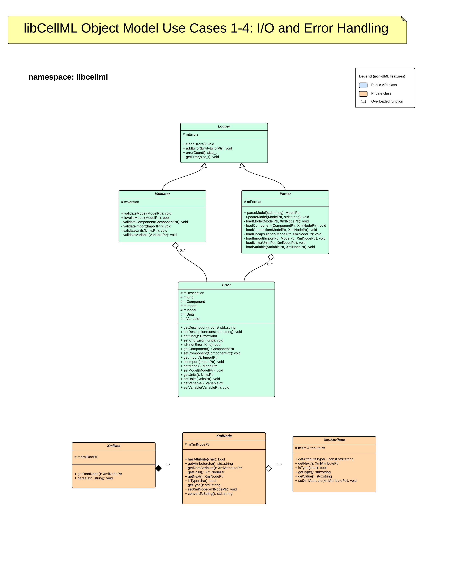

.. _libCellMLObjectModel:

======================
libCellML Object Model
======================

Introduction
============

The object model described by this document is a very high level conceptual design. The focus is on a design to support the initial use cases from the use case document :doc:`Use-cases for libCellML <usecases>`.  This document is organic and is expected to change in accordance with community decisions/discussion.

Overview of Object Model
========================

Object Model for Use Cases 1 - 4
====================================

