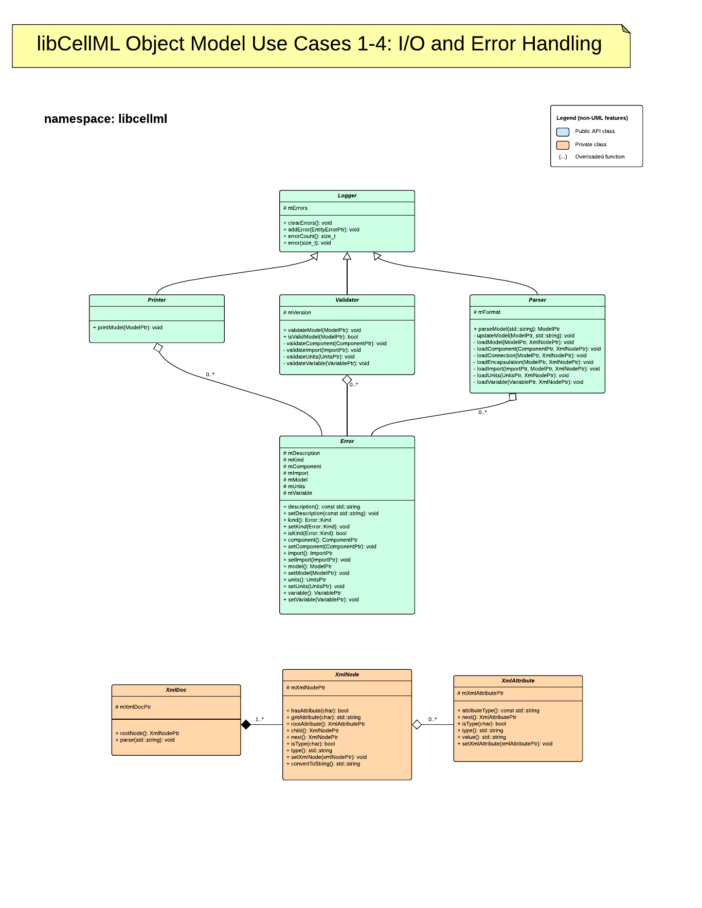

.. _libCellMLObjectModel:

======================
libCellML Object Model
======================

Introduction
============

The object model described by this document is a very high level conceptual design.
This document is organic and is expected to change in accordance with community decisions/discussion.

Overview of Object Model
========================

.. figure:: ./images/libCellMLRoughObjectModel-Overview.png
   :alt: libCellML Overview Object Model.

Detailed
========

.. figure:: ./images/libCellMLRoughObjectModel-Entities.png
   :alt: libCellML Object Model.

