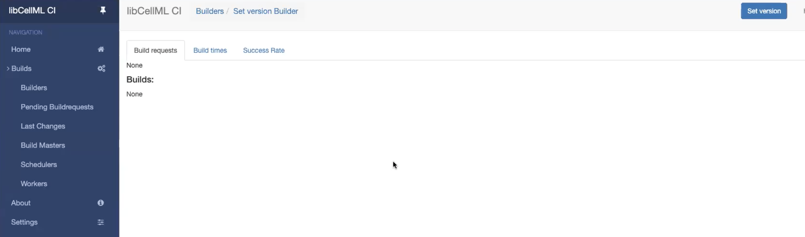
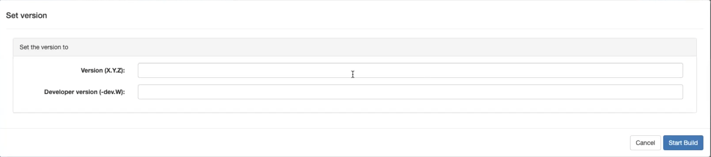
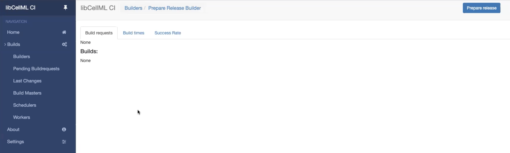
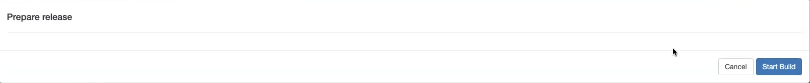
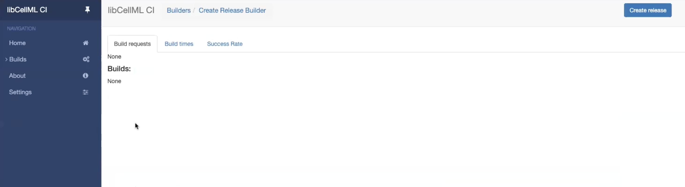
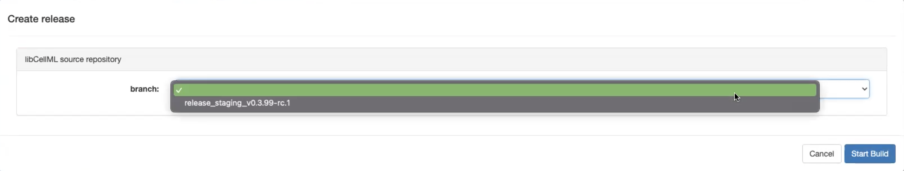
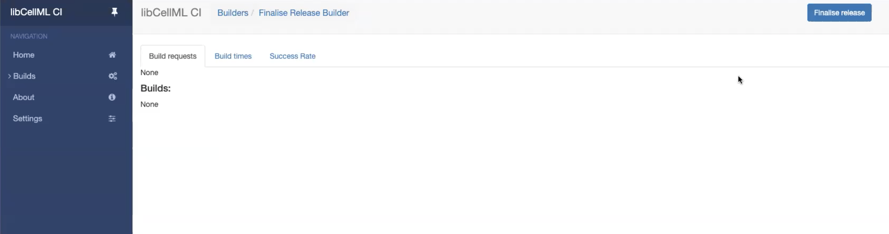
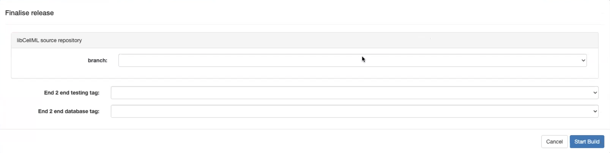
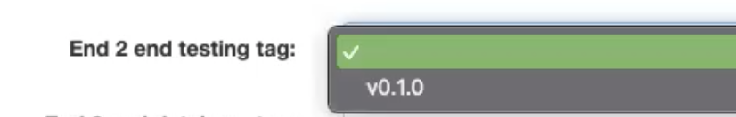
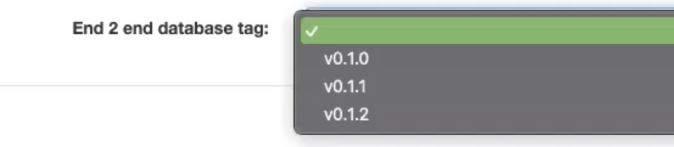

.. _release_process:

===============================
Release process for *libCellML*
===============================

The target audience of this document are the developers of *libCellML*, who have write authority to the `cellml/libcellml <https://github.com/cellml/libcellml>`__ repository.
Releases are made using builders from the Buildbot Continuous Integration (CI).
There are four steps in making a release.

1. `Step 1 - Setting the version number`_
2. `Step 2 - Preparing the release`_
3. `Step 3 - Creating the release`_
4. `Step 4 - Finalising the Release`_

Each section has further details on what actions are required for a particular step.
Each step must be done in order from step 1 through to step 4.

For all the steps in creating a release, you must be logged in to the Buildbot CI and be in the *admin* group.

.. note::

  Merging in pull requests when a release is under way is not recommended and more importantly has not been tested.
  To determine if a release is under way check the repository for the presence of a branch named *version_change* or *release_staging_<version number>*.

Step 1 - Setting the version number
===================================

The version number for the project can be set using the *Set Version Builder* (:numref:`libcellml_release_process_set_version_builder`).
The *Set Version Builder* sets the version that is entered into the interface, it does not increment the version.
The version that you set in the interface will be applied as is to the codebase.

   *Set Version Builder* on Buildbot.

libCellML uses semantic versioning as a versioning system, see `Semantic versioning <https://semver.org/>`_ for further information.
As such, each part of the version number carries a specific meaning and when setting a version number you need to make sure you are following semantic versioning rules.
There are no checks to determine if semantic versioning is being followed.
The version number is split into two parts: the core version, made up of the major, minor, and patch version identifiers; and the developer version.
An official release is created by leaving the developer version input empty.
The main difference between an official release and a developer release is the assets built by the developer release process are not uploaded or published to public registries or attached to an associated GitHub release.

   *Set Version Builder* interface.

When the *Start Build* button is pressed (:numref:`libcellml_release_process_set_version_builder_interface`) Buildbot will create an internal pull request on the `cellml/libcellml <https://github.com/cellml/libcellml>`__ GitHub repository.
The pull request will be made from the *version_change* branch to the *main* branch.
The creation of the pull request will trigger a CI build, wait for the CI to finish its checks before merging the pull request.
If, for some reason, the CI checks fail changes may be required.
Changes can be made directly to the *vesion_change* branch but quite likely any such changes will need to be propagated to the CI for a permanent fix.
How changes are propagated to the CI is outside the scope of this document.
When merging the pull request the *version_change* branch will be automatically deleted.

.. note::

  The merging of a *version_change* pull request created by the CI system is exempt from the 'two reviews' required rule.

When the version number has been set in the *main* branch the preparation of the release can start.

Step 2 - Preparing the release
==============================

A release is prepared using the *Prepare Release Builder* (:numref:`libcellml_release_process_prepare_release`).
The *Prepare Release Builder* will create a new branch named *release_staging_<version number>* (where <version number> is an actual semantic version number set in the first step) and generate a changelog.

   *Prepare Release Builder* on Buildbot.

The changelog for a release is generated from information found in merged pull requests between the current release under preparation and the previous release.

.. note::

  The changelog creation is unlikely to be accurate when creating a bug fix/hot fix release on a previously released official version.
  At this time, that means some manual editing of the changelog will need to happen when creating a bug fix/hot fix release.

   *Prepare Release Builder* interface.

There are no options for the *Prepare Release Builder*, there is only one place you can prepare a release from, there is only one place a release is going to be created.
The only thing you can do is start a build, (:numref:`libcellml_release_process_prepare_release_builder_interface`).

The *Prepare Release Builder* will kick off a round of unit tests as part of the preparation process.

When the release has been prepared the *release_staging_<version number>* branch will have been created and a changelog and table of contents entries for the changelog will have been created.
Manual changes to the generated changelog can be made at this point in the release process.
The changes made for the new changelog should be the only changes from the current *main* branch.

Step 3 - Creating the release
=============================

A release is created using the *Create Release Builder* (:numref:`libcellml_release_process_create_release`).

   *Create Release Builder* on Buildbot.

A release can only be created from a *release_staging_<version number>* branch.
The *Create Release Builder* interface interrogates `cellml/libcellml <https://github.com/cellml/libcellml>`__ for potential release branches.
Select the release preparation branch (there should only ever be one), to create the release from, and start the build with the *Start Build* button, :numref:`libcellml_release_process_create_release_builder_interface`.

   *Create Release Builder* interface showing the branch a release can be created from.

The *Create Release Builder* creates a release on GitHub and adds tags to identify where the release was created from.
The current status for the *release_staging_<version number>* branch will be applied to the *release* branch.
The tagged *release* branch is where the GitHub release will be created from.
When the release is created GitHub actions will take over to build all the assets.
The assets here are the binaries: installers and archives from Windows, macOS, and Ubuntu; Python wheels; and, the Javascript package.

.. note::

  **Do not** start the *Finalise Release Builder* until the deploy libCellML GitHub action has finished.
  The GitHub action for deploying libCellML is currently taking between 11 and 15 minutes to complete.

Step 4 - Finalising the Release
===============================

The release is finalised using the *Finalise Release Builder* (:numref:`libcellml_release_process_finalise_release`).

   *Finalise Release Builder* on Buildbot.

The *Finalise Release Builder* interface interrogates `cellml/libcellml <https://github.com/cellml/libcellml>`__ for release branches, and `end-to-end testing framework <https://github.com/libcellml/end-to-end-testing>`__, and `end-to-end testing database <https://github.com/libcellml/end-to-end-test-database>`__ for tags.
Choose the values for finalising the release in the finalise release interface, :numref:`libcellml_release_process_finalise_release_builder_interface`.
The branch input in the interface should be set to the *release_staging_<version number>* branch (again, there should be only one), :numref:`libcellml_release_process_release_branch_chooser_example`.
The end-to-end testing tag is the tag that specifies the version of the testing framework to use for running the tests, :numref:`libcellml_release_process_end_to_end_framework_tag_chooser_example`.
The end-to-end testing database is the tag that specifies the version of the database that describes the tests to run, :numref:`libcellml_release_process_end_to_end_database_tag_chooser_example`.

   *Finalise Release Builder* interface.

   Example of choosing a release branch.

   Example of choosing a tag for the end-to-end testing framework.

   Example of choosing a tag for the end-to-end testing database.

The *Finalise Release Builder* will update the libCellML staging website with the API documentation and the developer documentation.
The user documentation will only be udpated for the release if the end-to-end testing passes.
To this end, it is important to choose the appropriate end-to-end testing tag and end-to-end testing database tag.
If the end-to-end testing passes, the specifics of the versions that the release was tested with will be saved and surfaced on the website.

The last thing that the *Finalise Release Builder* does is the merging of the *release_staging_<version number>* into the *main* branch and the deletion of the *release_staging_<version number>* branch.
