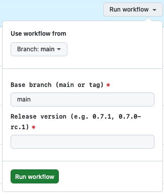
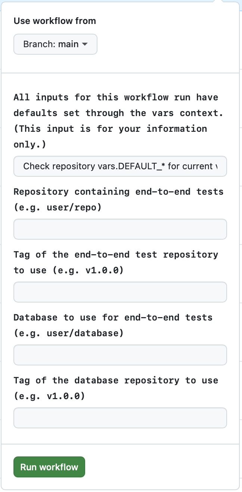
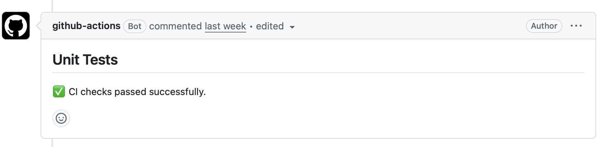
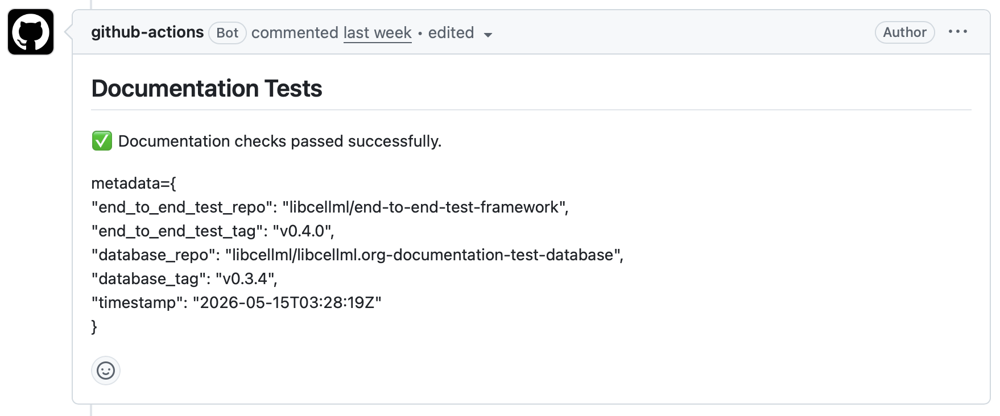
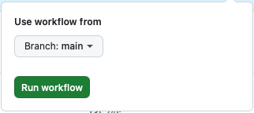
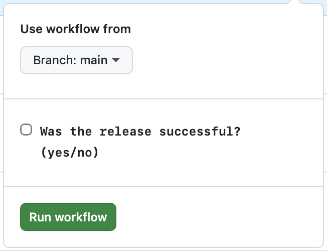

.. _release_process:

===============================
Release process for *libCellML*
===============================

The purpose of this document is to describe the process for preparing, reviewing, creating, and finalising releases of *libCellML* using GitHub Actions Continuous Integration (CI).

The target audience of this document are the developers of *libCellML* who have write authority to the `cellml/libcellml <https://github.com/cellml/libcellml>`_ repository.

Releases are made using GitHub Actions CI and consist of four steps:

1. `Step 1 - Preparing the release`_
2. `Step 2 - Checking the release`_
3. `Step 3 - Make the release`_
4. `Step 4 - Finalising the Release`_

Each step must be performed in order. Later steps assume that all previous steps have completed successfully.

Prerequisites
=============

For all steps in the release process, you must:

- Be a maintainer (have write access) of the *cellml/libcellml* GitHub repository.
- Be familiar with semantic versioning.
- Ensure that no other release is currently in progress.

.. note::

  Merging pull requests while a release is under way is not recommended and has not been tested.
  Before starting a new release, check the repository for the presence of a branch named *release-staging-v<version number>*.
  The presence of such a branch indicates that a release is already in progress.

Branch model overview
=====================

The *main* branch is the primary development branch where normal feature development occurs.
The *release* branch represents the base for all released versions of *libCellML*.
Release staging branches, named *release-staging-v<version number>*, are temporary branches used to assemble, review, and validate a candidate release before it is finalised.

Step 1 - Preparing the release
==============================

The *Prepare Release* GitHub Actions workflow prepares a release candidate using information supplied when the workflow is triggered.

This workflow performs the following tasks:

- Collects all changes that will make up the release from a specified source branch.
- Generates a changelog summarising the merged pull requests included in the release.
- Updates version numbers throughout the codebase.

These changes are separated into multiple commits (for example, content changes, changelog generation, and version updates) to make reviewing the release easier.

The workflow creates a staging branch in the repository that contains all proposed release changes.
The source branch is typically the *main* branch (which is the default), but it may be any branch or tag in the repository.
The staging branch is named *release-staging-v<version number>*, where <version number> is the version number specified when triggering the workflow.

The workflow can be triggered from the *Actions* tab of the `cellml/libcellml <https://github.com/cellml/libcellml/actions/workflows/release-prepare.yml>`__ repository.

This workflow is manually triggered and requires a version number to be provided using the GitHub Actions user interface.

   *Prepare Release* interface on GitHub.

Version numbers must follow semantic versioning rules. See `Semantic Versioning <https://semver.org/>`_ for further information.
Examples of valid version numbers include:

- 1.0.0
- 1.0.0-alpha
- 1.0.0-alpha.1
- 1.0.0-beta
- 1.0.0-beta.2
- 1.0.0-rc.1
- 1.0.0-rc.1+build.1
- 1.0.0-post.1

There are no explicit checks to ensure that version numbers strictly follow semantic versioning conventions; however, the workflow will fail if the supplied version number cannot be parsed as a semantic version.

The version number is split into two components: a core version (major, minor, and patch numbers) and an optional developer suffix.
An official release is created by omitting the developer suffix.
Developer releases include a suffix and differ from official releases in that the resulting assets are not published to public registries or attached to a GitHub release.

On successful completion, this workflow creates a pull request on the `cellml/libcellml <https://github.com/cellml/libcellml>`_ repository with *release* as the base branch and the newly created staging branch as the head branch.

If the workflow fails, the pull request will not be created. Depending on how far the workflow progressed before failure, the staging branch may still exist and may need to be cleaned up manually or reused after resolving the issue.

Next Step
---------

Once the pull request has been created, the checking of the release can begin (see `Step 2 - Checking the release`_).

Step 2 - Checking the release
=============================

The *Check Release* GitHub Actions workflow validates the staged release candidate created in `Step 1 - Preparing the release`_.
It ensures that the code builds correctly and that automated tests have been executed before proceeding with the release.

Procedure
---------

1. Navigate to the *Check Release* workflow in the GitHub Actions tab of the `cellml/libcellml <https://github.com/cellml/libcellml>`_ repository.
2. Optionally adjust the configuration parameters for the end-to-end tests using the GitHub Actions interface.
3. Manually trigger the workflow.
4. Review the results published as comments on the staging pull request.

   *Check Release* workflow interface from GitHub Action.

Tasks performed
---------------

The workflow performs the following tasks on the staged release code:

- Builds the codebase.
- Runs all unit tests.
- Reports on status of unit tests.
- Runs end-to-end tests.
- Reports on status of end-to-end tests along with the metadata used for running the tests.

Results
-------

Results from the workflow are published as comments on the staging pull request:

- **Unit test results**: A summary indicating whether all tests passed.
- **End-to-end test results**: A summary of the outcome along with the metadata used during test execution.

   Example of the comment left by the *Check Release Builder* showing the unit tests have passed.

   Example of the comment left by the *Check Release Builder* showing the unit tests have passed.

These comments must be reviewed before proceeding to the next step.

Success criteria
----------------

A release candidate is considered valid when:

- ✅ All unit tests pass (**required**).
- ⚠️ End-to-end tests may fail, but this has consequences.

If end-to-end tests fail:

- The release **may still proceed**, however:
  - The user documentation will **not** be updated as part of the release process.
  - The metadata recorded in the workflow comment will be used by subsequent workflows to finalise documentation updates on the libcellml.org website.

Failure handling
----------------

- If **unit tests fail**:
  - The release **must not proceed**.
  - The staged release should be removed and fixes applied to the source branch before starting the release process again.

- If **end-to-end tests fail**, either:
  - Continue with the release, understanding that the user documentation will not be updated.
  - Or, fix the issues stemming from the end-to-end testing and re-run the workflow.

Next step
---------

Once all required checks have passed and the results have been reviewed, the release process can continue with `Step 3 - Make the release`_.

Step 3 - Make the release
=========================

The *Make Release* GitHub Actions workflow creates a release on GitHub and builds all the release assets.

   *Make Release* workflow interface from GitHub Action.

This workflow behaves differently depending on the type of release:

- For official releases, it publishes binaries to GitHub and external registries.
- For developer (pre-)releases, it produces build artifacts only.

In addition, the workflow creates a pull request to the Julia packaging repository, `Yggdrasil <https://github.com/JuliaPackaging/Yggdrasil>`_, to updating the *libCellML* package.
The pull request to Yggdrasil must be manually managed.
Historically, the Julia package maintainers have been very good at approving and merging pull requests in a timely manner.

Procedure
---------

1. Navigate to the *Make Release* workflow in the GitHub Actions tab of the `cellml/libcellml <https://github.com/cellml/libcellml>`_ repository.
2. Manually trigger the workflow (this workflow may take up to 20 minutes to run).
3. Check the workflow run for any failures.
4. Monitor the pull request created on the `Yggdrasil <https://github.com/JuliaPackaging/Yggdrasil>`_ repository.

Tasks performed
---------------

The workflow performs the following tasks

- Moves the staged code to the release branch.
- Creates a release on GitHub using information from the staging branch.
- Builds release assets including:
  - Binaries
  - Python wheels
  - Javascript package
  - Julia packaging update (pull request), and
  - source code
- Publishes release assets to GitHub and public registries (for official releases only).

Failure handling
----------------

If there is a failure in the workflow that release will be incomplete, but should not be considered a failed release.
The only solution is to fix the problems through the normal channels and start the release process again.

Step 4 - Finalising the Release
===============================

The *Finalise Release* GitHub Actions workflow completes the release process by updating the libcellml.org website, integrating release changes back into the main development branch, and cleaning up release staging artefacts.

   *Finalise Release* workflow interface from GitHub Action.

This workflow is the final step in the release process and performs post-release housekeeping tasks.
The API and developer documentation will be updated and any user documentation that passed the end-to-end testing will be updated on the website.

If the release is considered a successful release:

- The libcellml.org website will be updated with the latest applicable documentation.
- The release staging branch will be merged back into the main development branch.

Regardless of the release outcome:

- The release staging branch will be deleted.
- The associated pull request will be closed.

Procedure
---------

1. Navigate to the Finalise Release workflow in the GitHub Actions tab of the `cellml/libcellml <https://github.com/cellml/libcellml>`_ repository.
2. Manually trigger the workflow.

   - If the release was successful, enable the option to update the website and merge changes back into the main development branch.

3. Monitor the workflow run for completion and check for any failures.
4. Review the pull request created against the production branch of the `libcellml.org website <https://github.com/libcellml/website-src>`_ repository, and merge it if the updates are correct.

Tasks performed
---------------

The workflow performs the following tasks:

- Generates API and developer documentation for the release and creates a pull request to update the website.
- Generates user documentation for components that passed end-to-end testing and updates the existing website update pull request.
- Updates the project version by appending a .post suffix.
- Merges the release staging branch back into the main development branch.
- Deletes the release staging branch and closes the associated draft pull request.

Failure handling
----------------

If a failure occurs during this workflow, manual intervention may be required to resolve any issues.
Recommended actions:

- Review the workflow logs to identify the source of the failure.
- Fix any issues in the staging or documentation repositories.
- Re-run the workflow once the problem has been resolved.
