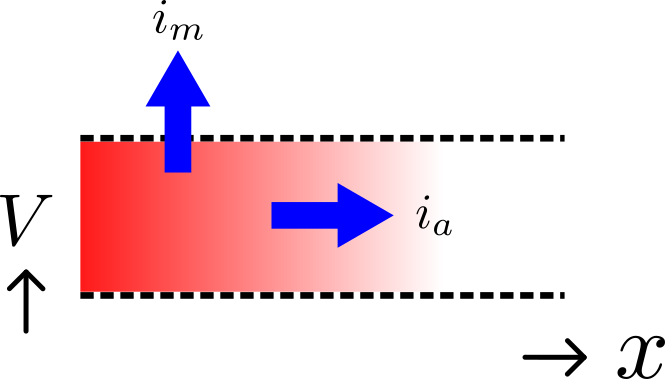
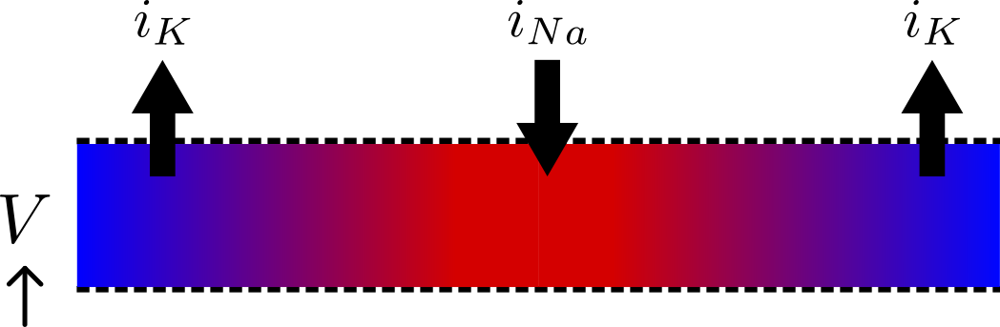
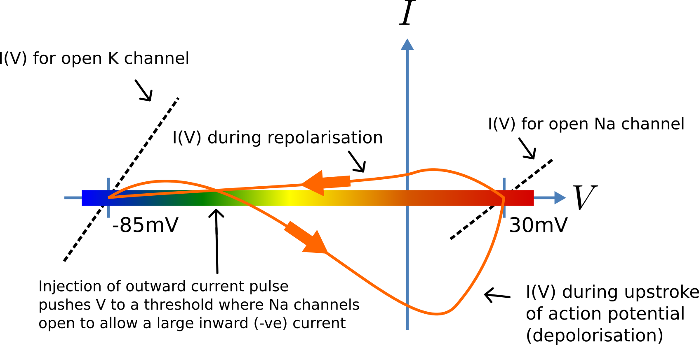
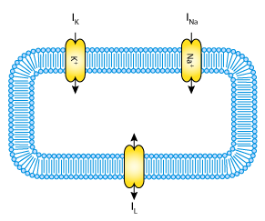
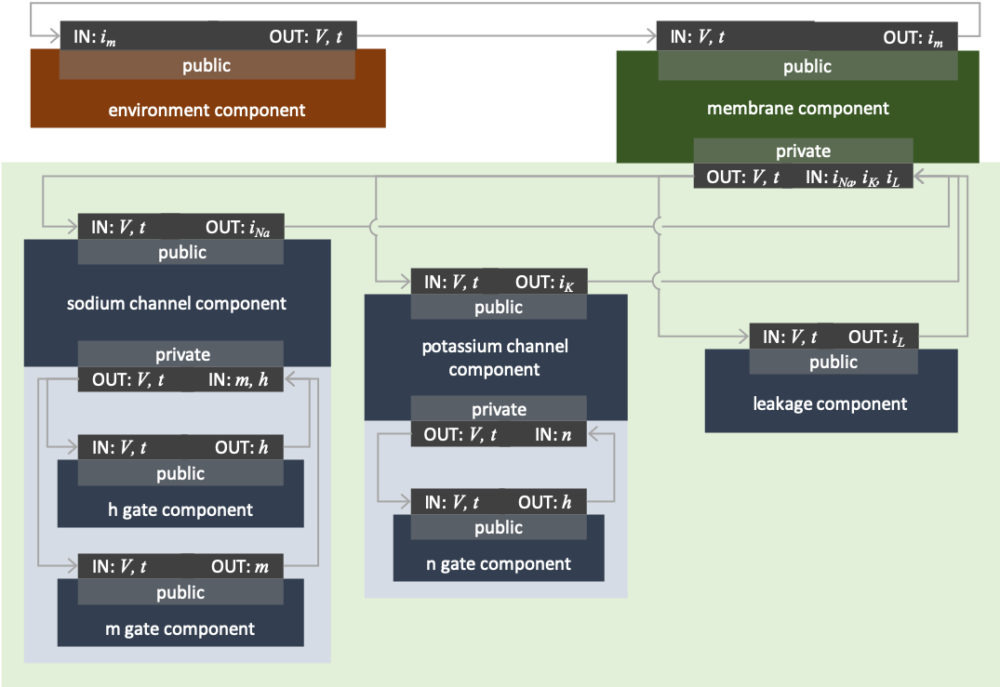

.. _hh_background:

=====================================
A model of the nerve action potential
=====================================

Here we describe the first (and most famous) model of nerve fibre
electrophysiology based on the membrane ion channels that we have
discussed in the last two sections. This is the work by Alan Hodgkin and
Andrew Huxley in 1952 cite ``10`` that won them (together with John Eccles) the
1963 Noble prize in Physiology or Medicine for *"their discoveries
concerning the ionic mechanisms involved in excitation and inhibition in
the peripheral and central portions of the nerve cell membrane"*.

.. contents::
    :local:

Theory: the cable equation
--------------------------

The *cable equation* was developed in 1890\ [#]_ to predict the
degradation of an electrical signal passing along the transatlantic
cable. It is derived as follows:

   Current flow in a leaky cable.  **TODO** I don't understand the vertical arrow??

If the voltage is raised at the left hand end of the cable (shown by the
deep red in :numref:`ocr_tut_cur_flow_leaky`), an axial current :math:`i_a`
(in :math:`A`) will flow.  This current depends on the voltage gradient
according to Ohm's Law, such that:

.. math::

  - \frac{\partial V}{\partial x} = r_a i_a

where :math:`\frac{\partial V}{\partial x}` is the voltage gradient along the
cable (in :math:`V/m`), and :math:`r_a` is the resistance (in
:math:`\Omega/m`).

If the cable membrane leaks a current of :math:`i_m` (:math:`A/m`) per unit
length, then conservation of current gives:

.. math::

  \frac{\partial i_a}{\partial x} = i_m

and, substituting for :math:`i_a` we get:

.. math::

  \frac{\partial}{\partial x}\left( - \frac{1}{r_a}\frac{\partial V}{\partial x} \right) = i_m

There are two sources of membrane leakage current, :math:`i_m`.
First, the capacitance associated with the membrane, :math:`C_m`
(approximately 1 :math:`\mu F/cm^2`) results in a current of
:math:`C_m\frac{\partial V}{\partial t}`, and secondly the
holes or channels in the membrane give :math:`i_{leak}`. Incorporating these
into the equation above gives:

.. math::

   \frac{\partial}{\partial x}\left( - \frac{1}{r_a}\frac{\partial V}{\partial x} \right) = i_m = C_m\frac{\partial V}{\partial t} + i_{leak}

Rearranging gives the **cable equation** (for constant :math:`r_a`):

.. math::

   C_{m}\frac{\partial V}{\partial t} = - \frac{1}{r_a}\frac{\partial^2 V}{\partial x^2} - i_{leak}

where all terms represent *current density* (current per membrane area)
and have units of :math:`\mu A/cm^2`.

Theory: Action potentials
-------------------------

   Current flow in a neuron.  **TODO** I don't
   understand the vertical arrow for V?? direction of voltage? Is one side in/out the cell?

The cable equation above can be used to model the propagation of an action
potential along a neuron or any other excitable cell. The leak current
is associated primarily with the inward movement of sodium ions through
the membrane's sodium channel, giving the *inward* membrane current
:math:`i_{Na}`, and the outward movement of potassium ions
through a membrane potassium channel, giving the *outward* current
:math:`i_K` (see :numref:`ocr_tut_cur_flow_neuron`). A further small leak
current :math:`i_L = g_L\left( V - E_L \right)` associated with chloride
and other ions is also included.  **TODO** Need to define E_L and g_L ??
How is i_L related to i_leak above??

   Current-voltage trajectory during an action potential.

When the membrane potential :math:`V` rises due to axial current flow,
the sodium (:math:`Na^+`) channels open and the potassium (:math:`K^+`)
channels close, such that the membrane
potential moves towards the Nernst potential for sodium. The subsequent
decline of the Na channel conductance and the increasing K channel
conductance as the voltage drops rapidly repolarises the membrane to its
resting potential of -85mV (see :numref:`ocr_tut_cur_volt_traj`).

If we assume that the whole cell is clamped with an axially-uniform potential
then we can neglect\ [#]_ the term in the equation above representing the
rate of change of axial current along the cable:

.. math::

   - \frac{1}{r_a}\frac{\partial^{2}V}{\partial x^2} \approx 0

and so obtain the membrane potential :math:`V` by integrating the first order ODE:

.. math::

   \frac{dV}{dt} = \frac{- \left( i_{Na} + \ i_K + i_L \right)}{C_m}

   A schematic cell diagram describing the current flows
   across the cell bilipid membrane that are captured in the Hodgkin-Huxley
   model. The membrane ion channels are a sodium (Na\ :sup:`+`) channel, a
   potassium (K\ :sup:`+`) channel, and a leakage (L) channel (for chloride
   and other ions) through which the currents I\ :sub:`Na`, I\ :sub:`K` and
   I\ :sub:`L` flow, respectively.

TODO How are the i_L and I_L in the figure related?  Consistent labelling needed?

Interpretation as a CellML model
--------------------------------
We discussed the idea and implementation of *encapsulation* in the
:ref:`previous section on the sodium channel<theory_sodiumchannel>`, and here
it is no different.  We would like to create a model with the encapsulation
structure shown in :numref:`hh_encapsulation`.

   The relationship between the ion channels for sodium, potassium and the
   leakage current, and the membrane and environment components.

As with other aspects of libCellML, there are several options for the model
construction process. Since we already have potassium and sodium channel
models available, it would make sense to be able to reuse these here.  This
functionality requires *imports*; their use is demonstrated in
:ref:`Tutorial 8<tutorial8>`.

Importing allows all or part of a model to be used in-situ, without
needing to manually parse its CellML file and instantiate it as an
additional model (as has been the procedure in :ref:`Tutorial 6<tutorial6>`
and :ref:`Tutorial 7<tutorial7>`).  There are some points to note.

  - I

Simulation and results
----------------------
:ref:`Tutorial 8<tutorial8>` outlines how smaller models can be used to construct
a more complicated model as described above.  In this instance, the models
described earlier
representing a :ref:`potassium channel<theory_potassiumchannel>` and a
:ref:`sodium channel<theory_sodiumchannel>`, as well as one to represent
the leakage concept introduced above can be combined to make the full
Hodgkin-Huxley model.

---------------------------

.. rubric:: Footnotes

.. [#] http://en.wikipedia.org/wiki/Cable_theory

.. [#] This term is needed when determining the propagation of the action potential, including its wave speed.
