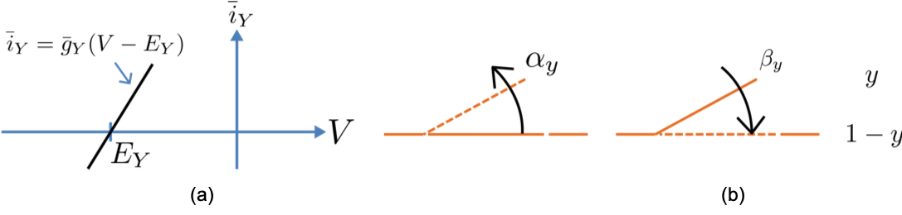
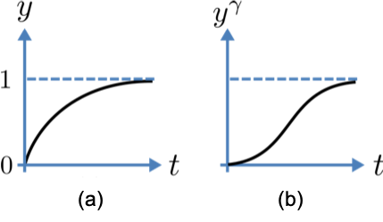
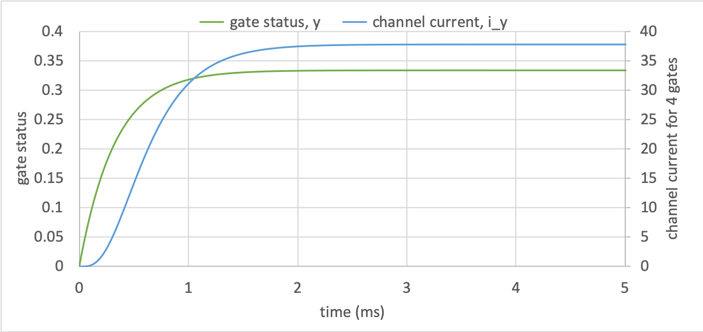

.. include:: resources/roles.txt

.. _theory_iongates:

=========================================
A model of ion channel gating and current
=========================================

This chapter describes a generic ion channel, and provides a foundation for
later chapters where specific channels of sodium and potassium are described.
The theory here is the basis for the practical modelling tutorial in
:ref:`Tutorial 5<tutorial5>`.

.. contents::
   :local:

Chemical theory and entropy
---------------------------
A good example of a model based on a first order equation is the one
used by Hodgkin and Huxley cite ``10`` to describe the gating behaviour of an
ion channel. Before we describe the
gating behaviour of an ion channel, however, we need to explain the
concepts of the 'Nernst potential' and channel conductance.

An ion channel is a protein or protein complex embedded in the bi-lipid
membrane surrounding a cell and containing a pore through which an ion
:math:`Y^{+}` (or :math:`Y^{-}`) can pass when the channel is open. If
the concentration of this ion is
:math:`\left\lbrack Y^{+} \right\rbrack_{o}` outside the cell and
:math:`\left\lbrack Y^{+} \right\rbrack_{i}` inside the cell, the force
driving an ion through the pore is calculated from the change in
*entropy*.

.. figure:: images/distribution_microstates.png
    :name: distribution_microstates
    :alt: Distribution of microstates
    :align: center
    :width: 50%

    Distribution of microstates in a system cite ``11``. The 16 particles in a
    confined region (left) have only one possible arrangement (:math:`W=1`) and
    therefore zero entropy (:math:`k_{B}\ln W=0`). When the barrier is
    removed and the number of possible locations for each particle increases
    four-fold (right), the number of possible arrangements for the 16 particles
    increases by 416 and the increase in entropy is therefore
    :math:`\ln(416)=16\ln(4)`. The thermal energy (temperature)
    of the previously
    confined particles on the left has been redistributed in space to achieve
    a more probable (higher entropy) state. If we now added more particles to
    the container on the right, the concentration would increase and the entropy
    would decrease.

Entropy :math:`S` in :math:`J.K^{-1}` is a measure of the number of
microstates available to a system, as defined by Boltzmann’s equation:

.. math::

    S = k_{B}\ln W

where :math:`W` is the number of ways of
arranging a given distribution of microstates of a system and
:math:`k_{B}` is Boltzmann’s constant \ [#]_. The driving force for ion
movement is the dispersal of energy into a more probable distribution
(see :numref:`distribution_microstates` ; cf. the second law of
thermodynamics \ [#]_).

The energy change :math:`\Delta q` associated with this change of
entropy :math:`\Delta S` at temperature :math:`T` is
:math:`\Delta q = T\Delta S` in :math:`J`.

For a given volume of fluid the number of microstates :math:`W`
available to a solute (and hence the entropy of the solute) at a high
concentration is less than that for a low concentration \ [#]_. The
energy difference which drives ion movement from a high ion concentration
:math:`\left\lbrack Y^{+} \right\rbrack_{i}` (lower entropy) to a lower
ion concentration :math:`\left\lbrack Y^{+} \right\rbrack_{o}` (higher
entropy) is therefore:

.. math::

    \Delta q
    = T\Delta S
    = k_{B}T\left( \ln{\left\lbrack Y^{+} \right\rbrack_{o} - \ln\left\lbrack Y^{+} \right\rbrack_{i}} \right)
    = k_{B}T\ln\frac{\left\lbrack Y^{+} \right\rbrack_{o}}{\left\lbrack Y^{+} \right\rbrack_{i}}
    \text{    }(J.ion^{-1})

or

.. math::

    \Delta Q = RT\ln\frac{\left\lbrack Y^{+} \right\rbrack_{o}}{\left\lbrack Y^{+} \right\rbrack_{i}}
    \text{    }(J.mol^{-1})

where

.. math::

    R = k_{B}N_{A} \approx 1.34\times10^{-23}\text{ }(J.K^{-1}) \times 6.02\times10^{23}\text{ }(mol^{-1}) \approx 8.4
    \text{    }(J.mol^{-1}K^{-1})

is the 'universal gas constant'\ [#]_. At 25°C (:math:`298K`)
:math:`{RT} \approx 2.5 \text{ }(kJ.mol^{-1})`.

Electrical theory
-----------------
Every positively charged ion that crosses the membrane raises the
potential difference and produces an electrostatic driving force that
opposes the entropic force (see :numref:`ocr_tut_bal_force`). To move an
electron of
charge :math:`e` (:math:`\approx 1.6\times 10^{-19}\text{  }(C)`) through a
voltage
change of :math:`\Delta\phi` ( in :math:`V`) requires energy
:math:`e\Delta\phi` (in :math:`J`) and therefore the energy needed to move an
ion :math:`Y^{+}` of
valence :math:`z=1` (the number of charges per ion) through a voltage change of
:math:`\Delta\phi` is :math:`{ze}\Delta\phi` (:math:`J.ion^{-1}`) or
:math:`{ze}N_{A}\Delta\phi` (:math:`J.mol^{-1}`). Using Faraday's
constant :math:`F = eN_{A}`, where
:math:`F \approx 0.96\times10^{5}` (:math:`C.mol^{-1}`), the change in
energy density at the macroscopic scale is :math:`{zF}\Delta\phi`
(:math:`J.mol^{-1}`).

No further movement of ions takes place when the force for entropy
driven ion movement exactly equals the opposing electrostatic driving
force associated with charge movement:

.. math::

    {zF}\Delta\phi = RT\ln\frac{\left\lbrack Y^{+} \right\rbrack_{o}}{\left\lbrack Y^{+} \right\rbrack_{i}}
    \text{    }(J.mol^{-1})

or

.. math::

    \Delta\phi = E_{Y} = \frac{RT}{zF}\ln\frac{\left\lbrack Y^{+} \right\rbrack_{o}}{\left\lbrack Y^{+} \right\rbrack_{i}}
    \text{    }(J.C^{-1} \text{ or }V)

where :math:`E_{Y}` is the "equilibrium" or "Nernst" potential for
:math:`Y^{+}`. At 25°C (298K),
:math:`\frac{{RT}}{F} =
\frac{2.5\times10^{3}\ }{0.96\times10^{5}}\text{ }(J.C^{-1}) \approx 25mV`.

.. figure:: images/balance_forces.png
   :name: ocr_tut_bal_force
   :alt: Balance of entropic and electrostatic forces
   :align: center
   :width: 30%

   The balance between :purple:`entropic` and :red:`electrostatic` forces
   determines the Nernst potential.

Mathematical modelling
----------------------
For an open channel the electrochemical current flow is driven by the
open channel conductance :math:`{\overset{\overline{}}{g}}_{Y}` times
the difference between the transmembrane voltage :math:`V` and the
Nernst potential for that ion:

.. math::

    {\overset{\overline{}}{i}}_{Y}\mathbf{=}{\overset{\overline{}}{g}}_{Y}\left( V - E_{Y} \right)

This defines a linear current-voltage relation ("Ohm's law") as shown in
:numref:`Fig. %s(a) <ion_gates_theory>`. The specific characteristics of a channel's
behaviour depend on how its gates modify the open channel conductance.

   (a) Open channel linear current-voltage relation.  (b) Ion channel gating
   kinetics. :math:`y` is the fraction of gates in the open state.
   :math:`\alpha_n` and :math:`\beta_n` are the rate constants for opening and
   closing, respectively.

To describe the time dependent transition between the closed and open
states of the channel, Hodgkin and Huxley introduced the idea of channel
gates that control the passage of ions through a membrane ion channel.
If the fraction of gates that are open is :math:`y`, the fraction of gates
that are closed is :math:`1-y`, and a first order ODE can be used to describe
the transition between the two states
(see :numref:`Fig. %s(b) <ion_gates_theory>`).

.. math::

    \frac{dy}{dt} = \alpha_{y}\left( 1 - y \right) - \beta_{y}.y

where :math:`\alpha_{y}`\ is the opening rate and :math:`\beta_{y}` is
the closing rate.

The solution to this ODE is:

.. math::

    y = \frac{\alpha_{y}}{\alpha_{y} + \beta_{y}} + Ae^{- \left( \alpha_{y} + \beta_{y} \right)t}

The constant :math:`A` can be interpreted as:

.. math::

    A = y\left( 0 \right) - \frac{\alpha_{y}}{\alpha_{y} + \beta_{y}}

as in the previous example and, with :math:`y\left( 0 \right) = 0` (i.e.
all gates initially shut), the solution looks like
:numref:`Fig. %s(a) <gate_behaviour>`.  The experimental data obtained
by Hodgkin and Huxley for the squid axon indicated that the initial current
flow began more slowly, as in :numref:`Fig. %s(b) <gate_behaviour>`.

   Transient behaviour for one gate (left) and γ gates in series (right). Note
   that the right hand graph has an initial S-shaped increase, reflecting the
   multiple gates in series.

Hodgkin and Huxley modelled this by proposing a series of gates within the ion
channel. Conduction can only occur when each gate is at least partially open.
Since :math:`y` is the probability of a gate being open, :math:`y^{\gamma}` is
the probability of :math:`\gamma` gates being open (since they are assumed to be
independent), so the current through the channel is:

.. math::

    i_{Y} = {\overset{\overline{}}{i}}_{Y}y^{\gamma} = y^{\gamma}{\overset{\overline{}}{g}}_{Y}\left( V - E_{Y} \right)

where

.. math::

    {\overset{\overline{}}{i}}_{Y}{= \overset{\overline{}}{g}}_{Y}\left( V - E_{Y} \right)

is the steady state current through the open gate.

Simulation and results
----------------------
The formulation of a model for the generic ion channel described here is the
focus of :ref:`Tutorial 5<tutorial5>`.  The results shown here come from that
model, where parameters representing :math:`\gamma = 4`
gates transitioning from the closed to the open state at a membrane
voltage :math:`V = 0`, and opening and closing rate constants of
:math:`\alpha_{y} = 1` ms\ :sup:`-1` and :math:`\beta_{y} = 2`
ms\ :sup:`-1`.

The modelled behaviour of a single gate is shown by the green line in
:numref:`ion_gate_status`, and the resulting channel current for four
gates in series by the blue line. Note the slow start to the current trace
in comparison with the single gate transient :math:`y\left( t \right)`, as
observed experimentally by Hodgkin and Huxley.

   Dynamics of opening status for a single gate, and the resulting current
   for :math:`\gamma=4` gates in series.

Next steps
----------
The model of a gated ion channel presented here is used in the next two
sections for the neural potassium and sodium channels. The gates create the
transience of the channel's conductance through the
voltage dependence of the gating rate constants
:math:`\alpha_{y}` and :math:`\beta_{y}`.  This means that the channel
conductance (including the open channel conductance) is voltage
dependent. For a partially open channel (:math:`y < 1`), the steady
state conductance is
:math:`\left( y_{\infty} \right)^{\gamma}{.\overset{\overline{}}{g}}_{Y}`,
where :math:`y_{\infty} = \frac{\alpha_{y}}{\alpha_{y} + \beta_{y}}`.
The gating time constants
:math:`\tau = \frac{1}{\alpha_{y} + \beta_{y}}` are therefore also
voltage dependent. Both of these voltage dependent factors of ion
channel gating are important in explaining channel properties, as is
described in the next sections for the neural
:ref:`potassium<theory_potassiumchannel>` and
:ref:`sodium ion channels<theory_sodiumchannel>`.

---------------------------

.. rubric:: Footnotes

.. [#]
   The Brownian motion of individual molecules has energy :math:`k_{B}T`
   (J), where the Boltzmann constant :math:`k_{B}` is approximately
   :math:`1.34\times10^{-23}` (:math:`J.K^{-1}`). At 25°C, or 298K,
   :math:`k_{B}T = 4\times10^{-21}` (:math:`J`) is the minimum amount
   of energy to contain a ‘bit’ of information at that temperature.

.. [#]
   The *first law of thermodynamics* states that energy is conserved,
   and the *second law* (that natural processes are accompanied by an
   increase in entropy of the universe) deals with the distribution of
   energy in space.

.. [#]
   At infinitely high concentration the specified volume is jammed
   packed with solute and the entropy is zero.

.. [#]
   :math:`N_{A}` is Avogadro’s number (:math:`6.023\times 10^{23}`) and is the
   scaling factor between molecular and macroscopic processes.
   Boltzmann’s constant :math:`k_{B}` and electron charge *e* operate at
   the atomic/molecular scale. Their effect at the physiological scale
   is via the universal gas constant :math:`R = k_{B}N_{A}` and
   Faraday’s constant :math:`F = eN_{A}`.

.. [#]
   It is well accepted in engineering analysis that thinking about and
   dealing with units is a key aspect of modelling. Taking the ratio of
   dimensionally consistent terms provides non-dimensional numbers which
   can be used to decide when a term in an equation can be omitted in
   the interests of modelling simplicity. We investigate this idea
   further in a later section.

.. [#] http://en.wikipedia.org/wiki/International_System_of_Units
