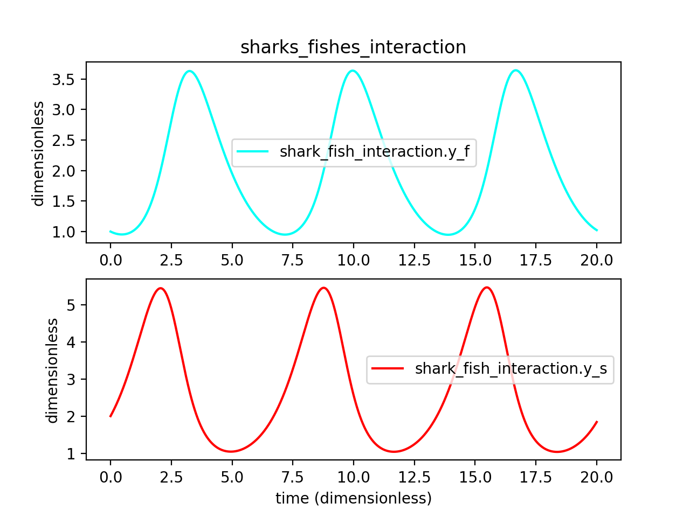

.. _theory_ode_solutions:

============================================================
Solution methods for sets of Ordinary Differential Equations
============================================================

.. toctree::
   :maxdepth: 2

Differential equations provide the governing mathematics for most of the simulations used in computational biology and engineering.
This document is a very simplified explanation for how the output files from the libCellml :code:`Generator` functionality can be coupled with a numerical integrator in order to solve generated model's system of equations.

The basic premise of differential equations is that we know something about a derivative quantity (like speed) which we need to integrate to find the variable we care about (like distance).
Because most numerical integrators can handle only one order of differentiation, in situations involving higher orders (like acceleration) or more than one variable of influence or interest (like drag) we need to use a set of connected equations instead of one alone.

Some examples:

- A simple first order system, :math:`\frac{dy}{dt}=f(y,t)` representing the effects of speed-dependent drag forces on the motion of an object;
- A higher-order system, :math:`\frac{d^2y}{dt^2} = f(\frac {dy}{dt}, y, t)` representing a spring-mass-damper system like that in shock absorbers; and
- A multi-variable system, :math:`\frac{dy_1}{dt} = f(y_1, y_2, t)` representing population dynamics between predator and prey species over time.

For each variable we need to know:

- How to evaluate the variable's first derivative as the solution progresses.
  This is known as the *gradient function evaluation* step, and includes anything and everything - including other unknown variables, constants etc - which affect the gradient of this variable.
- An initial condition for the variable so we have somewhere to start from.
  If this value is dependent on other variable values, it must nonetheless be able to be determined at the time of submitting the solver.
- How large a step to take through the independent variable space (like time).
  This is often made consistent between all variables so that their solutions progress together, though adaptive step sizing methods (in which the step size adjusts itself during the solution process) and mixed methods (in which different steps are used for different variables) are possible.
  In the examples here we will use a constant step-size for all variables and all steps.

Modelling situation: Swimming with sharks
+++++++++++++++++++++++++++++++++++++++++
The remainder of this document will use the following modelling situation to explain the :code:`Generator` outputs.
Imagine a tank filled with sharks and fishes; predators and prey.
The population of fish can only grow when they are not being constantly eaten by sharks, and the rate at which is grows will depend on how many fish are available for breeding.
At the same time, the population of sharks will depend on how much food is available in the fish population.
In maths this relationship can be written:

.. math::

    \frac{dy_s}{dt} =f(sharks, fishes, time) = a y_s + b y_s y_f

    \frac{dy_f}{dt} =f(sharks, fishes, time) = c y_f + d y_s y_f

where the constants :math:`(a, b, c, d)=(1.2, -0.6, -0.8, 0.3)` and we'll use the initial condtions of :math:`y_s(t=0)=2.0` and
:math:`y_f(t=0)=1.0`.

Interpretation in code: MathML, generated C, generated Python
=============================================================
The :code:`Generator` interprets your CellML model into a structure which can easily be passed to a numerical integrator.
Consider the file created by completing :ref:`Tutorial 3<tutorial3>` to model a coupled system of first-order ODEs.
The governing equations - that is, gradient of each variable as a function of all the others - were specified in the MathML block within the CellML as:

.. code-block:: xml

  <!-- Gradient function for variable "y_s" based on the current shark and fish populations. -->
  <apply><eq/>
    <apply><diff/>
      <ci>y_s</ci>
      <bvar>time</bvar>
    </apply>
    <apply><plus/>
      <apply><times/>
        <ci>a</ci>
        <ci>y_s</ci>
      </apply>
      <apply><times/>
        <ci>b</ci>
        <ci>y_s</ci>
        <ci>y_f</ci>
      </apply>
    </apply>
  </apply>

  <!-- Gradient function for variable "y_f" based on the current shark and fish populations. -->
    <apply><eq/>
    <apply><diff/>
      <ci>y_f</ci>
      <bvar>time</bvar>
    </apply>
    <apply><plus/>
      <apply><times/>
        <ci>c</ci>
        <ci>y_f</ci>
      </apply>
      <apply><times/>
        <ci>d</ci>
        <ci>y_s</ci>
        <ci>y_f</ci>
      </apply>
    </apply>
  </apply>

For the sake of illustrating the different variable types, we'll also define the (otherwise) constant :math:`d` using the simple equation :math:`d=a+b+c+0.5`:

.. code-block:: xml

    <apply><eq/>
       <ci>d</ci>
       <apply><plus/>
           <ci>a</ci>
           <ci>b</ci>
           <ci>c</ci>
           <cn cellml:units="dimensionless">0.5</cn>
       </apply>
    </apply>

Classification of variables
+++++++++++++++++++++++++++
The :code:`Generator` classifies all the :code:`Variable` items within each :code:`Component` as:

    - **Variables**: These do not require integration, but come in three types:

      - :code:`CONSTANT` variables do not need any kind of calculation, and is initialised directly using a constant value (for example, :math:`x = 3`);
      - :code:`COMPUTED_CONSTANT` variables only need calculation in order to set their initial (and thereafter constant) value (for example, :math:`x = y+5`); and
      - :code:`ALGEBRAIC` variables are computed based on the values of other variables (for example, :math:`x = 3yz` where :math:`y` and/or :math:`z` are not constant).

    - **Variables of integration**: Also called "base variables", "free variables", or "VOI", these are specified by the :code:`<bvar>` child of the :code:`<diff>` operator.
      VOI must not be initialised.

    - **States**: These are those variables which need integration by a solver.
      They are the :code:`<ci>` operand of the :code:`<diff>` operator.

We can see this results of this classification process in the generated code returned by a call to the :code:`implementationCode` function of the :code:`Generator`.

.. tabs::

  .. code-tab:: c++

    // Defines the VOI variable of integration, its units and the name of its parent component.
    const VariableInfo VOI_INFO = {"time", "dimensionless", "shark_fish_interaction"};

    // Defines the states: the variables which require integration.
    const VariableInfo STATE_INFO[] = {
        {"y_f", "dimensionless", "shark_fish_interaction"},
        {"y_s", "dimensionless", "shark_fish_interaction"}
    };

    // Defines the CONSTANT and COMPUTED_CONSTANT variables: these do not require integration.
    const VariableInfoWithType VARIABLE_INFO[] = {
        {"a", "dimensionless", "shark_fish_interaction", CONSTANT},
        {"b", "dimensionless", "shark_fish_interaction", CONSTANT},
        {"c", "dimensionless", "shark_fish_interaction", CONSTANT},
        {"d", "dimensionless", "shark_fish_interaction", COMPUTED_CONSTANT}
    };

  .. code-tab:: py

    # Defines the VOI variable of integration, its units and the name of its parent component.
    VOI_INFO = {"name": "time", "units": "dimensionless", "component": "shark_fish_interaction"}

    # Defines the states: the variables which require integration.
    STATE_INFO = [
        {"name": "y_f", "units": "dimensionless", "component": "shark_fish_interaction"},
        {"name": "y_s", "units": "dimensionless", "component": "shark_fish_interaction"}
    ]

    # Defines the CONSTANT and COMPUTED_CONSTANT variables: these do not require integration.
    VARIABLE_INFO = [
        {"name": "a", "units": "dimensionless", "component": "shark_fish_interaction", "type": VariableType.CONSTANT},
        {"name": "b", "units": "dimensionless", "component": "shark_fish_interaction", "type": VariableType.CONSTANT},
        {"name": "c", "units": "dimensionless", "component": "shark_fish_interaction", "type": VariableType.CONSTANT},
        {"name": "d", "units": "dimensionless", "component": "shark_fish_interaction", "type": VariableType.COMPUTED_CONSTANT}
    ]

Defining the initial values
+++++++++++++++++++++++++++
All :code:`Variables` items must either be initialised using the :code:`setInitialValue` function, or specified within the MathML as a variable of integration (VOI) using the :code:`<bvar></bvar>` tags.
Errors will be returned by the :code:`Generator` where variables are either:

- are not a VOI and are missing an initial value, or
- are a VOI and have been initalised.

The initial conditions for all non-VOI variables are specified in a function, as opposed to the dictonary syntax used for the information items above.
This function can be called by the solver whenever the solution's initial conditions need to be reset.

.. code-block:: cpp

  // In the *.c generated file
  void initializeStatesAndConstants(double *states, double *variables)
  {
      // "states" are those variables whose rates are being integrated.
      states[0] = 2.0;      // shark population
      states[1] = 1.0;      // fish population
      variables[0] = 1.2;   // a, constant in the rates equation for sharks
      variables[1] = -0.6;  // b, constant in the rates equation for sharks
      variables[2] = -0.8;  // c, constant in the rates equation for fishes
  }

  void computeComputedConstants(double *variables)
  {
      // d, the calculated constant in the rates equation for fishes.
      variables[3] = variables[0]+variables[1]+variables[2]+0.5;
  }

.. code-block:: python

  # In the *.py generated file:
  def initialize_states_and_constants(states, variables):
      states[0] = 2.0      # the initial condition for the shark population
      states[1] = 1.0      # initial condition for the fish population
      variables[0] = 1.2   # a, constant in the rates equation for sharks
      variables[1] = -0.6  # b, constant in the rates equation for sharks
      variables[2] = -0.8  # c, constant in the rates equation for fishes

  def compute_computed_constants(variables):
      # d, the calculated constant in the rates equation for fishes:
      variables[3] = variables[0]+variables[1]+variables[2]+0.5

Specification of states and rates
+++++++++++++++++++++++++++++++++
Once a :code:`Variable` has been identified as a *state* variable, it is paired by the :code:`Generator` by its corresponding entry in the :code:`rates` array, which represents its gradient function.

Because the gradients of each of the integrated variables or :code:`states` could include dependency on time or any variable's value, the values of each gradient function array must be updated throughout the solution process.
This is done by calling the :code:`computeRates` (in C) or :code:`compute_rates` (in Python) function to recalculate the gradient values for each state variable.

.. code-block:: cpp

  void computeRates(double voi, double *states, double *rates, double *variables)
  {
      // The "rates" array contains the gradient functions for each of the variables
      // which are being integrated (the "states").

      // This equation is the equivalent of d(sharks)/dt = a*y_sharks + b*y_sharks*y_fishes:
      rates[0] = variables[0]*states[0]+variables[1]*states[0]*states[1];

      // This equation is the equivalent of d(fishes)/dt = c*y_fishes + d*y_sharks*y_fishes:
      rates[1] = variables[2]*states[1]+variables[3]*states[0]*states[1];
  }

.. code-block:: python

  def compute_rates(voi, states, rates, variables):
      # The "rates" array contains the gradient functions for each of the variables
      # which are being integrated (the "states").

      # This equation is the equivalent of d(sharks)/dt = a*sharks + b*sharks*fishes:
      rates[0] = variables[0]*states[0]+variables[1]*states[0]*states[1]

      # This equation is the equivalent of d(fishes)/dt = c*fishes + d*sharks*fishes:
      rates[1] = variables[2]*states[1]+variables[3]*states[0]*states[1]

.. _solving_the_model:

Solving the model
=================
A simple numerical integration method like :euler_method:`Euler's method <>` involves stepping from the variable's initial value, along the gradient (as evaluated by the *gradient function evaluation*), to a new value.
This new value is used in turn to update all of the other gradient functions for other variables, and the process is repeated for all variables and all time points within the solution time interval.
More complicated stepping procedures involve the combination of many points at which to evaluate the gradient function as well as relaxation and hybrid techniques.
In this example we will use Euler's method as being the simplest possible.

Euler's method updates each variable according to:

.. math::

    x_{next} = x_{current} + (gradient\text{ }function\text{ }value)\times(timestep)

    x(t_k+\Delta t) = x_k + f(t_k, x_k)\times\Delta t

where the gradients of each variable are given by evaluating the current value of the appropriate gradient function, :math:`f(t_k, x_k,...)`.
It is the evaluation of these *gradient functions* which defines the nature of the physical situation represented by the model.

Simple implementations are provided which will take the generated files, from both the C and Python generator profiles, and solve the system of equations.

Simple solver routines have been provided for you for both the C and Python profiles.
Please see the relevant tutorial for details:

  - :ref:`Simple solver for C profile<simplesolver_cpp>`
  - :ref:`Simple solver for Python profile<simplesolver_py>`

Solving the model reveals the cyclical interaction between the populations of fish and sharks, as shown in :numref:`sharks_and_fishes`.

   Solution to the 0<time<20 period for the interaction of the two populations
