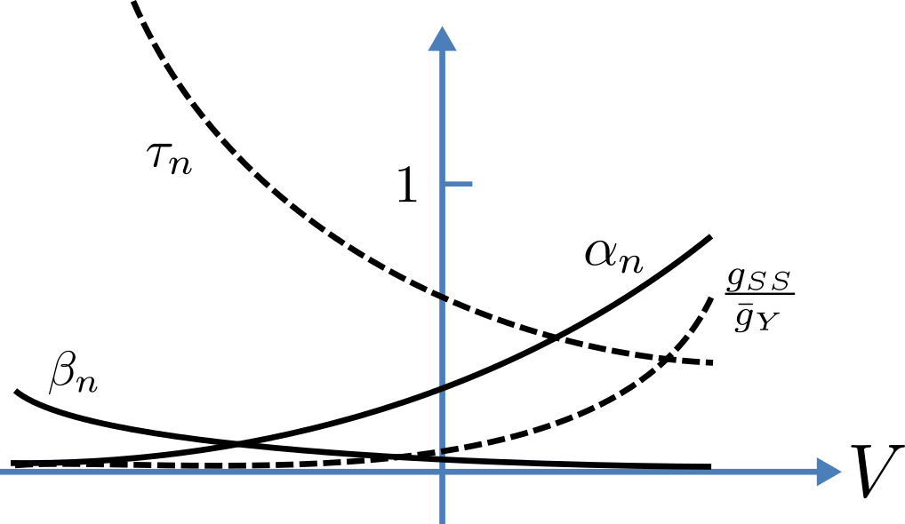
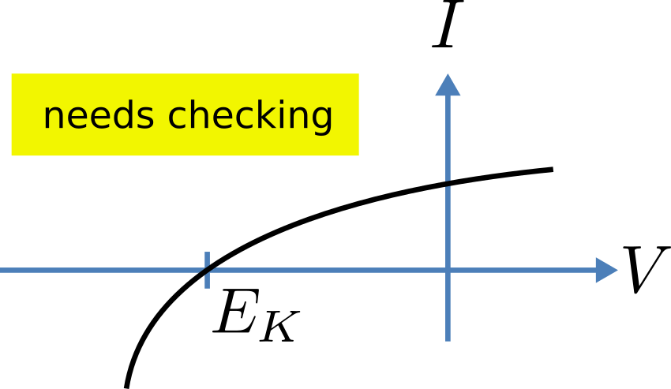
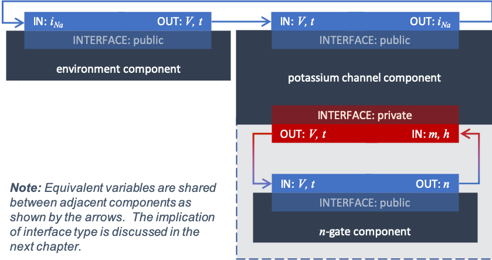
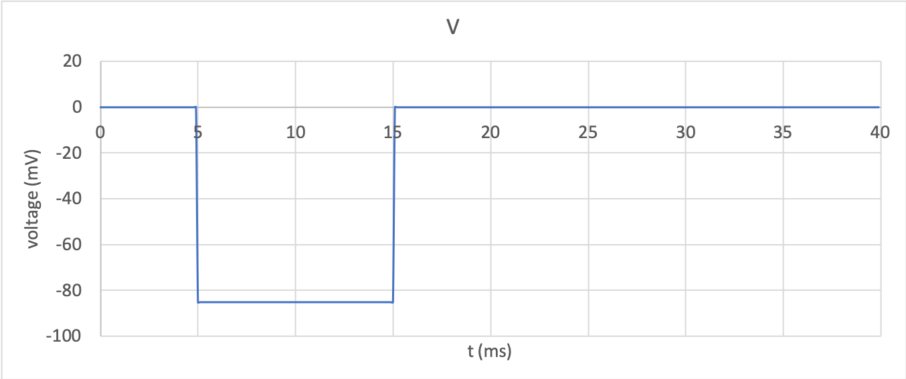
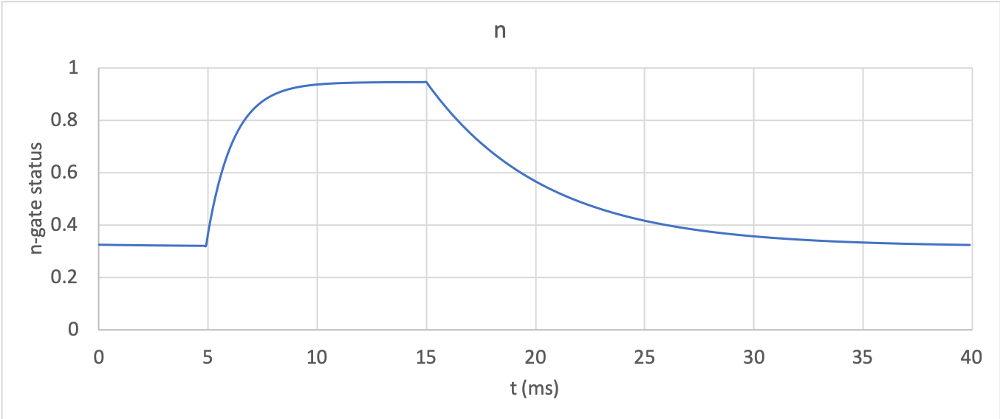
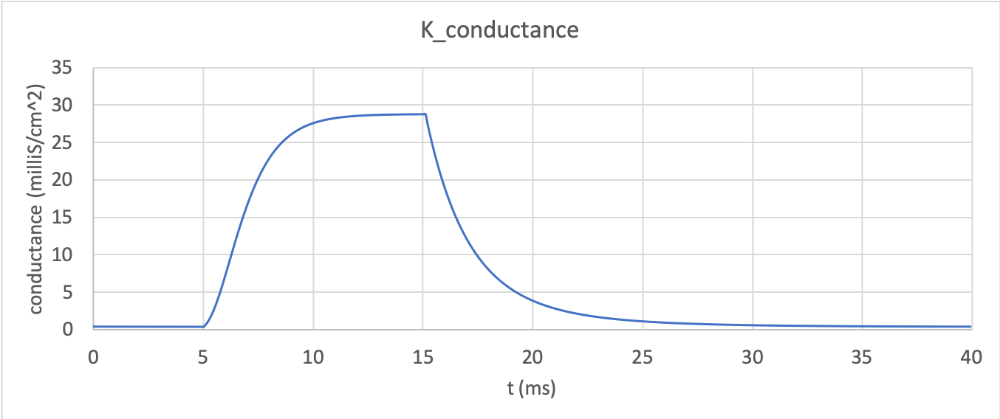
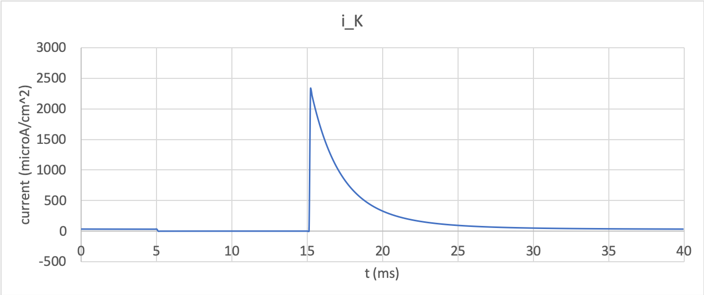

.. include:: resources/roles.txt

.. _theory_potassiumchannel:

================================
A model of a potassium channel
================================

We now deal specifically with the application of the ion channel model
discussed in :ref:`the previous chapter on ion gates
theory<theory_iongates>` to
the Hodgkin and Huxley (HH) potassium channel. This theory is the basis for
the practical modelling tutorial in :ref:`Tutorial 6<tutorial6>`.

.. contents::
    :local:

Theory
------
Following the convention
introduced by Hodgkin and Huxley, the gating variable for the potassium
channel is :math:`n` and the number of gates in series is
:math:`\gamma = 4`, therefore:

.. math::

    i_{K} = \bar{i_K}n^{4} = n^{4}\bar{g}_{K}\left( V - E_{K} \right)

where :math:`\bar{g}_{K} = \ 36 \text{ mS.cm}^{-2}`,
and with intra- and extra-cellular concentrations
:math:`\left\lbrack K^{+} \right\rbrack_{i} = 90\text{ mM}` and
:math:`\left\lbrack K^{+} \right\rbrack_{o} = 3\text{ mM}`, respectively, the
Nernst potential for the potassium channel (:math:`z = 1` representing the one
positive charge on :math:`K^{+}`) is:

.. math::

    E_{K} = \frac{RT}{zF} \ln\frac{\left\lbrack K^{+}
    \right\rbrack_{o}}{\left\lbrack K^{+} \right\rbrack_{i}} =
    25\ln\frac{3}{90} = - 85\text{ mV}

The :math:`E_K` term is called the *equilibrium potential* since it is
the potential across the cell membrane when the channel is open but no
current is flowing.  This happens when the electrostatic driving force from the
potential (voltage) difference between internal and external ion *charges*
is exactly matched by the entropic driving force from the ion
*concentration* difference. The channel conductance is given by
:math:`n^{4}\bar{g}_{K}`.

The gating kinetics are described (as before) by:

.. math::

    \frac{dn}{dt} = \alpha_{n}\left( 1 - n \right) - \beta_{n}n

with time constant:

.. math::
    \tau_{n} = \frac{1}{\alpha_{n} + \beta_{n}}

The main difference from the gating model in our previous example is
that Hodgkin and Huxley found it necessary to make the rate constants
:math:`\alpha_n` and :math:`\beta_n`
functions of the membrane potential :math:`V`
(see :numref:`ocr_tut_volt_deps_gates`) as
follows \ [#]_:

.. math::

    \alpha_{n} = \frac{- 0.01\left( V + 65 \right)}{\exp \left({-0.1 \left( V + 65 \right)}\right) - 1} \\[16pt]
    \beta_{n} = 0.125\exp{\left( \frac{- \left( V + 75 \right) } {80} \right) }

   Voltage dependence of rate constants :math:`\alpha_n` and
   :math:`\beta_n (\text{ms}^{-1})`,
   time constant :math:`\tau_n (\text{ms})` and
   relative conductance :math:`\frac{g_{ss}}{\bar{g}_Y}`.

Note that under steady state conditions when
:math:`t \rightarrow \infty` and
:math:`\frac{dn}{dt} \rightarrow 0`:

.. math::

    \left. \ n \right|_{t = \infty} = n_{\infty} =
    \frac{\alpha_{n}}{\alpha_{n} + \beta_{n}}

The voltage dependence of the steady state channel conductance is then:

.. math::

    g_{ss} = \left( \frac{\alpha_{n}}{\alpha_{n} + \beta_{n}} \right)^{4}.\bar{g}_{Y}

(see :numref:`ocr_tut_volt_deps_gates`). The steady state current-voltage
relation for the channel is illustrated in :numref:`ocr_tut_ss_cur_volt`.

   The steady-state current-voltage relation for the potassium channel.

Interpretation into a CellML model
----------------------------------
Defining components serves two purposes: it preserves a modular
structure for CellML models, and allows these component modules to be
imported into other models, as demonstrated in
:ref:`Tutorial 6<tutorial6>`. For the
potassium channel model we define components representing (i) the
environment, (ii) the potassium channel conductivity, and (iii) the
dynamics of the :math:`n`-gate as shown in **TODO**.

Since certain variables (:math:`t`, :math:`V` and :math:`n`) are shared
between components, we need to also define the component maps or equivalent
variables as described below.

An aside: Equivalent variables
------------------------------
Variables are contained within components in order to make the models
modular, and to enable the sharing and reuse of their different entities.
But along with this containment functionality comes the need for the
enclosed variables to communicate with one another across these artificial
barriers.  This is done by creating *equivalent variable maps*, wherein a
variable in one component is mapped through an *interface* to a corresponding
variable in another.

More information about how components can be nested to
create a hierarchical *encapsulation structure* is shown in more detail in
the next chapter, :ref:`A model of a sodium channel<theory_sodiumchannel>` and
demonstrated in :ref:`Tutorial 6<tutorial6>`.

    Structure of the potassium channel component with its :math:`n`-gate and environment component

Simulation and results
----------------------
The behaviour of the potassium channel can be simulated using the
:ref:`simple solver<solver>` provided to run the code generated
in :ref:`Tutorial 6<tutorial6>`.  A step change in membrane voltage between 0mV
and -85mV and back gives the behaviour shown in :numref:`potassium_voltage` to
:numref:`potassium_current` below.  These were created using a timestep of
0.01ms to an ending time of 40ms using the
:ref:`simple ODE solver<theory_ode_solutions>`.

At 0mV, the steady state value of the :math:`n`-gate is
:math:`n_{\infty} = \frac{\alpha_{n}}{\alpha_{n} + \beta_{n}} =` 0.324
and, at -85mV, :math:`n_{\infty} = \ `\ 0.945.

The voltage traces are shown in :numref:`potassium_voltage`.
The :math:`n`-gate response in :numref:`potassium_ngate`
shows it opening beyond its initial partially open value
of :math:`n =`\ 0.324 at 0mV, to plateau at an almost fully open
state of :math:`n =`\ 0.945 at the Nernst potential of -85mV, before closing
again as the voltage is stepped back to 0mV. Note that the opening
behaviour (set by the voltage dependence of the :math:`\alpha_{n}`
opening rate constant) is faster than the closing behaviour (set by the
voltage dependence of the :math:`\beta_{n}` closing rate constant). The
channel conductance (:math:`= n^{4}\bar{g}_K`) is
shown in :numref:`potassium_conductance`.  Note the initial s-shaped
conductance increase caused by the effect of the four gates in series
:math:`n^{4}`
effect on conductance. Finally the channel current
:math:`i_{K} = g_{Na}\left( V - E_{K} \right)` is shown in
:numref:`potassium_current`.
There is no current flow during the time when the voltage is clamped at the
Nernst potential (-85mV) when the gate is opening.  When the voltage
is stepped back to 0mV the open gates begin to close and the
conductance declines, but as there is a voltage gradient it drives an
outward (positive) current flow through the partially open channel.  Current
can only flowswhen there is a non-zero conductance and a non-zero voltage
gradient. This is called the ‘tail current’.

    Membrane voltage clamp step from 0mv to -85mV and back.

    First-order response of the n-gate to the voltage change.

    Potassium channel conductance dynamics

    Potassium channel current response

Note that the simulation above includes the Nernst equation with
its dependence on the concentrations
:math:`\left\lbrack K^{+} \right\rbrack_{i}`\ = 90mM and
:math:`\left\lbrack K^{+} \right\rbrack_{o}`\ = 3mM. By raising the
external potassium concentration to
:math:`\left\lbrack K^{+} \right\rbrack_{o}`\ = 10mM you will then see
the Nernst potential increase from -85mV to -55mV and a negative
(inward) current flowing during the period when the membrane voltage is
clamped to -85mV. The cell is now in a ‘hyperpolarised’ state because
the potential is less than the equilibrium potential.

Next steps
----------
This potassium channel model will be used - together with a sodium
channel model (in :ref:`Tutorial 7<tutorial7>`) and a leakage channel
model - to form the Hodgkin-Huxley
neuron model (in :ref:`Tutorial 8<tutorial8>`), where the membrane ion
channel current flows are coupled to the equations governing current flow
along the axon to generate an action potential.

The next chapter describes the theory behind the
:ref:`sodium channel model<theory_sodiumchannel>`.

---------------------------

.. rubric:: Footnotes

.. [#] The original expression in the HH paper used
       :math:`\alpha_n = \frac{0.01(v+10)}{\exp\left(0.1(v+10)\right)-1}` and
       :math:`\beta_n = 0.125\exp \left( {\frac{v}{80}} \right)`, where
       :math:`v` is defined
       relative to the resting potential (:math:`-75\text{ mV}`) with positive
       corresponding to positive *inward* current and :math:`v = -(V+75)`.
