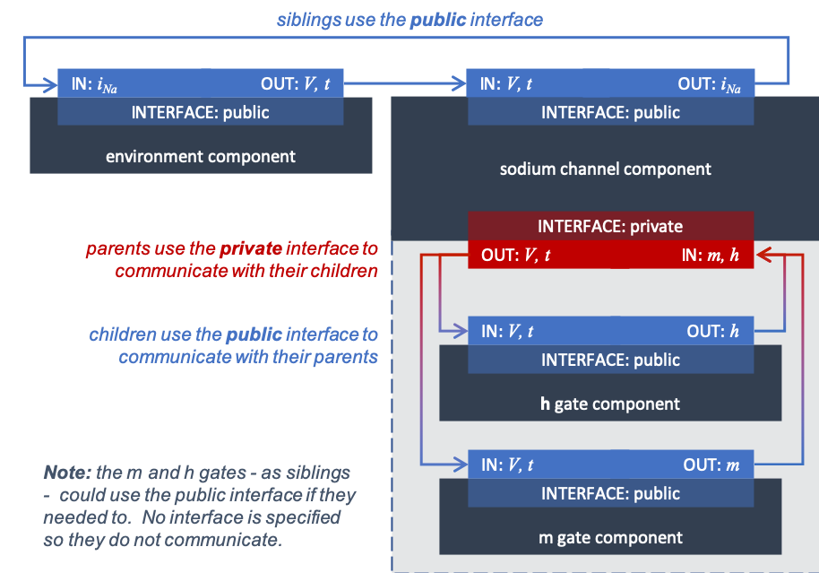

.. _theory_sodiumchannel:

===========================
A model of a sodium channel
===========================

Theory
------
The Hodgkin-Huxley model's sodium channel has two types of gate,
an :math:`m`-gate (of which
there are 3) that is initially closed (:math:`m = 0`) before activating
and inactivating back to the closed state, and an :math:`h`-gate that is
initially open (:math:`h = 1`) before activating and inactivating back
to the open state. The short period when both types of gate are open
allows a brief window current to pass through the channel. Therefore,

.. math::

   i_{Na} = \bar{i}_{Na}m^{3}h = m^{3}{h.}\bar{g}_{Na}\left( V - E_{Na} \right)

where :math:`\bar{g}_{Na} = \ `\ 120
mS.cm\ :sup:`-2`, and with
:math:`\left\lbrack Na^{+} \right\rbrack_{i}`\ = 30mM and
:math:`\left\lbrack Na^{+} \right\rbrack_{o}`\ = 140mM, the
Nernst potential for the sodium channel (:math:`z=1`) is:

.. math::

   E_{Na} = \frac{RT}{zF}ln\frac{\left\lbrack Na^{+} \right\rbrack_{o}}{\left\lbrack Na^{+} \right\rbrack_{i}} = 25 \ln\frac{140}{30} = 35\text{mV}.

The gating kinetics are described by:

.. math::

   \frac{dm}{dt} = \alpha_{m}\left( 1 - m \right) - \beta_{m}.m

   \frac{dh}{dt} = \alpha_{h}\left( 1 - h \right) - \beta_{h}.h

where the voltage dependence of these four rate constants is determined
experimentally [#]_ to be:

.. math::

   \alpha_{m} = \frac{- 0.1\left( V + 50 \right)} {\exp \left( - 0.1 \left( V + 50 \right) \right) - 1}; \\[5pt]
   \beta_{m} = 4 \exp \left( {\frac{- \left( V + 75 \right)}{18}} \right);\\[5pt]
   \alpha_{h} = 0.07\exp\left( {\frac{- \left( V + 75 \right)}{20}}\right);\\[5pt]
   \beta_{h} = \frac{1} {\exp\left({ {- 0.1 \left( V + 45 \right)}}\right) + 1}

Interpretation as a CellML model
--------------------------------
Before we construct a CellML model of the sodium channel, we first
introduce some further CellML concepts that help deal with the
complexity of biological models: first the use of *encapsulation groups*
and *public* and *private interfaces* to control the visibility of
information in modular CellML components.  To understand encapsulation,
it is useful to use terms like ‘parent’, ‘child’ and ‘sibling’, to describe the
relationships between components.  This is illustrated in
:numref:`encapsulation_parent_structure` below:

.. _encapsulation_parent_structure:

    Encapsulation structure of nested components in a parent-child-sibling structure.

Beyond convenience, defining an encapsulation structure also controls which components
are able to see and be seen by which others, as defined by the available interface types:

- By default, no interfaces exist between components.  The types of interface
  listed below are those which are *possible*; they must be specified
  before they can be used. This is the default, but may be specified explicitly
  using the *none* interface type.
- A *public* interface is available between siblings, and from a child to its parent.
  This is also true of top-level components, such as the 'grandparent' and 'no relation'
  components.
- A *private* interface is available from a parent to its child(ren).
- Both *public* and *private* interfaces are available using the
  *public_and_private* type, needed where there is more than one level of
  nesting
  (for example, a grandparent-parent-child structure).  Here, the parent must
  define a *public_and_private* interface type as it is both the child of the
  grandparent, and the parent of the child.
- Communication through the aunt-child, grandparent-child, and cousin-parent
  relationships is not possible as there is no available interface.
  Communication with the no-relation component is only possible with the
  grandparent because, as top-level components, they are siblings.

We define the CellML components **sodium_channel_m_gate** and
**sodium_channel_h_gate** below. Each of these components has its own
equations (voltage-dependent gates and first-order gate kinetics) but
they are both parts of one protein – the sodium channel – and it is
useful to group them into one **sodium_channel** component.

.. _sodium_channel_encap_structure:

    The sodium channel component is the parent of two children:
    the :math:`m`-gate and the :math:`h`-gate components, which are
    therefore siblings. A *private
    interface* allows a parent to talk to its children and a *public
    interface* allows siblings to talk among themselves and to their parents.

Simulation process
------------------
A simulation of the sodium gate's operation using OpenCOR is summarised
in ?? to ?? below. Other solvers in Python or C++ could have been utilised
by using the code generation functionality to output the appropriate files.

**TODO** link to code generation tutorial for this component

Results
-------
The results of the computation, with an end time of 40 and
time interval of 0.1, are shown in :numref:`ocr_tut_kin_na_ch_vs` with
plots :math:`V\left( t \right)`, :math:`m\left( t \right)`,
:math:`h\left( t \right)`, :math:`g_{Na}\left( t \right)` and
:math:`i_{Na}(t)` for voltage steps from (a) -85mV to -20mV,
(b) -85mV to 0mV and (c) -85mV to 20mV. There are several
things to note:

i.   The kinetics of the :math:`m`-gate are much faster than the
     :math:`h`-gate.

ii.  The opening behaviour is faster as the voltage is stepped to higher
     values since :math:`\tau = \frac{1}{\alpha_{n} + \beta_{n}}`
     reduces with increasing :math"`V` (see :numref:`ocr_tut_volt_deps_gates`).

iii. The sodium channel conductance rises (*activates*) and then falls
     (*inactivates*) under a positive voltage step from rest since the
     three :math:`m`-gates turn on but the :math:`h`-gate turns off and the
     conductance is a product of these. Compare this with the potassium channel
     conductance shown in **TODO ref to potassium page**
     :numref:`ocr_tut_kin_pot_ch` which is only reduced back to zero by
     stepping the voltage back to its resting value – that is, *deactivating*
     it.

iv.  The only time current :math:`i_{Na}` flows through the
     sodium channel is during the brief period when the :math:`m`-gate is
     rapidly opening and the much slower :math:`h`-gate is beginning to close.
     A small current flows during the reverse voltage step but this is at
     a time when the :math:`h`-gate is now firmly off so the magnitude is very
     small.

v.   The large sodium current :math:`i_{Na}` is an inward current
     and hence negative.

Note that the bottom trace does not quite line up at t=0 because the
values shown on the axes are computed automatically and hence can take
more or less space depending on their magnitude.

.. figure:: images/kinetics_na_ch_voltages.png
   :name: ocr_tut_kin_na_ch_vs
   :alt: Kinetics of the sodium channel gates for voltage steps to (a) -20mV, (b) 0mV, and (c) 20mV.
   :align: left

   Kinetics of the sodium channel gates for voltage steps to (a) -20mV, (b) 0mV, and (c) 20mV.

Next steps
----------
The incorporation of this sodium channel model into the full Hodgkin-Huxley
model of a neuron is described in the next chapter,
:ref:`Hodgkin-Huxley assembly<theory_hh>`.  This will include the
:math:`n`-gate described in the previous chapter, :ref:`A model of a potassium
channel<theory__potassiumchannel>` as well as a leakage current model.

---------------------------

.. rubric:: Footnotes

.. [#] The Hodgkin-Huxley paper used:
    .. math::
       \alpha_m = \frac{0.1(v+25)}{\exp\left({0.1(v+25)\right)-1}
       \beta_m = 4\exp\left({\frac{v}{18}\right)
       \alpha_h = 0.07e^{\frac{v}{20}}
       \beta_h = \frac{1}{\exp\left(0.1(v+30)\right)+1}
