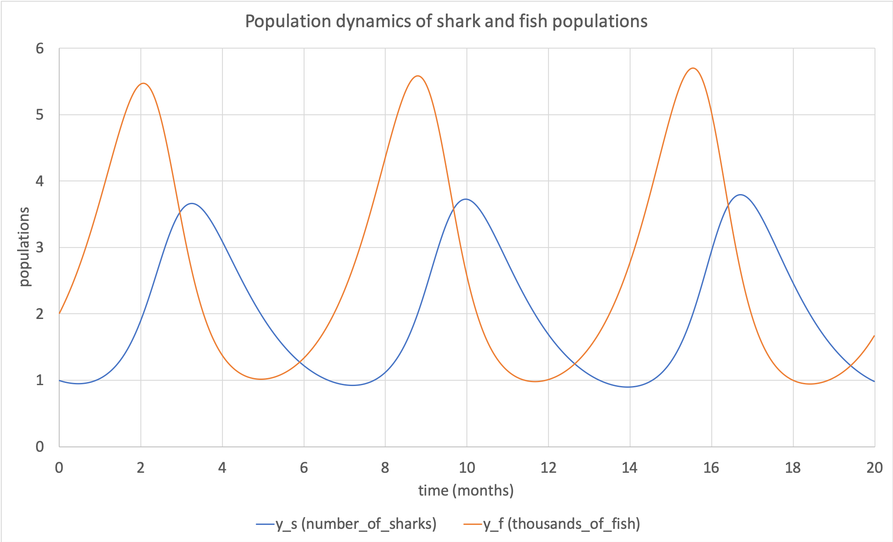

.. _tutorial4_cpp:

====================================================
Tutorial 4 C++: Generating code and model simulation
====================================================

This tutorial assumes that you are comfortable with:

    - Interacting with a model and its entities using the API (see :ref:`Tutorial 3<tutorial3_cpp>`); and
    - Using the :code:`Generator` functionality to output files in C or Python (see :ref:`Tutorial 3<tutorial3_cpp>`).

By the end of this tutorial you will be able to:

    - Interact with files created by the :code:`Generator` to retrieve information for integrating; and
    - Use the simple solver provided to numerically integrate the governing equations of the model.

.. contents:: Contents
    :local:

Step 1: Include the generated code in this project
==================================================
In :ref:`Tutorial 3<tutorial3_cpp>` you created a CellML model representing the population dynamics in a predator-prey situation, and used the :code:`Generator` to write files which can be run using a numerical integration solver in either Python or C.

This tutorial is slightly different from the other ones because you will need to change the way your project is compiled and built in order to include the generated code.
As before, if you didn't complete the earlier tutorial in which the generated code was created, you can use files from the
:code:`resources` folder instead.

Because this is for generated code in C you will need the files:

- :download:`../resources/tutorial3_PredatorPrey_generated.cpp`
- :download:`../resources/tutorial3_PredatorPrey_generated.h`

.. container:: dothis

    **1.a** Enter the path to the generated header/interface :code:`.h` file in the :code:`#include` section at the top of your :code:`tutorial4.cpp` file.

.. container:: dothis

    **1.b** If you're using the generated file with a :code:`.c` extension you will need to change the file extension to :code:`.cpp` for it to build correctly with the supplied template.
    Do this now.

.. container:: dothis

    **1.c** Add the name and path of the implementation :code:`.cpp` file into the CMakeLists.txt file so that it's built with your project.

    Inside the CMakeLists.txt file:
    .. code-block:: cmake

        #   1.b, c Note that you will need to adjust the file name here to match the one that you generated
        #          in Tutorial 3.  You will also need to change its extension to be *.cpp instead of *.c in
        #          order for CMake to accept it.
        set (PROJECT_SRC
                ${PROJECT_NAME}.cpp
                ../utilities/tutorial_utilities.cpp
                ../resources/tutorial3_PredatorPrey_generated.cpp
             )

.. container:: dothis

    **1.d** Open your generated :code:`.cpp` file and change the name of the header it includes using the :code:`#include` statement to be the name of your generated header :code:`.h` file.
    By default this is :code:`#include "model.h"`.

.. container:: dothis

    **1.e** The version which the generated code was created with is stored in a variable called :code:`LIBCELLML_VERSION`.
    Print this to the terminal and check that it matches the version of libCellML library which you're using, just like in :ref:`Tutorial 0<tutorial0_cpp>`.

.. container:: dothis

    **1.f** Call :code:`cmake` to generate the makefile, :code:`make` to build the executable, and run the code so far to check that the versions match.

    .. code-block:: console

        cmake -DINSTALL_PREFIX=../../install .
        make -j
        ./tutorial4

Step 2: Investigate the information items in the generated files
================================================================
This step is about figuring out what's contained in the generated files, and demonstrating how you can use them to run your simulation.

The implementation code contains some constants as well as functions which make it simple to switch between models for solution.
This tutorial will pretend that you know nothing about the contents of the CellML model from which the files were generated, and take you through writing a general numerical solver.

Classification of variables
+++++++++++++++++++++++++++
The :code:`Generator` classifies all the :code:`Variable` items within each :code:`Component` as:

    - **Variables**: These do not require integration, but come in three types:

      - :code:`CONSTANT` variables do not need any kind of calculation;
      - :code:`COMPUTED_CONSTANT` variables need calculation but not integration; and
      - :code:`ALGEBRAIC` variables need ...?? **TODO**

    - **Variables of integration**: Also called "base variables", "free variables", or "VOI", these are specified by the :code:`<bvar>` child of the :code:`<diff>` operator.
      VOI must not be initialised.

    - **States**: These are those variables which need integration by a solver.
      They are the :code:`<ci>` child of the :code:`<diff>` operator.

We can see this results of this classification process in the generated code returned by a call to the :code:`implementationCode` function of the :code:`Generator`.

.. code-block:: cpp

  // Define the VOI variable of integration, its units and the name of its parent component.
  const VariableInfo VOI_INFO = {"time", "dimensionless", "shark_fish_interaction"};

  // Define the states: the variables which require integration.
  const VariableInfo STATE_INFO[] = {
      {"y_f", "dimensionless", "shark_fish_interaction"},
      {"y_s", "dimensionless", "shark_fish_interaction"}
  };

  // Define the CONSTANT and COMPUTED_CONSTANT variables: these do not require integration.
  const VariableInfoWithType VARIABLE_INFO[] = {
      {"a", "dimensionless", "shark_fish_interaction", CONSTANT},
      {"b", "dimensionless", "shark_fish_interaction", CONSTANT},
      {"c", "dimensionless", "shark_fish_interaction", CONSTANT},
      {"d", "dimensionless", "shark_fish_interaction", COMPUTED_CONSTANT}
  };

These are accessible in the generated code:

    - :code:`VARIABLE_COUNT` is an integer representing the number of variables (including constants) in the model.
      Note that these are variables which might need calculation, but do not need integration.

    - :code:`VARIABLE_INFO` is an array of :code:`VariableInfoWithType` structs, which contains:

        - a :code:`name` field;
        - a :code:`units` field;
        - a :code:`component` field; and
        - a :code:`type` enum field.

    - the :code:`VARIABLE_INFO` array is :code:`VARIABLE_COUNT` long.

.. container:: dothis

    **2.a** Retrieve the number of variables from the generated code, and print the information related to each of them to the terminal.

There are similar information items related to the state variables.
These are:

    - :code:`STATE_COUNT` is an integer representing the number of state variables in the model.
      These are the variables which need to be integrated.
    - :code:`STATE_INFO` is an array of :code:`VariableInfo`
      structs, which contains:

        - a :code:`name` field
        - a :code:`units` field
        - a :code:`component` field

    - the :code:`STATE_INFO` array is :code:`STATE_COUNT` long.

.. container:: dothis

    **2.b** Retrieve the number of state variables from the generated code, and print the information related to each of them to the terminal.

The final information stored is the name and attributes of the base integration variable (variable of integration, VOI).
This is stored in :code:`VOI_INFO`, a :code:`VariableInfo` item.

.. container:: dothis

    **2.c** Retrieve the information about the VOI and print it to the terminal.

Step 3: Investigate the functions provided in the generated files
=================================================================
As well as the information items, the generated code also contains functions which are derived from the governing equations in the MathML blocks in the original CellML model.

In order to perform any kind of numerical integration, a solver needs three things:

    - An array of the current values of all state variables (length = :code:`STATE_COUNT`);
    - A way to update the gradient function of each of the state variables as the solution progresses; and
    - A method to move from the current solution position to the next one.

For a more detailed background on numerical integration, please see :ref:`Solution methods for ODEs<theory_ode_solutions>`.

Allocating arrays
+++++++++++++++++
Because we're writing this tutorial based around a general situation, we can use the helper functions provided to allocate these arrays to the right size.
These are:

    - :code:`createStatesArray` will allocate an array of length :code:`STATE_COUNT` and element type :code:`double` (which can be used to allocate the array of rates too); and
    - :code:`createVariableArray` will allocate an array of length :code:`VARIABLE_COUNT` and element type :code:`double`.

.. container:: dothis

    **3.a** Allocate three arrays: one for the state variables, one for the rates, and one for the variables.

Defining the initial values
+++++++++++++++++++++++++++
After allocating these arrays, we need to fill them with the information.
In :ref:`Tutorial 3<tutorial3_cpp>` we used three equations to define this model:

.. math::

    \frac{dy_s}{dt} =f(sharks, fishes, time) = a y_s + b y_s y_f

    \frac{dy_f}{dt} =f(sharks, fishes, time) = c y_f + d y_s y_f

    c = a - 2.0

with constants :math:`(a, b, d)=(1.2, -0.6, 0.3)` and initial condtions of :math:`y_s(t=0)=2.0` and :math:`y_f(t=0)=1.0`.

If you look inside the implementation file (:code:`*.c/cpp`) which was generated in the last tutorial you'll see the code shown below, and recognise its correlation with the initial conditions above.

.. code-block:: cpp

    // tutorial3_PredatorPrey_generated.cpp:
    void initializeStatesAndConstants(double *states, double *variables)
    {
        states[0] = 2.0;        // represents the inital number of sharks
        states[1] = 1.0;        // represents the inital number of fish (in thousands)
        variables[0] = 1.2;     // a, constant in the rates equation for sharks
        variables[1] = -0.6;    // b, constant in the rates equation for sharks
        variables[2] = 0.3;     // d, constant in the rates equation for fish
    }

.. container:: dothis

    **3.b** Call the :code:`initializeStatesAndConstants` function to initalise the arrays you created earlier.
    Print them to the terminal for checking. **TODO** US spelling of functions??

Printing to the terminal should show you that while the CellML :code:`Variable` items for which we specified an initial value have been applied, the constant :code:`c` has not yet been evaluated.
There's a second helper function :code:`computeComputedConstants(double *variables)` which will do this for you.

.. code-block:: cpp

    // tutorial3_PredatorPrey_generated.cpp:
    void computeComputedConstants(double *variables)
    {
        variables[3] = variables[0] - 2.0;    // c, constant in the rates equation for fish
    }

.. container:: dothis

    **3.c** Call the :code:`computeComputedConstants` function, and reprint the variables array to the terminal to check that the initial values for all variables have now been set correctly.

Now we're ready to begin solving the model.

Step 4: Iterate through the solution
====================================
A simple solver has been provided for you already, as outlined in :ref:`<solver>`.
Please visit that page for details of its operation, or you can easily write your own following the steps below.

We now make use of a simple routine to step through the solution iterations using the Euler method to update the state variables.
Following initialisation of some solution controls (time step, end point) there are three general parts to each iteration:

    - Computing the variables at the current timestep;
    - Computing the gradient functions or rates at the current timestep; and
    - Updating the state variables using an Euler\* step.
      \* Note that this could be any stepping method - we just use this one as it's very simple.

.. container:: dothis

    **4.a** Define some variables to control the total number of steps to take, and the size that those steps should be.
    In this example it's safe to use a step of 0.001 and an end time of 20.

.. container:: dothis

    **4.b** Create a file for output and open it.
    We'll simply write the solution directly to the file instead of allocating memory for storage.
    Name your columns with VOI and the state variable names and units.

Specification of the variables
++++++++++++++++++++++++++++++
In each iteration the variables may need to be updated.
In our example we do not have any dependencies (that is, :math:`a, b, c, d` are constants) so the function which updates them is blank here; this is not true of the general case.

.. code-block:: cpp

    // tutorial3_PredatorPrey_generated.cpp:
    void computeVariables(double voi, double *states, double *rates, double *variables)
    {
    }

Specification of states and rates
+++++++++++++++++++++++++++++++++
Once a :code:`Variable` has been identified as a *state* variable, it is paired by the :code:`Generator` to its corresponding entry in the :code:`rates` array, which represents its gradient function.

Because the gradients of each of the :code:`states` could include dependency on time or any variable value, the gradients must be updated throughout the solution process.
This is done by calling the :code:`computeRates` function to recalculate the rate for each state variable.

.. code-block:: cpp

    void computeRates(double voi, double *states, double *rates, double *variables)
    {
        // The "rates" array contains the gradient function for each of the variables
        // which is being integrated (the "states")

        // This equation is the equivalent of d(sharks)/dt = a*y_sharks + b*y_sharks*y_fishes
        rates[0] = variables[0]*states[0] + variables[1]*states[0]*states[1];

        // This equation is the equivalent of d(fishes)/dt = c*y_fishes + d*y_sharks*y_fishes
        rates[1] = variables[3]*states[1] + variables[2]*states[0]*states[1];
    }

**TODO** Check which order to call these in? rates or variables first?

.. container:: dothis

    **4.c** Iterate through the time interval :math:`[0, 20]` and update the state variables using the Euler update method: :code:`x[n+1] = x[n] + r[n]*stepSize`.
    At each step you will need to:

        - Recompute the variables, :code:`y`;
        - Recompute the rates, :code:`r`;
        - Compute the state variables :code:`x`, using the update method above; and
        - Write the output to a file.

Step 5: Output
==============

.. container:: dothis

    **5.a** Now it's time for housekeeping.
    Use the :code:`deleteArray` function to free the three arrays you allocated in step 3.a.

.. container:: dothis

    **5.b** You can retrieve your solution from the file you've written for plotting in your program of choice.
    If all has gone well you should see something similar to that shown in :numref:`sharks_and_fish` below.

   Euler solution to the predator-prey population model

.. container:: dothis

    **5.c** Go and have a cuppa, you're done!
