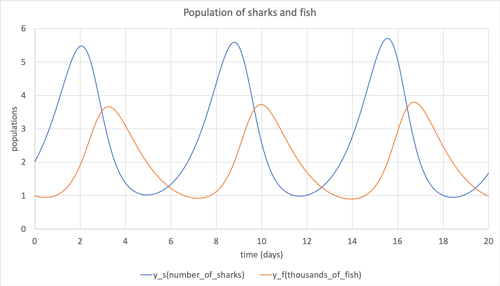

.. _tutorial4_py:

=======================================================
Tutorial 4 Python: Generating code and model simulation
=======================================================

This tutorial assumes that you are comfortable with:

- Interacting with a model and its entities using the API (see :ref:`Tutorial 3<tutorial3_py>`); and
- Using the Generator functionality to output files in C or Python (see :ref:`Tutorial 3<tutorial3_py>`).

By the end of this tutorial you will be able to:

- Interact with files created by the :code:`Generator` to retrieve information for integrating; and
- Use the simple solver provided to numerically integrate the governing equations of the model.

.. contents:: Contents
    :local:

Step 1: Include the generated code in this project
==================================================
In :ref:`Tutorial 3<tutorial3_py>` you created a CellML model representing the population dynamics in a predator-prey situation, and used the :code:`Generator` to write files which can be run using a numerical integration solver in either Python or C.

This tutorial is slightly different from the other ones because you will need to change the way your project is linked in order to include the generated code.
As always, if you didn't complete the earlier tutorial in which the generated code was created, you can use files from the :code:`resources` folder instead.

Because this is for generated code in Python we will need the file:

- :download:`../resources/tutorial3_PredatorPrey.py`

The generated code exists in its own module which can be imported directly into your script for manipulation.
It's best to do this in a general manner, so using the Python :code:`import some_thing as some_alias` idiom you can then use :code:`some_alias` throughout the rest of the code.

.. container:: dothis

    **1.a**  Import the file generated in Tutorial 3 using the aliasing idiom as above.
    Note that this will need to be in the same directory as your script, or a child: you cannot reference it from its current location in the :code:`resources` directory; you'll need to move or copy it here.

.. container:: dothis

    **1.b** The version which the generated code was created with is stored in the module in a variable called :code:`some_alias.LIBCELLML_VERSION`.
    Print this to the terminal and check that it matches the version of libCellML library which you're using, just like in :ref:`Tutorial 0<tutorial0>`.

Step 2: Investigate the information items in the generated files
================================================================
This step is about figuring out what's contained in the generated file, and demonstrating how you can use it to run your simulation.

The implementation code contains some constants as well as functions which make it simple to switch between models for solution.
This tutorial will pretend that you know nothing about the contents of the CellML model for which the file was generated, and take you through connecting it to a general numerical integrator.

Classification of variables
+++++++++++++++++++++++++++
The :code:`Generator` then classifies all the :code:`Variable` items within each :code:`Component` as:

  - *variables* do not require integration, but come in three types:

    - :code:`CONSTANT` variables do not need any kind of calculation;
    - :code:`COMPUTED_CONSTANT` variables need calculation but not integration; and
    - :code:`ALGEBRAIC` variables need ...?? **TODO**

  - *VOI* variables are the base "variables of integration", specified by the :code:`<bvar>` tags in the MathML.
    These must not be initialised.
  - *states* are those variables which do need integration by a solver.

We can see the results of this classification process in the generated code:

.. code-block:: python

  # Inside the generated "tutorial3_PredatorPrey.py" file:

  # Define the VOI variable of integration, its units and the name of its parent component.
  VOI_INFO = {"name": "time", "units": "day", "component": "predator_prey_component"}

  # Define the states: the variables which require integration.
  STATE_INFO = [
    {"name": "y_s", "units": "number_of_sharks", "component": "predator_prey_component"},
    {"name": "y_f", "units": "thousands_of_fish", "component": "predator_prey_component"}
  ]

  # Define the CONSTANT and COMPUTED_CONSTANT variables: these do not require integration.
  VARIABLE_INFO = [
      {"name": "a", "units": "per_day", "component": "predator_prey_component", "type": VariableType.CONSTANT},
      {"name": "b", "units": "per_shark_day", "component": "predator_prey_component", "type": VariableType.CONSTANT},
      {"name": "d", "units": "per_1000fish_day", "component": "predator_prey_component", "type": VariableType.CONSTANT},
      {"name": "c", "units": "per_day", "component": "predator_prey_component", "type": VariableType.COMPUTED_CONSTANT}
  ]

These are accessible in the imported module:

    - :code:`VARIABLE_COUNT` is an integer representing the number of variables (including constants) in the model.
      Note that these are variables which might need calculation, but do not need integration.
    - :code:`VARIABLE_INFO` is an array of :code:`VariableInfoWithType` dictionary, which contains:

        - a :code:`name` field
        - a :code:`units` field
        - a :code:`component` field
        - a :code:`type` enum field

    - the :code:`VARIABLE_INFO` array is :code:`VARIABLE_COUNT` long.

.. container:: dothis

    **2.a** Retrieve the number of variables from the generated module, and print the information related to each of them to the terminal.
    If you aliased your imported module as :code:`model` then these can be accessed using :code:`model.SOMETHING`.

Secondly we have similar information items related to the state variables.
These are:

    - :code:`STATE_COUNT` is an integer representing the number of state variables in the model.
      These are the variables which need to be integrated.
    - :code:`STATE_INFO` is an array of dictionaries, with keys:

        - a :code:`name` field
        - a :code:`units` field
        - a :code:`component` field

    - the :code:`STATE_INFO` array is :code:`STATE_COUNT` long.

.. container:: dothis

    **2.b** Retrieve the number of state variables from the generated code, and print the information related to each of them to the terminal.

The final information stored is the name and attributes of the base integration variable (variable of integration, VOI).
This is stored in :code:`VOI_INFO`, a dictionary with the same keys as the :code:`STATE_INFO` dictionaries.

.. container:: dothis

    **2.c** Retrieve the information about the VOI and print it to the terminal.

Step 3: Investigate the functions provided in the generated files
=================================================================
As well as the information items, the generated module also contains functions which are derived from the governing equations in the MathML blocks in the original CellML model.

In order to perform any kind of numerical integration, a solver needs three things:

    - An array of the current values of all state variables;
    - A way to update the gradient function of each of the state variables as the solution progresses; and
    - A method to move from the current solution position to the next one.

Allocating arrays
+++++++++++++++++
Because we're writing this tutorial based around a general situation, we can use the helper functions provided to allocate these arrays to the right size.
These are:

    - :code:`create_states_array` will allocate an array of length :code:`STATE_COUNT` and values of :code:`nan`.
      This can be used to allocate the array of rates too.
    - :code:`create_variable_array` will allocate an array of length :code:`VARIABLE_COUNT` and values of :code:`nan`.

.. container:: dothis

    **3.a** Allocate three arrays: one for the state variables, one for the rates, and one for the variables.

Defining the initial values
+++++++++++++++++++++++++++
After allocating these arrays, we need to fill them with the information.
In :ref:`Tutorial 3<tutorial3>` we used three equations to define this model:

.. math::

    \frac{dy_s}{dt} =f(sharks, fishes, time) = a y_s + b y_s y_f

    \frac{dy_f}{dt} =f(sharks, fishes, time) = c y_f + d y_s y_f

    c = a - 2.0

with constants :math:`(a, b, d)=(1.2, -0.6, 0.3)` and initial condtions of :math:`y_s(t=0)=2.0` and :math:`y_f(t=0)=1.0`.

If you look inside the module file which was generated in the last tutorial you'll see:

.. code-block:: python

    # Inside the generated "tutorial3_PredatorPrey.py" file:

    def initialize_states_and_constants(states, variables):
      states[0] = 2.0
      states[1] = 1.0
      variables[0] = 1.2
      variables[1] = -0.6
      variables[2] = 0.3

From here we can see the correlation with the initial conditions we specified in Tutorial 3, and the equations above.

.. container:: dothis

    **3.b** Call the :code:`initialize_states_and_constants` function to initalise some of the arrays you created earlier.  Print them to the terminal for checking.

.. container:: NB

    Calling the :code:`initialize_states_and_constants` function does not set the initial value of the other :code:`Variable` objects.

Printing to the terminal should show you that while the CellML :code:`Variable` items representing states and constants for which we specified an initial value have been applied, the constant :code:`c` has not yet been evaluated.
There's a second helper function :code:`compute_computed_constants(variables)` which will do this for you.

.. code-block:: python

    # Inside the generated "tutorial3_PredatorPrey.py" file:
    def compute_computed_constants(variables):
      variables[3] = variables[0]-2.0

.. container:: dothis

    **3.c** Call the :code:`compute_computed_constants` function, and reprint the variables array to the terminal to check that the initial values for all variables have now been set correctly.

Now we're ready to begin solving the model.

Step 4: Iterate through the solution
====================================
You can make use of the :cellsolver:`cellsolver package <>` to solve the generated model, or follow the simple steps below to write your own solver instead.

This part will make use of a simple routine to step through the solution iterations using the Euler method to update the state variables.
Following initialisation of some solution controls (time step, end point) there are three general parts to each iteration:

    - Computing the variables at the current timestep;
    - Computing the gradient functions or rates at the current timestep;
    - Updating the state variables using an Euler\* step.
      \* Note that this could be any stepping method - we just use this one as it's very simple.

.. container:: dothis

    **4.a** Define some variables to control the total number of steps to take, and the size that those steps should be.
    In this example it's safe to use a step of 0.001 and a step count of 2000.

.. container:: dothis

    **4.b** Create an array in which to store the rates.
    Because this will always be the same length as the number of states in the model, you can use the create_states_array function.

.. container:: dothis

    **4.c** Create a file for output and open it.
    We'll simply write the solution directly to the file instead of allocating memory for storage.
    Name your columns with VOI and the state variable names and units.

Specification of the variables
++++++++++++++++++++++++++++++
In each iteration the variables may need to be updated.
In our example we do not have any dependencies (that is, :math:`a, b, c, d` are constants) so the function which updates them is blank here, but this is not true of the general case.

.. code-block:: python

    # Inside the generated "tutorial3_PredatorPrey.py" file
    def compute_variables(voi, states, rates, variables):
      pass

Specification of states and rates
+++++++++++++++++++++++++++++++++
Once a :code:`Variable` has been identified as a *state* variable, it is paired by the :code:`Generator` by its corresponding entry in the :code:`rates` array, which represents its gradient function.

Because the gradients of each of the integrated variables or :code:`states` could include dependency on time or any variable value, it must be updated throughout the solution process.
This is done by calling the :code:`computeRates` function to recalculate the rates for each state variable.

.. code-block:: python

    # Inside the generated "tutorial3_PredatorPrey.py" file:

    def compute_rates(voi, states, rates, variables):
      # The "rates" array contains the gradient functions for each of the variables
      # which are being integrated (the "states").

      # This equation is the equivalent of d(sharks)/dt = a*y_sharks + b*y_sharks*y_fishes.
      rates[0] = variables[0]*states[0]+variables[1]*states[0]*states[1]

      # This equation is the equivalent of d(fishes)/dt = c*y_fishes + d*y_sharks*y_fishes.
      rates[1] = variables[3]*states[1]+variables[2]*states[0]*states[1]

**TODO** Check which order to call these in? rates or variables first?

.. container:: dothis

    **4.d** Iterate through the time interval :math:`[0,20]` and update the state variables using the Euler update method: :code:`y[n+1] = y[n] + y'[n]*stepSize`.
    At each step you will need to:

        - Recompute the variables;
        - Recompute the rates;
        - Compute the state variables using the update method above; and
        - Write to the file.

Step 5: Output
==============

.. container:: dothis

    **5.a** You can retrieve your solution from the file you've written for plotting in your program of choice.
    If all has gone well you should see something similar to that shown in :numref:`sharks_and_fish` below.

   Euler solution to the predator-prey population model.

.. container:: dothis

    **5.b** Go and have a cuppa, you're done!
