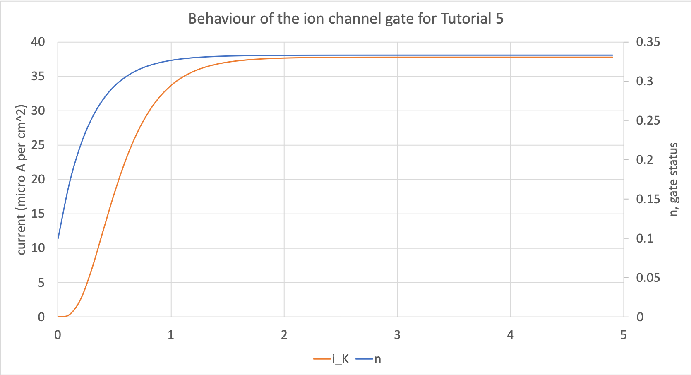

..  _tutorial5_cpp:

=============================================
Tutorial 5 C++: Modelling a gated ion channel
=============================================

If you're reading this it's presumed that you're already comfortable with the serlialisation, mainipulation, and debugging functionality available in the libCellML library.
If not, please see the earlier tutorials which introduce these issues:

- :ref:`Tutorial 1: Reading and writing a CellML file <tutorial1_cpp>`
- :ref:`Tutorial 2: Debugging, error checking, and validation<tutorial2_cpp>`
- :ref:`Tutorial 3: Creating a model using the API<tutorial3_cpp>`

This tutorial is in C++; for the same tutorial in Python please see the :ref:`Tutorial 5 Python<tutorial5_py>` page instead.

.. contents:: Contents
    :local:

Overview
========
The basic steps for model creation and output are the same as those in :ref:`Tutorial 3<tutorial3_cpp>`, but here you'll begin to create a model based on the Hodgkin Huxley model.
All the biological and mathematical modelling background needed for this model are explained in a separate document, :ref:`Understanding the Hodgkin-Huxley model<hh_background>`.

#.  Create a simple model with one component.
    This will represent a gated ion channel, and we'll write it in such a way that we can reuse it later.
#.  Add mathematics to the component.
    This includes writing MathML code as a string and adding it to the component.
#.  Because the maths defined above will need variables, we'll need to add these to the component as well.
#.  Because the quantities modelled have units, we will define what these are, and make sure that they are included in the model too.

As always, the steps discussed here are mirrored by the comments in the code files attached.
You can choose to either create your own code from the structure given in the :code:`tutorial5.cpp` file, or to simply read the
finished code given in the :code:`tutorial5_complete.cpp` file.

Step 0: Setup
=============
Navigate into the :code:`tutorial5` folder and check that you can build the template against the libCellML library successfully:

.. code-block:: console

    cmake -DINSTALL_PREFIX=../../install .
    make -j

Run the template:

.. code-block:: console

    ./tutorial5

Check that you have the output:

.. code-block:: console

    -----------------------------------------------
      STEP 1: Create the model and component
    -----------------------------------------------
    -----------------------------------------------
      STEP 2: Define the mathematical behaviour
    -----------------------------------------------
    -----------------------------------------------
      STEP 3: Define the variables and their units
    -----------------------------------------------
    -----------------------------------------------
      STEP 4: Define the units and add to the model
    -----------------------------------------------
    -----------------------------------------------
      STEP 5: Serialise and print the model
    -----------------------------------------------

Step 1: Create the model and component items
============================================
Following the same procedures as in previous tutorials, our first step is to create new model and component instances.
In this case, we're going to create a component which represents a generic gated ion channel; variations of this gate will be used later on to represent channels for sodium and potassium in neuron models, or calcium in a cardiac model.
There's an introduction to the biological and mathematical theory behind this particular model in :ref:`Understanding the Hodgkin-Huxley model<hh_background>`.

.. container:: dothis

    **1.a** Create a model instance, and name it appropriately.

.. container:: dothis

    **1.b** Create a component, name it, and add the component to the model.

.. container:: dothis

    **1.c** Create a validator and use it to verify that your model has no errors.

Step 2: Define the mathematical behaviour
=========================================
The next step is to define what the component actually *does*.
In this case, its purpose is to represent a collection of gates in series in order to model the channel behaviour.
Let's start with the simple ODE below:

.. math::
    \frac{dn}{dt} = \alpha_y (1-y) - \beta_y y

where :math:`y` is the fraction which is open (so :math:`(1-y)` must be the fraction which is closed), :math:`\alpha_y` is the opening rate, :math:`\beta_y` is the closing rate, and :math:`t` is time.

Now to add this equation into the component we created in Step 1.
Once the maths is created, the process of adding it is very simple, and follows the same pattern as adding anything to anything else: there is a :code:`setMath` command which which does the job nicely.
The more difficult part is creating the maths itself.
This was covered in :ref:`Tutorial 3<tutorial3_cpp>` and there are other resources on the :mathml2help:`W3 resource pages for MathML2 <>` too.

Consider the equation above, converted here into MathML2 format:

Left hand side: :math:`\frac{dn}{dt}`

.. code-block:: xml

            <apply>
                <diff/>
                <bvar>
                    <ci>time</ci>
                </bvar>
                <ci>y</ci>
            </apply>

Right hand side: :math:`\alpha_y (1-y) ...`

.. code-block:: xml

            <apply> <!-- Note opening apply block is closed under the left hand side equation. -->
                <minus/>
                <apply>
                    <times/>
                    <ci>alpha_y</ci>
                    <apply>
                        <minus/>
                        <cn cellml:units="dimensionless">1</cn>
                        <ci>y</ci>
                    </apply>
                </apply>

:math:`... - \beta_y y`  **NB** The negative comes from the first :code:`minus` operation in the block above, indicating that the block below subtracted from the one above.

.. code-block:: xml

                <apply>
                    <times/>
                    <ci>beta_y</ci>
                    <ci>y</ci>
                </apply>
            </apply> <!-- Note that the extra closing apply block matches RHS equation. -->

All of this needs to be wrapped inside the :code:`<math>` tags, which will include a namespace definition, as well as the initial :code:`<apply>` and :code:`<eq/>` tags to assign the left and right-hand sides of the equation:

.. code-block:: xml

    <math xmlns="http://www.w3.org/1998/Math/MathML"
            cellml="http://www.cellml.org/cellml/2.0#">
        <apply>
            <eq/>
                ...
        </apply>
    </math>

.. container:: NB

    **libCellML will only take MathML2 format**, and **not** the more recent MathML3 or MathML4 formats, which are targetted at presentation rather than content alone.

.. container:: dothis

    **2.a** Create the MathML string(s) representing the equations below.

.. math::
    \frac{dn}{dt} = \alpha_y (1-y) - \beta_y y

    i_K = g_K y^{\gamma} (V-E_K)

... where :math:`\alpha_K` and :math:`\beta_K` are the rate constants for the opening and closing of the gate, :math:`g_K` is the open channel conductance, :math:`y` is the fraction of open gates, and :math:`\gamma` is the number of gates which exist in series in the channel, :math:`V` is the transmembrane voltage, and :math:`i_K` is the current flow through the channel.

Three functions are available for accessing and editing the math block, these are:

- :code:`setMath(input)` replaces the existing Math string with the :code:`input` string;
- :code:`appendMath(input)` adds the :code:`input` string to the existing Math string; and
- :code:`math()` returns the stored Math string.

.. container:: NB

    **Note** that there is only one MathML block stored per component.
    Even if there is more than one equation, they're all stored as one single concatenated string.

.. container:: dothis

    **2.b** Use the manipulation functions listed above to add your string(s) to the component you created in step 1.a.

.. container:: dothis

    **2.c** Submit your model to the validator.
    Expected errors at this stage will be similar to those below, relating to as yet undefined variables and units.

.. code-block:: console

     Description: MathML ci element has the child text 'alpha_y' which does not
        correspond with any variable names present in component
        'HodgkinHuxleySingleIonChannel' and is not a variable defined within a bvar
        element.
     Description: Math has a cn element with a cellml:units attribute
        'per_millivolt_millisecond' that is not a valid reference to units in
        component 'HodgkinHuxleySingleIonChannel' or a standard unit.

Step 3: Define the variables and their units
============================================
Now that the mathematical behaviour is defined, the variables that have been used also need to be defined.
Each variable needs a name which is equal to the term inside the :code:`<ci>` tags in the MathML, as well as units defined in
the model.

.. container:: dothis

    **3.a** Use the validator output or the MathML you've written to determine the variables which you'll need to declare.
    These must be created, named, and added to the component.
    Need help? See :ref:`Tutorial 2<tutorial2_cpp>`.

.. container:: NB

    **Note** Remember that the names you give the variables in this step must be the same as the names used between the code:`<ci>` tags inside your MathML string.

As well as a name and a parent component, each variable needs units.
These are specified using the :code:`setUnits` function for a variable, just as you did in :ref:`Tutorial 3<tutorial3_cpp>`.
The units and their relevant variables are:

- time, :math:`t`, has units of :code:`millisecond`;
- voltage, :math:`V`, has units of :code:`millivolt`;
- opening rate, :math:`\alpha_y` has units :code:`per_millisecond`; and
- closing rate, :math:`\beta_y` has units :code:`per_millisecond`.

.. container:: dothis

    **3.b** For each of the variables created in step 3.a, use the :code:`setUnits(name)` function to add the units you'll need.

Even though the final variable in our equations has no units, CellML 2 requires every variable to have units defined.
For the proportion of open gates :math:`y` use the units name :code:`dimensionless`.

.. container:: dothis

    **3.c** Submit your model to the validator.
    Expected errors at this stage will be similar to those below.

.. code-block:: console

     - Description: Variable 'time' has an invalid units reference 'millisecond'
       that does not correspond with a standard unit or units in the variable's
       parent component or model. See section 11.1.1.2 in the CellML specification.
     - Description: Math has a cn element with a cellml:units attribute 'millivolt'
       that is not a valid reference to units in component
       'HodgkinHuxleySingleIonChannel' or a standard unit.

Step 4: Define the units and add to the model
=============================================
The variables created above referenced unit names of :code:`millisecond`, :code:`millivolt`, :code:`per_millisecond`, and :code:`dimensionless`.
The :code:`dimensionless` units are already present, so we don't need to take any other action, but the other three need to be created and added.
This process was covered in :ref:`Tutorial 3<tutorial3_cpp>`.

.. container:: dothis

    **4.a** Create the three units you need for this component, name them, and define them.

.. container:: dothis

    **4.b** Add all the new units into the model.
    Adding units to the model allows other components (when you have them!) to use them as well.

.. container:: dothis

    **4.c** Link units and validate the model configuration.
    When you encounter errors related to missing units that you've actually added, you need to call the :code:`ModelPtr::linkUnits()` function.
    This function cleans up the referencing of units which were added (by name) to a variable before their corresponding :code:`Units` item existed in the model.
    If you still encounter validation errors, you can compare the code you've created to that provided in the :code:`resources/tutorial5/tutorial5_complete.cpp` file.

Step 5: Generate the model
==========================
The final steps are to output our created model to a CellML2 file (which will be used in subsequent tutorials, so be sure to name it something meaningful!) as well as generating the C or Python files which we can use to investigate this component's operation in isolation.
We will do the code generation step first to take advantage of the additional error checks present inside the :code:`Generator`.

.. container:: dothis

    **5.a** Create a :code:`Generator` item and submit the model for processing.

.. container:: dothis

    **5.b** Check the :code:`Generator` for errors.
    At this stage you can expect errors related to non-initialised variables.

.. container:: dothis

    **5.c** Go back and set the following initial conditions:

    - :math:`V(t=0)=0`
    - :math:`y(t=0)=0`
    - :math:`E_K(t=0)=-85`
    - :math:`g_K(t=0)=36`
    - :math:`\gamma(t=0)=4`
    - :math:`\alpha_y(t=0)=1`
    - :math:`\beta_y(t=0)=2`

.. container:: dothis

    **5.d** Reprocess the model and check that it is now free of errors.

Step 6: Output the model
========================

.. container:: dothis

    **6.a** Retrieve the output code from the :code:`Generator`, remembering that for output in C you will need both the :code:`interfaceCode` (the header file contents) as well as the :code:`implementationCode` (the source file contents).
    Write the files.

The second step is the same as what was covered at the end of :ref:`Tutorial 2<tutorial2_cpp>` to use the :code:`Printer`; you can refer back to the code and/or instructions there if you need to.

.. container:: dothis

    **6.b** Change the generator's profile to Python and reprocess the model.

.. code-block:: cpp

    // Change the generated language from the default C to Python if need be
    auto profile =
        libcellml::GeneratorProfile::create(libcellml::GeneratorProfile::Profile::PYTHON);
    generator->setProfile(profile);

.. container:: dothis

    **6.c** Output the Python version of the model to a file, remembering that you will only need to retrieve the implementation code for the Python profile.

.. container:: dothis

    **6.d** Create a :code:`Printer` item and submit your model for serialisation.

.. container:: dothis

    **6.e** Write the serialised string output from the printer to a file.

.. container:: dothis

    **6.f** Check that your files have been written correctly.
    You should have both sets of generated files (:code:`*.c/h` as well as :code:`*.py`) and the :code:`*.cellml` file.

Step 7: Simulate the behaviour of the gate
==========================================
At this stage you should have some new files created:

- The CellML file of your model (this will be used in later tutorials as you work toward building the whole Hodgkin-Huxley model);
- The generated file for the Python profile (an example for changing profiles only); and
- the generated files for the C profile, the header and source files.

These last three files can be used in conjuction with a simple solver to model the behaviour of this ion channel.
Because this tutorial is in C++ we give instructions for the C++ solver.
For the Python solver please see :ref:`the Python Tutorial 5 instructions<tutorial5_py>` or :ref:`the general solver instructions<solver>`.

.. container:: dothis

    **6.a** Navigate to the :code:`tutorials/solver` directory.

.. code-block:: console

  cd ../solver

Because the code you've generated needs to be built at the same time as the solver code is built, each different model requires rebuilding a new solver executable which includes the generated code.

.. container:: dothis

  **6.b**
  From inside the :code:`tutorials/solver` directory, use the CMake command line to point to your generated files.
  **NB** It's assumed that both of the header and source files have the same base filename (eg: :code:`baseFileName.c` and :code:`baseFileName.h`).
  The general CMake command is below.

.. code-block:: console

  cmake -DINPUT=../tutorial5/baseFileName .

.. container:: NB

  Note that the fullstop in the cmake command sets both the source and binary directories to the solver directory.
  This is because even though your generated files are elsewhere, the solver code and CMakeLists.txt file are in *this* directory, and the executable will end up here too.

If all has gone well you should see the output similar to:

.. code-block:: console

    -- The C compiler identification is AppleClang 10.0.1.10010046
    -- The CXX compiler identification is AppleClang 10.0.1.10010046
    -- Check for working C compiler: /Library/Developer/CommandLineTools/usr/bin/cc
    -- Check for working C compiler: /Library/Developer/CommandLineTools/usr/bin/cc -- works
    -- Detecting C compiler ABI info
    -- Detecting C compiler ABI info - done
    -- Detecting C compile features
    -- Detecting C compile features - done
    -- Check for working CXX compiler: /Library/Developer/CommandLineTools/usr/bin/c++
    -- Check for working CXX compiler: /Library/Developer/CommandLineTools/usr/bin/c++ -- works
    -- Detecting CXX compiler ABI info
    -- Detecting CXX compiler ABI info - done
    -- Detecting CXX compile features
    -- Detecting CXX compile features - done

    1) First use 'make -j' to build the file for running
    2) Then solve by running: ./solve_baseFileName with the arguments:
      -n  step_total
      -dt step_size

    -- Configuring done
    -- Generating done
    -- Build files have been written to: /path/to/your/stuff/tutorials/solver

.. container:: dothis

  **6.c** Following the instructions in the output, next you need to build the executable by entering:

  .. code-block:: console

    make -j

.. container:: dothis

  **6.d** Finally you're ready to solve your model.
  The executable will have been given the prefix :code:`solve_` and then your :code:`baseFileName`, and can be run using the command line flags :code:`-n` to indicate the number of steps to run, and :code:`-dt` to indicate the step size, for example:

  .. code-block:: console

    ./solve_baseFileName -n 50 -dt 0.1

The parameters read from the file, along with your command line arguments are printed to the terminal for checking, and the results of the simulation written to a tab-delimited file with the extension :code:`_solution.txt` after your base file name.

Running your generated model for 50 steps with a step size of 0.1ms results in the solution shown below in :numref:`tutorial5_image`.

    Behaviour of the current and ion channel status with time.
