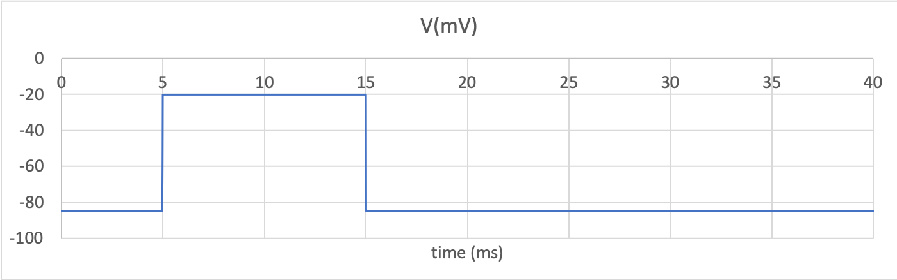
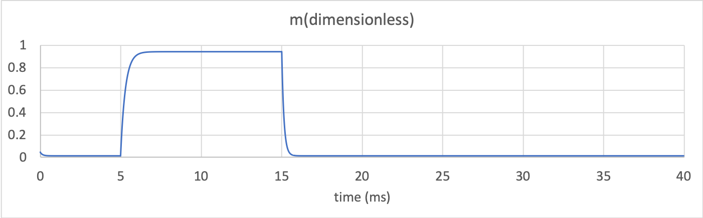
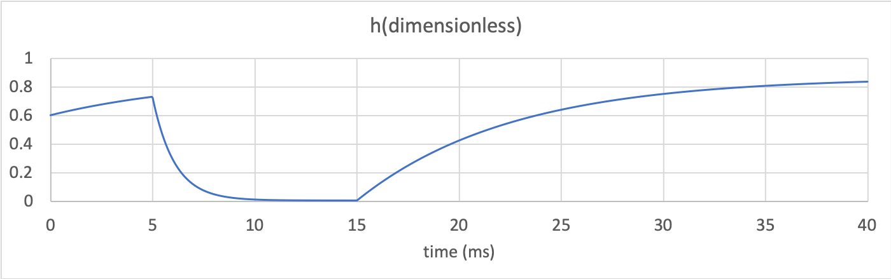
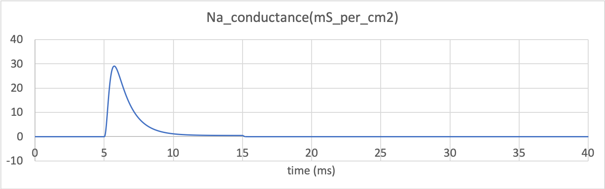
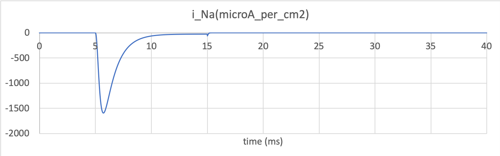

.. _tutorial7_cpp:

===========================================
Tutorial 7 C++: Creating the sodium channel
===========================================

The outline for this tutorial is shown on the :ref:`Tutorial 7<tutorial7>`
page. These are the C++ instructions.  For the same tutorial in Python
please see the :ref:`Tutorial 7 in Python<tutorial7_py>` page instead.

Resources:

    - :download:`CMakeLists.txt` The CMake file for building this tutorial
    - :download:`tutorial7.cpp` Either the skeleton code, or ..
    - :download:`tutorial7_complete.cpp` the completed tutorial code
    - :download:`../utilities/tutorial_utilities.h` and
      :download:`../utilities/tutorial_utilities.cpp`  Utility functions for
      use in the tutorials.
    - If you did not complete Tutorial 5 you can download the file created there:
      :download:`../resources/tutorial7_SodiumChannelModel.cellml`

.. contents:: Contents
    :local:

0: Setup
========

.. container:: dothis

    **0.a** Create a model instance and name it appropriately.

.. container:: dothis

    **0.b** Create a validator for later use.

1: Create the sodium channel component
======================================

.. container:: dothis

    **1.a** Create a component instance for the sodium channel and name it
    appropriately.  Add the component to the model.

.. container:: dothis

    **1.b** Add the mathematics to this component according to:

.. math::

    Na_{conductance} = g_{Na} h m^{3}

    i_{Na} = Na_{conductance} (V-E_{Na})

.. container:: dothis

    **1.c** Call the validator and print its debugging information.  This will
    help to summarise the variables which you need to add:

- :math:`V` voltage, mV
- :math:`t` time, ms
- :math:`h` h-gate status, dimensionless
- :math:`m` m-gate status, dimensionless
- :math:`g_{Na} \;\; mS/cm^2`, (ie: milli-Siemens per square centimetre),
  initially 120
- :math:`E_{Na} \;\; mV`, initially 35
- :math:`i_{Na} \;\; \mu A/cm^2`, (ie: micro-Amperes per square centimetre)
- :math:`Na_{conductance}  \;\;  mS/cm^2`

.. container:: dothis

    **1.d** Again call the validator to list the units you will need to add to
    the parent model.  Remember that these will include the units of any constant
    values present in the MathML block too.

.. container:: dothis

    **1.e** Validate that the model is now free of errors.

2: Create the m-gate component
==============================

.. container:: dothis

    **2.a** Create a new component for the m-gate and name it appropriately.

.. container:: dothis

    **2.b** Create the MathML required to represent the mathematics governing
    the m-gate, as in three equations shown below, and add to the component.
    Remember that you will need to add the appropriate units to the constants to
    ensure consistency throughout.

.. math::

    \alpha_m = \frac {-0.1(V+50)}{e^{-0.1(V+50)}-1}

    \beta_m = 4 e^{\frac {-(V+75)} {18}}

    \dot m = \frac {dm}{dt} = \alpha_m(1-m)-m\beta_m

.. container:: dothis

    **2.c** Call the validator and use it to summarise the variables you need
    to add into this component, along with their units and initial conditions.

- :math:`V` voltage, mV
- :math:`t` time, ms
- :math:`\alpha_m` rate constant, 1/ms
- :math:`\beta_m` rate constant, 1/ms
- :math:`m` gate status, dimensionless, initially 0.05

.. container:: dothis

    **2.d** Call the validator and use it to list any remaining units which
    are not yet defined in the model.  Add them in as needed.

.. container:: dothis

    **2.e** Validate that the model is now free of errors.

3: Create the h-gate component
==============================

.. container:: dothis

    **3.a-c** Repeat the procedure above to create the h-gate component and add
    it to the model.  Its governing equations are:

.. math::

    \alpha_h = 0.07 e^{-0.05(V+75)}

    \beta_h = \frac {1} {e^{-0.1(V+45)} + 1}

    \dot {h} = \frac {dh} {dt} = \alpha_h (1-h) - h\beta_h

where:

- :math:`\alpha_h` rate constant, 1/ms
- :math:`\beta_h` rate constant, 1/ms
- :math:`V` voltage, mV
- :math:`t` time, ms
- :math:`h` gate status, dimensionless, initially 0.6

.. container:: dothis

    **3.d** Check that the model is valid to this point.

4: Create the environment component
===================================
As in the previous :ref:`Tutorial 5<tutorial5_cpp>` we need to create an
environment component which we'll use to control the time and voltage in which
the channels operate.  As before we define two variables:

- :math:`V` voltage, mV
- :math:`t` time, ms

We will add the driving function later.

.. container:: dothis

    **4.a** Define the environment component, including its variables, and add
    to the model.  Call the validator to check that the model is still free of
    errors.

5: Connect the components
=========================
At this stage we should have three components in the hierarchy below:
::

    |--- the model
       |--- the environment component
       |--- the sodium channel component
          |--- the m-gate component
          |--- the h-gate component

You can use the :code:`printModelToTerminal` utility function to check that
this is indeed the structure that you have.

Just as we did before, we need to connect the environment variables throughout
the rest of the components.  Recall from :ref:`Tutorial 5<tutorial6_cpp>` that:

- only immediate siblings, children, and parents can be connected
- the kind of interface depends on the relationship between components.

.. container:: dothis

    **5.a** This model involves sharing several variables between components.
    For each of them, create the appriopriate variable equivalence using the
    :code:`libcellml::Variable::setVariableEquivalence` function.  The shared
    variables are:

- :math:`V` voltage
- :math:`t` time
- :math:`h` h-gate status
- :math:`m` m-gate status

.. container:: dothis

    **5.b** For each of the variables you connected in 5.a, set their
    appropriate interface type using the :code:`setInterfaceType` function.

6: Set the driving function
===========================
The last step in defining your model behaviour is the driving function.  As in
the other tutorials, this is a voltage clamp such that the voltage is held at
a value of -20mV in the interval 5ms < t < 15 ms and -85mV otherwise.
Recall that this driving function applies to the variables in the environment
component: the variable connections you have established in 5.a will propagate
these values throughout the model.

.. container:: dothis

    **6.a** Write the MathML required for the driving function behaviour above.
    You will need to use the :code:`<piecewise>` function.

.. container:: dothis

    **6.b** Validate the final model and confirm that it is error free.

7: Set the initial conditions
=============================

.. container:: dothis

    **7.a** Set the initial conditions for the solver.  These are:

    .. math::

          g_{Na}(t=0) = 120 \\
          E_{Na}(t=0) = 35 \\
          h(t=0)=0.6 \\
          m(t=0)=0.05 \\

8: Generate and output the model
===================================
The last step is to output the model.  As previously, this happens in two ways:
the generation of code that can be solved here, and the serialisation and
printing of the model to a CellML file for use in later tutorials.

.. container:: dothis

    **8.a** Create a :code:`Generator` instance and submit the model for
    processing.  Check that there are no errors found during the processing.

.. container:: dothis

    **8.b** Write the interface code (.h header) and implementation code
    (.c source) to files.

.. container:: dothis

    **8.c**  Create a `GeneratorProfile` and use it to change to Python.
    Reprocess the model, and write the implementation code (.py source) to
    a file.

.. container:: dothis

    **8.d** Create a :code:`Printer` to serialise your model, and output it
    to a CellML file.

9: Run the model
================
You can solve the model to simulate the dynamics of the sodium gate using the
supplied solver.  Instructions for running this are given on the
:ref:`Simple solver for generated models<solver>` page.  You should see the
behaviour shown in the figures below.  The theory of this channel's operation
is given in :ref:`Theory of the sodium channel<theory_sodiumchannel>`.

   Driving function for the voltage clamp

   m-gate dynamics

   h-gate dynamics

   Sodium conductance

   Sodium current
