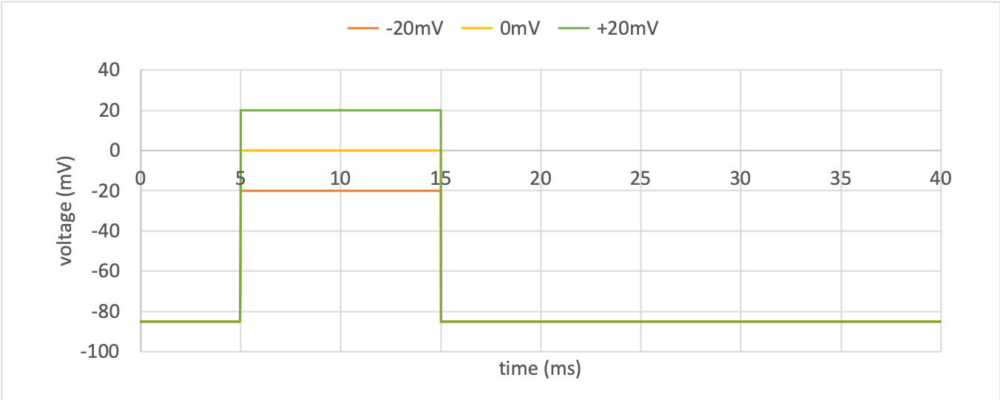
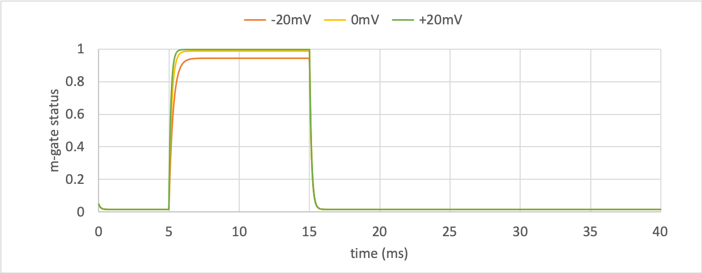
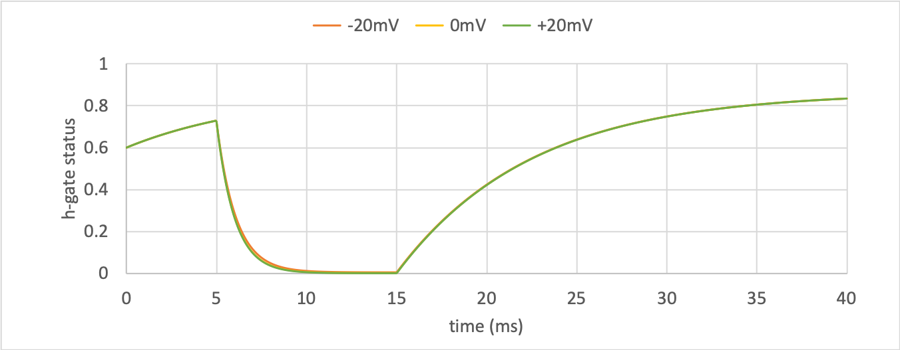
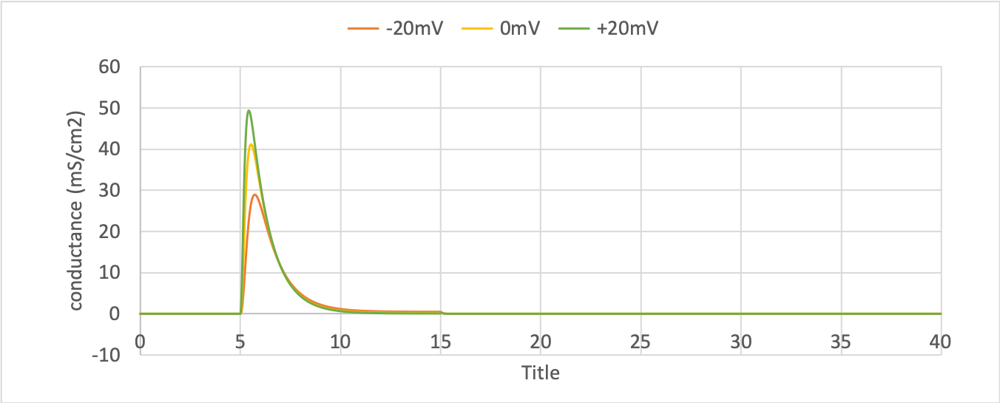
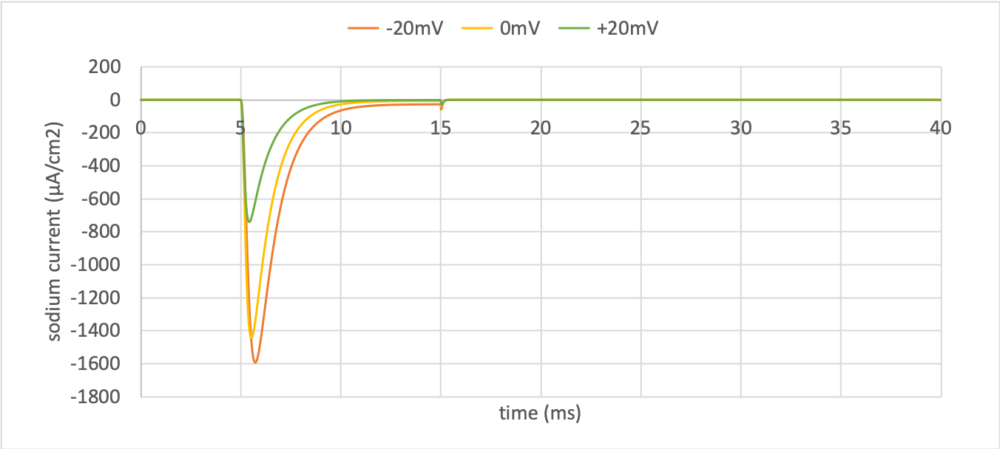

.. _tutorial7_py:

==============================================
Tutorial 7 Python: Creating the sodium channel
==============================================

The outline for this tutorial is shown on the :ref:`Tutorial 7<tutorial7>` page.
These are the Python instructions.
For the same tutorial in C++ please see the :ref:`Tutorial 7 in C++<tutorial7_cpp>` page instead.

**Resources:**

    - :download:`tutorial7.py` Either the skeleton code, or :download:`tutorial7_complete.py` the completed tutorial code;
    - :download:`../utilities/tutorial_utilities.py`  Utility functions for use in the tutorials; and
    - :download:`../resources/tutorial7_resources.cellml` An external controller model.

.. contents:: Contents:
    :local:

Step 1: Create the sodium channel component
===========================================

.. container:: dothis

    **1.a** Create a model and name it appropriately.

.. container:: dothis

    **1.b** Create a component instance for the sodium channel and name it appropriately.
    Add the component to the model.

.. container:: dothis

    **1.c** Add the mathematics to this component according to the equations shown below (if you need to, you can copy the code from the "Show code" link below).
    Call the validator, expecting errors related to missing variables.

.. math::

    Na_{conductance} = g_{Na} h m^{3} \\

    i_{Na} = Na_{conductance} (V-E_{Na})

.. container:: toggle

    .. container:: header

        Show code

    .. code-block:: python

        equation1 = \
            '  <apply><eq/>\n'\
            '    <ci>Na_conductance</ci>\n'\
            '    <apply><times/>\n'\
            '      <ci>g_Na</ci>\n'\
            '      <ci>h</ci>\n'\
            '      <apply><power/>\n'\
            '        <ci>m</ci>\n'\
            '        <cn cellml:units="dimensionless">3</cn>\n'\
            '      </apply>\n'\
            '    </apply>\n'\
            '  </apply>\n'

        equation2 = \
            '  <apply><eq/>\n'\
            '    <ci>i_Na</ci>\n'\
            '    <apply><times/>\n'\
            '      <ci>Na_conductance</ci>\n'\
            '      <apply><minus/>\n'\
            '        <ci>V</ci>\n'\
            '        <ci>E_Na</ci>\n'\
            '      </apply>\n'\
            '    </apply>\n'\
            '  </apply>\n'

.. container:: dothis

    **1.d** Add the missing variables as listed by the validator.
    Validate the model again, expecting errors related to missing units.

.. container:: dothis

    **1.e** Add the units are required by the validator.

.. container:: dothis

    **1.f** Link the model's units, and validate that the model is now free of errors.

Step 2: Create the m-gate component
===================================

.. container:: dothis

    **2.a** Create a new component for the m-gate and name it appropriately.
    Add the m-gate component to the sodium channel component.

.. container:: dothis

    **2.b** Create the MathML required to represent the mathematics governing
    the m-gate, as in three equations shown below, and add to the component.
    Remember that you will need to deduce the appropriate units to the constants to
    ensure consistency throughout.
    If needed you can access the code under the "Show code" link.

.. math::

    \alpha_m = \frac {-0.1(V+50)}{e^{-0.1(V+50)}-1} \\

    \beta_m = 4 e^{\frac {-(V+75)} {18}} \\

    \dot m = \frac {dm}{dt} = \alpha_m(1-m)-m\beta_m \\

.. container:: toggle

    .. container:: header

        Show code

    .. code-block:: python

        equation1 = \
            '  <apply><eq/>\n'\
            '    <ci>alpha_m</ci>\n'\
            '    <apply><divide/>\n'\
            '      <apply><times/>\n'\
            '        <cn cellml:units="per_mV_ms">0.1</cn>\n'\
            '        <apply><plus/>\n'\
            '          <ci>V</ci>\n'\
            '          <cn cellml:units="mV">25</cn>\n'\
            '        </apply>\n'\
            '      </apply>\n'\
            '      <apply><minus/>\n'\
            '        <apply><exp/>\n'\
            '          <apply><divide/>\n'\
            '              <apply><plus/>\n'\
            '                <ci>V</ci>\n'\
            '                <cn cellml:units="mV">25</cn>\n'\
            '              </apply>\n'\
            '            <cn cellml:units="mV">10</cn>\n'\
            '          </apply>\n'\
            '        </apply>\n'\
            '        <cn cellml:units="dimensionless">1</cn>\n'\
            '      </apply>\n'\
            '    </apply>\n'\
            '  </apply>\n'

        equation2 = \
            '  <apply><eq/>\n'\
            '    <ci>beta_m</ci>\n'\
            '    <apply><times/>\n'\
            '      <cn cellml:units="per_ms">4</cn>\n'\
            '      <apply><exp/>\n'\
            '        <apply><divide/>\n'\
            '          <ci>V</ci>\n'\
            '          <cn cellml:units="mV">18</cn>\n'\
            '        </apply>\n'\
            '      </apply>\n'\
            '    </apply>\n'\
            '  </apply>\n'

        equation3 = \
            '  <apply><eq/>\n'\
            '    <apply><diff/>\n'\
            '      <bvar>\n'\
            '        <ci>t</ci>\n'\
            '      </bvar>\n'\
            '      <ci>m</ci>\n'\
            '    </apply>\n'\
            '    <apply><minus/>\n'\
            '      <apply><times/>\n'\
            '        <ci>alpha_m</ci>\n'\
            '        <apply><minus/>\n'\
            '          <cn cellml:units="dimensionless">1</cn>\n'\
            '          <ci>m</ci>\n'\
            '        </apply>\n'\
            '      </apply>\n'\
            '      <apply><times/>\n'\
            '        <ci>m</ci>\n'\
            '        <ci>beta_m</ci>\n'\
            '      </apply>\n'\
            '    </apply>\n'\
            '  </apply>\n'

.. container:: dothis

    **2.c** Call the validator and use it to summarise the variables that are missing.
    Add these variables to the component.

.. container:: dothis

    **2.d** Call the validator and use it to list any remaining units which
    are not yet defined in the model.
    Add them in as needed.

.. container:: dothis

    **2.e** Link the model's units and validate that the model is now free of errors.

Step 3: Create the h-gate component
===================================

.. container:: dothis

    **3.a-c** Repeat the procedure above to create the h-gate component and add it to the model.
    Its governing equations are shown below.

.. math::

    \alpha_h = 0.07 e^{-0.05(V+75)} \\

    \beta_h = \frac {1} {e^{-0.1(V+45)} + 1} \\

    \dot {h} = \frac {dh} {dt} = \alpha_h (1-h) - h\beta_h

where:

- :math:`\alpha_h` rate constant, 1/ms
- :math:`\beta_h` rate constant, 1/ms
- :math:`V` voltage, mV
- :math:`t` time, ms
- :math:`h` gate status, dimensionless.

.. container:: toggle

    .. container:: header

        Show code

    .. code-block:: python

        equation1 = \
            '  <apply><eq/>\n'\
            '    <ci>alpha_h</ci>\n'\
            '    <apply><times/>\n'\
            '      <cn cellml:units="per_ms">0.07</cn>\n'\
            '      <apply><exp/>\n'\
            '        <apply><divide/>\n'\
            '          <ci>V</ci>\n'\
            '          <cn cellml:units="mV">20</cn>\n'\
            '        </apply>\n'\
            '      </apply>\n'\
            '    </apply>\n'\
            '  </apply>\n'

        equation2 = \
            '  <apply><eq/>\n'\
            '    <ci>beta_h</ci>\n'\
            '    <apply><divide/>\n'\
            '      <cn cellml:units="per_ms">1</cn>\n'\
            '      <apply><plus/>\n'\
            '        <apply><exp/>\n'\
            '          <apply><divide/>\n'\
            '            <apply><plus/>\n'\
            '              <ci>V</ci>\n'\
            '              <cn cellml:units="mV">30</cn>\n'\
            '            </apply>\n'\
            '            <cn cellml:units="mV">10</cn>\n'\
            '          </apply>\n'\
            '        </apply>\n'\
            '        <cn cellml:units="dimensionless">1</cn>\n'\
            '      </apply>\n'\
            '    </apply>\n'\
            '  </apply>\n'

        equation3 = \
            '  <apply><eq/>\n'\
            '    <apply><diff/>\n'\
            '       <bvar>\n'\
            '         <ci>t</ci>\n'\
            '       </bvar>\n'\
            '       <ci>h</ci>\n'\
            '    </apply>\n'\
            '    <apply><minus/>\n'\
            '      <apply><times/>\n'\
            '        <ci>alpha_h</ci>\n'\
            '        <apply><minus/>\n'\
            '          <cn cellml:units="dimensionless">1</cn>\n'\
            '          <ci>h</ci>\n'\
            '        </apply>\n'\
            '      </apply>\n'\
            '      <apply><times/>\n'\
            '        <ci>h</ci>\n'\
            '        <ci>beta_h</ci>\n'\
            '      </apply>\n'\
            '    </apply>\n'\
            '  </apply>\n'

.. container:: dothis

    **3.d** Check that the model is free of errors to this point.

Step 4: Import the controller and parameters components
=======================================================
In :ref:`Tutorial 6<tutorial6_py>` we separated the mathematics from the values of the variables, and used the :code:`Parser` to read an external controller model containing the initialisation information.
In this tutorial, we will introduce the :code:`ImportSource` and importing functionality, which can be used to the same purpose.

When an item - either :code:`Component` or :code:`Units` - is imported from one model into another, three ingredients are needed:

    - An :code:`ImportSource` instance which does the work;
    - The name of the item to be retrieved from the source model; and
    - A destination item (:code:`Component` or :code:`Units`) in which to store the imported item.

.. container:: dothis

    **4.a** Create a pointer to an :code:`ImportSource` item.

.. code-block:: python

   importer = ImportSource()

.. container:: dothis

    **4.b** Use the :code:`ImportSource.setUrl()` function to point the importer to the file containing the controller, :code:`tutorial7_controller.cellml`.

.. container:: dothis

    **4.c** Create the destination component into which the imported component will be saved, and name it as usual.
    This will be the controller component, and should sit at the top level of the model's encapsulation hierarchy, as a child of the model itself.

Now that we've created a source as well as a destination for the imported controller component, we need to link the two of them together.
This is done using a function in the destination component called :code:`setSourceComponent` which takes two arguments:

- The :code:`ImportSource` item you created in step 4.a; and
- A string, which is the name of the item to retrieve from that import source.

.. container:: dothis

    **4.d** Set the source component for the destination controller component which you created in 4.c using the :code:`setSourceComponent` function.
    The name of component to retrieve (the second argument) is "controller".

.. container:: dothis

    **4.e** Repeat the above processes to import the component called "parameters" from the same file.
    Note that since they're in the same file, you can reuse the ImportSource instance, and simply repeat steps 4.c-d.

.. container:: dothis

    **4.f** Validate your model, and expect that there are no errors.

Step 5: Import the initial conditions and parameters
====================================================

When you import something, it isn't instantiated in the model properly until the model is flattened.
Because it's easier to work with unflattened models later on (if you want to vary their ingredients etc), you will probably find that you need to connect imported components to local ones, or to other imported ones before the model is flattened.
This creates a problem as the variables in those imported components can't yet be referenced.
The way around this is to create "dummy" variables in the imported component placeholders you created (as in step 4.c, for example).
Note that these need to have the same name as the variables in the import, and will be over-written by the "real" ones when the model is flattened.

.. container:: dothis

    **5.a** Create the dummy variables as you would normally, and add them to the imported components.
    These are:

    - parameters: h, m, E_Na, g_Na
    - controller: t, V

.. container:: dothis

    **5.b** Add the equivalent variable connections throughout the model.
    Recall from :ref:`Tutorial 6<tutorial6_py>` that you can only create connections between components which have a sibling or parent/child relationship.

.. container:: dothis

    **5.c** Validate the model, and expect to see errors relating to unspecified interface types.
    Add the recommended interface types to the variables.

.. container:: dothis

    **5.d** Even though it won't be used in this tutorial, we need to set the interface types on any variable in the sodium channel component that will need to be accessible to other components later.
    It's worth thinking about these at the time of writing the component, as it increases its reusability and usefulness later on.
    In this case, we'll only need to set the :code:`i_Na` sodium current variable to have a public interface.

At this stage our model can be written to a CellML file.
As the model contains import statements, the serialised and printed model would also maintain those same dependencies, and would need to exist alongside the :code:`tutorial7_controller.cellml` file specified earlier.
In later steps we'll disconnect this dependency ("flattening" the model) to allow for the code generation step.

.. container:: dothis

    **5.e** Check that the model is valid, then create a :code:`Printer`, and use it to serialise the model.
    Write the serialised model to a file.

Step 6: Resolve the imports and flatten the model
=================================================
Once the import sources and destinations are specified, we need to also point the model to the directory in which they sit.
This is done using the :code:`resolveImports()` function of the model, with the argument of the directory path to the imported file(s).

.. container:: dothis

    **6.a** Use the :code:`resolveImports()` function to specify the (relative to the current working directory, or absolute) path to the directory in which the :code:`tutorial7_controller.cellml` file is found.
    If this is the same as your working directory, simply enter an empty string, :code:`""`.
    Once that is done, use the :code:`Model.hasUnresolvedImports()` function to check whether or not the model imports have been found.

Finally it's time to flatten the model so that it can be used to generate runnable code.
This operation will create new local instances of all of the imported items, thereby removing the model's dependency on imports.

.. container:: dothis

    **6.b** Call the :code:`flatten()` function on the model, and then print it to the terminal for checking.
    You should see a structure similar to that shown below.

.. code-block:: text

    ─ model
        ├─ component: controller
        ├─ component: parameters
        └─ component: sodium channel
            ├─ component: h-gate
            └─ component: m-gate

.. container:: gotcha

    Flattening a model completely over-writes the "import" version with the "flat" version.
    This means that any imported items which you'd previously assigned to pointers (such as the components defined as destinations for the imports: the controller and parameters components) are now obsolete.
    **TODO** Check if this is true?? all components or only imported ones??
    The easiest thing to do is to refresh all pointers by re-fetching them from the flattened model:

    .. code-block:: python

        from libcellml import Component, Model

        myModel = Model()
        myModel.setName("myModel")

        myComponent = Component()
        myComponent.setName("myComponent")
        myModel.addComponent(myComponent)

        #Flattening the model over-writes all references:
        myModel.flatten()

        # Re-fetching the pointer after flattening:
        myComponent = myModel.component("myComponent")

.. container:: dothis

    **6.c** Following the example above, re-fetch the component pointers which you created earlier.

.. container:: dothis

    **6.d** Link the units and validate the model a final time.
    Expect no errors.

Step 7: Generate and output the model
=====================================
As we've done several times before, it's time to generate the runnable model code.

.. container:: dothis

    **7.a** Create a :code:`Generator` instance and submit the model for
    processing.
    Check that there are no errors found during this processing.

.. container:: dothis

    **7.b** Retrieve and write the interface :code:`*.h` code and implementation :code:`*.c` code to files.

.. container:: dothis

    **7.c**  Change the generator profile to Python and reprocess the model

.. container:: dothis

    **7.d** Retrieve and write the implementation code :code:`*.py` to a file.

Step 8: Run the simulation
==========================
You can solve the model to simulate the dynamics of the sodium gate using the supplied solver.
Instructions for running this are given on the :ref:`Simple solver for generated models<solver>` page, as well as in previous tutorials.
You should see the behaviour shown in the figures below by the red line representing a voltage step to -20mV.
The theory of this channel's operation is given in :ref:`Theory of the sodium channel<theory_sodiumchannel>`.

   Driving function for the voltage clamp

   m-gate dynamics

   h-gate dynamics

   Sodium conductance

   Sodium current
