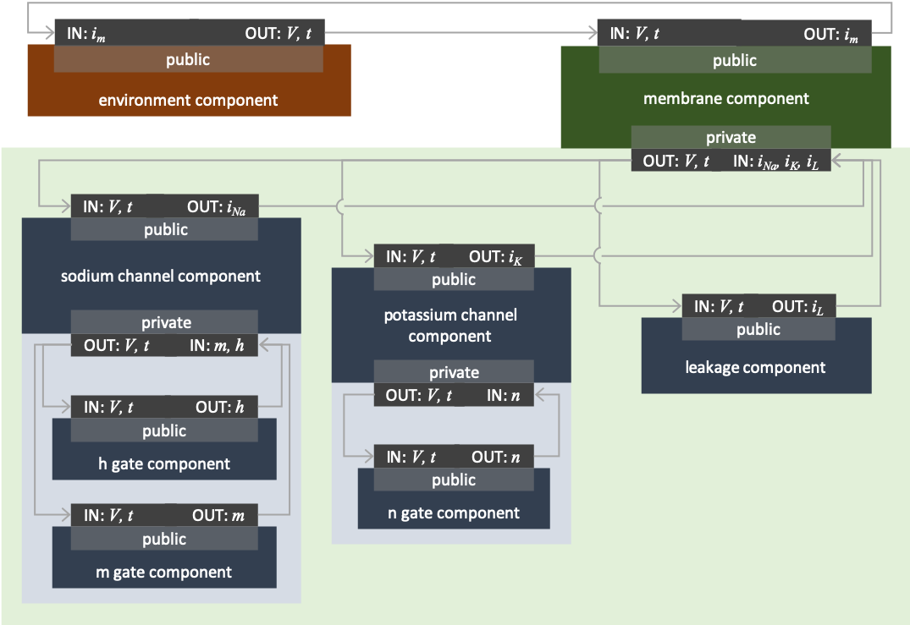

.. _tutorial8:

=============================================
Tutorial 8: Creating models which use imports
=============================================

If you're reading this it's presumed that you're already comfortable with:
- Parsing model files and creating models from them (:ref:`Tutorial 1<tutorial1>`);
- Printing models to CellML 2 files (:ref:`Tutorial 1<tutorial1>`);
- Validating and debugging models (:ref:`Tutorial 2<tutorial2>`);
- Working with encapsulated components (:ref:`Tutorial 6<tutorial6>`);
- Using imports and model flattening (:ref:`Tutorial 7<tutorial7>`); and
- Using the generator to output a simple solver for simulation (:ref:`Tutorial 3<tutorial3>`).

By the end of this tutorial you will be able to:

- Create connections within complicated encapsulations involving imports;
- Design and create files which allow easy reuse of components,
- Appreciate the consistency needed throughout the imports to avoid renaming units.

Outline and background
----------------------
In :ref:`Tutorial 6<tutorial6>` we created a voltage-controlled ion channel with parameters and gating appropriate to the modelling of potassium current.
In :ref:`Tutorial 7<tutorial7>` we did the same for a sodium current.
This tutorial will combine these ion channel currents with a leakage current, and encapsulate all of them within a membrane to form a representation of Hodgkin and Huxley's model of a nerve action potential.
The complete biological background of given in :ref:`A model of nerve action potential<hh_background>`, and its interpretation into a CellML model is shown below in :numref:`<>`.

   Encapsulation structure for the Hodgkin-Huxley model assembled in Tutorial 8.

This tutorial focusses on the use of importing as as way of combining several models together, yet preserving the integrity of their parts.

You can think of each imported component as a plug'n'play entity, where the "plugs" are the connections to variables that you make between the imported and the locally defined variables.
As with non-imported components, each imported component will have variable values it needs (inputs) and variable values which it calculates (outputs).
Depending on where the imported component sits, it may also

C++ instructions
----------------
Please see the :ref:`C++ instructions<tutorial8_cpp>` page.

Resources:

    - :download:`CMakeLists.txt` The CMake file for building this tutorial
    - :download:`tutorial8.cpp` Either the skeleton code, or ..
    - :download:`tutorial8_complete.cpp` the completed tutorial code
    - :download:`../utilities/tutorial_utilities.h` and
      :download:`../utilities/tutorial_utilities.cpp`  Utility functions for
      use in the tutorials.
    - :download:`../resources/tutorial8_LeakageCurrentModel.cellml` The leakage current model
    - If you did not complete Tutorial 7 you can download the file created there:
      :download:`../resources/tutorial8_MembraneModel.cellml`

Python instructions
-------------------
Please see the :ref:`Python instructions<tutorial8_py>` page.

Resources:

    - :download:`tutorial8.py` Either the skeleton code, or ..
    - :download:`tutorial8_complete.cpp` the completed tutorial code
    - :download:`../utilities/tutorial_utilities.py`  Utility functions for
      use in the tutorials.
    - :download:`../resources/tutorial8_LeakageCurrentModel.cellml` The leakage current model
    - If you did not complete Tutorial 7 you can download the file created there:
      :download:`../resources/tutorial8_MembraneModel.cellml`
