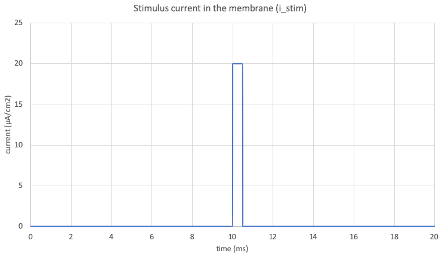
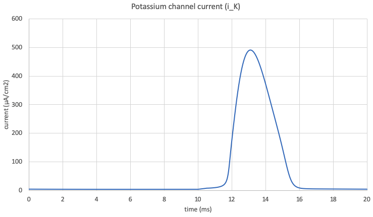
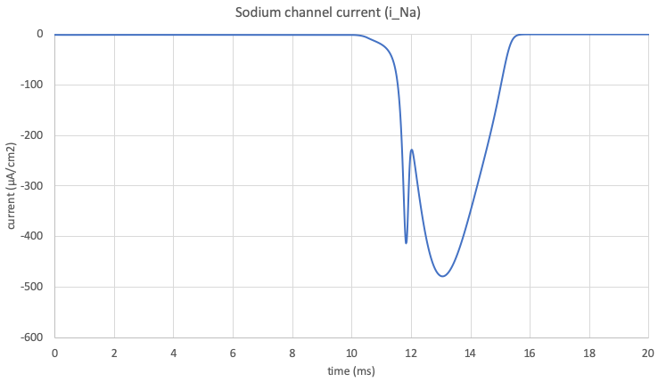
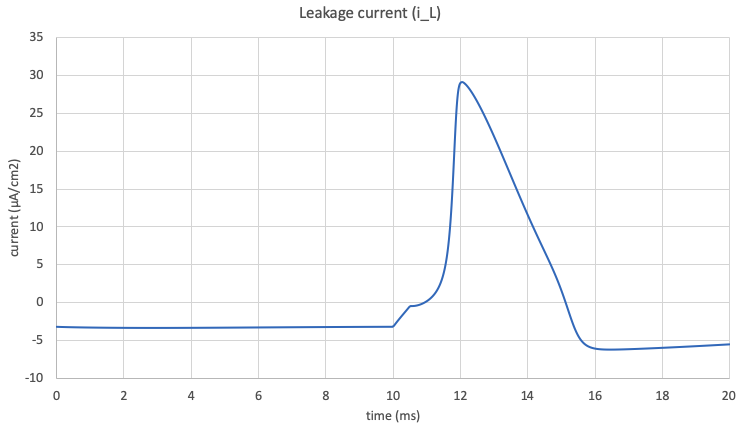
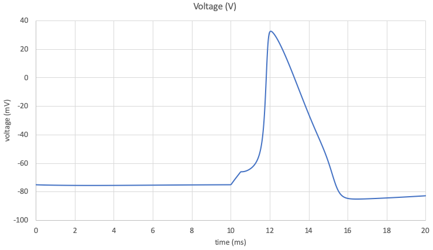

.. _tutorial8_py:

==================================================
Tutorial 8 Python: Importing and flattening models
==================================================

The outline for this tutorial is shown on the :ref:`Tutorial 8<tutorial8>` page.
These are the Python instructions.
For the same tutorial in C++ please see the :ref:`Tutorial 8 in C++<tutorial8_cpp>` page instead.

**Resources:**

- :download:`tutorial8.py` Either the skeleton code, or :download:`tutorial8_complete.py` the completed tutorial code;
- :download:`../utilities/tutorial_utilities.py` utility functions for use in the tutorials.

The following files are needed as inputs for this tutorial.
If you did not complete the relevant tutorials you can copy these files from the resources folder:

- :download:`../resources/tutorial8_LeakageCurrentModel.cellml` The leakage current model;
- :download:`../resources/tutorial8_LeakageCurrentModel_parameters.cellml` Leakage parameters;
- :download:`../resources/tutorial8_MembraneModel.cellml` The membrane model;
- :download:`../resources/tutorial6_PotassiumChannelModel.cellml` The potassium channel model (or use your own); and
- :download:`../resources/tutorial7_SodiumChannelModel.cellml` The sodium channel model (or use your own).

.. contents:: Contents
    :local:

This tutorial combines four existing models into one: two are the ion channel models for potassium and sodium which were created in :ref:`Tutorial 6<tutorial6_py>` and :ref:`Tutorial 7<tutorial7>` respectively, plus two new ones provided here.
The goal of the tutorial is to combine the coponents of these models such that the three currents - potassium, sodium, and a new leakage current - are children of the membrane component.

Step 0: Set the stage
=====================
Before you begin it's a good idea to collect everything into one place.
Later in the tutorial you'll be using imports, and these need to have one common root location per model in order to resolve them.
We suggest putting all the file listed above into a single directory, whether you use the files from the resources directory or ones that you have created yourself in earlier tutorials.

.. container:: dothis

    **0.a** Move all of the required :code:`.cellml` files into a single directory location.

It's also a good idea to understand what it is that you're doing here.
For a full description of the biological theory, please see the :ref:`Hodgkin-Huxley background<hh_background>` document.
You should be able to see the variables and maths inside the components as you go by simply printing them to the screen.

Step 1: Create an external parameters model
===========================================
The goal of this tutorial is to create a model in which import functionality is used to give flexibility to the way in which the model can be simulated.
This means that parameters for simulation - constant values, initial conditions, variables, driving functions - can be set in an external file without needing to change the model proper.
For this reason, this tutorial will involve creating two CellML files: one containing the model, and one containing the controller and parameters.

.. container:: dothis

    **1.a** Create a new model instance to be the controller model, name it appropriately, and add to it a component for the parameters.

As we go through the rest of the tutorial, you will be adding variables to this external parameters component.

Step 2: Parse the membrane model
================================
Parsing and importing can - in certain cases - result in the same situtation (an instantiated model), but the have very different philisophies behind them.
You can read more about that under the link below.

.. include:: asides/import_vs_parse.rst

Even though the membrane model is supplied, it will need to be changed to accommodate the new connections to the ion channel components.
Each of these channels calculates a current (:code:`i_K`, :code:`i_Na`, and :code:`i_L`) which they supply to the membrane.
The membrane can then integrate an ordinary differential equation for voltage based on these current values.

Our first job is to parse the membrane model so that we can edit it accordingly.

.. container:: dothis

    **2.a** Create a :code:`Parser` and use it to deserialse the contents of the :code:`tutorial8_MembraneModel.cellml` file supplied into a new model instance.
    This will be referred to as the "model", and the one you created in step 1.a as the "controller model" or "parameters component".
    This model will - after modification - represent the Hodgkin-Huxley model, so rename it appropriately.

.. container:: dothis

    **2.b** Print the model to the screen.
    You should see seven variables listed as below (annotation added).

.. code-block:: console

    ...
    VARIABLES: 7 variables
        [0]: V [mV]                  # integrated variable, initialised by parameters component
        [1]: t [ms]                  # base variable of integration
        [2]: i_K [microA_per_cm2]    # potassium current, calculated by imported component
        [3]: i_Na [microA_per_cm2]   # sodium current, calculated by imported componnet
        [4]: i_L [microA_per_cm2]    # leakage current, calculated by imported component
        [5]: i_stim [microA_per_cm2] # stimulus current, specified locally in the membrane
        [6]: Cm [microF_per_cm2]     # constant, membrane capacitance, initialised by the parameters component

We want to be able to initialise the variables in this membrane component, so we need to add the corresponding variables into the parameters component, where their values will be stored.
Looking at the print-out of the component above, the variables which need to have values set are :code:`Cm` and :code:`V`.
You will need to keep track of the units needed as you go, and add in any new ones.
In this case, both are new and will need to be created and added to the controller model as normal.

.. container:: dothis

    **2.c** Create two new variables in the parameters component to represent these, giving each an interface type of "public", and units as listed above.
    Create and add the appropriate units to the controller model.

Step 3: Import the sodium channel component
===========================================
In order to use the import functionality we need to know three things:

  1. The import destination (the component/unit to which the imported item will be assigned);
  2. The file we're importing it from (the url to the model containing the item to be imported); and
  3. Which item within the file should be imported (the name of the component/units inside the import model file).

Imports were introduced in :ref:`Tutorial 7<tutorial7_py>`, so you can refer there for more information.

First we need to know the contents of the component we're importing.
This step is necessary so that we can create dummy variables with the same name and units in step 2.e.
If you don't happen to know the contents of the components, you can parse the models and print them to the terminal for viewing:

.. code-block:: py

    # Parsing a model before importing it so that its contents can be viewed.
    # Note that this is a temporary model and is *only* parsed for viewing
    # purposes, *not* for interaction.
    if True:
        temp = parser.parseModel(fileContents(sodiumChannelFile))
        print_model_to_terminal(temp)

.. container:: dothis

    **3.a** Parse the sodium channel model and print it to the terminal.

.. container:: dothis

    **3.b** Create a component representing the sodium channel.
    This will be encapsulated inside the membrane component, so add it there instead of adding it to the model.

.. container:: dothis

    **3.c** Create an importer for the sodium channel, and point it to the file you created in Tutorial 7.
    Note that you will need to make sure it exists in the same path as the earlier files.
    If you did not complete :ref:`Tutorial 7<tutorial7_py>` you can copy the :code:`tutorial7_SodiumChannelModel.cellml` file from the resources folder.
    This takes care of (2) above.

.. container:: dothis

    **3.d** Thirdly we need to link our import source to the import destination using the :code:`Component::setImportSource()` function on the sodium channel component, and to use the :code:`Component::setImportReference()` function to specify the name of the component inside the import model to retrieve.
    Use your print-out to identify the correct component name.
    This takes care of (3) above.

At this stage our model has two components in it.
Even though we've specified the imports completely, they still need to be resolved and the model flattened before the imported items will be instantiated here.

Looking at your printout in step 3.a, any variables in the imported model which were connected to its local parameters or controller components will now need to be connected to the membrane component here instead ... but until the imports are resolved and the model flattened, those variables are not instantiated here.
This is where *dummy variables* come in.

Dummy variables are those which already exist in the component to be imported, but must be added manually before the import is resolved so that we can create the connections between equivalent variables *before* flattening the model.
Because these are dummy variables will be overwritten, you do not need to specify units or interfaces, just names that mirror the variables that will be imported.

.. container:: dothis

    **3.e** Refer to your printout from 3.a and use it to find the names of variables which will need to have dummies created in the local sodium channel component.
    These are all those variables currently listed in the :code:`controller` and :code:`parameters` components in the imported model.
    Create a dummy variable for each of these, and add it to your sodium channel component as normal.
    Make sure that the names of each of your variables are the same as those listed in the print-out.

Because any values for initialisation must also be passed through the membrane component, we have to add *intermediate variables* to hold them.

In contrast to dummy variables, *intermediate variables* are those which are not needed by a component, but rather by its children.
They provide a way for values in a top-level component (the parameters component that you'll create soon in step 7) to be connected into a component to which it does not have direct access.
There is more information of encapsulations and connections **TODO**.

Because these are real variables (ie: not dummies, they will not be overwritten by an import), you *will* need to specify units and interfaces.
They should have the interface type :code:`public_and_private`.

.. container:: dothis

    **3.g** Create intermediate variables for all those which are listed in the sodium channel component, but not present in the membrane component.
    You will need to give them appropriate units, as well as an interface type of :code:`public_and_private`.
    Add them to the membrane component.

Finally, all variables for initialisation need to be present in the parameters component too.
As above, these are real (not dummy) variables, so will require units and interfaces.

.. container:: dothis

    **3.h**
    Create the variables and add them to the parameters component in the controller model.
    Create and add any units that they require to the controller model.

Step 4: Import the potassium channel component
==============================================

.. container:: dothis

    **4.a** Repeat all the tasks in Step 3, this time for the potassium channel model you created in :ref:`Tutorial 6<tutorial6_py>`.
    If you did not complete Tutorial 6 you can copy the file :download:`../resources/tutorial6_PotassiumChannelModel.cellml` into your working directory.

Step 5: Import the leakage component
====================================

.. container:: dothis

    **5.a** Repeat all the tasks in Step 3, this time for the leakage component in the model supplied inside :download:`../resources/tutorial8_LeakageModel.cellml`.

Step 6: Export the parameters
=============================
Now that we've imported all the components and added the variables which need initial values into the parameters component, we can write the controller model (which contains that parameters component) to a separate file.
This makes it easier to locate the parameters of interest and change them later.

.. container:: dothis

    **6.a** Set the initial conditions of variables in the parameters according to the values specified below.

Sodium channel parameters:

.. math::

   E_{Na}(t=0) = 40 \\
   g_{Na}(t=0) = 120 \\
   h(t=0) = 0.6 \\
   m(t=0) = 0.05

Potassium channel parameters:

.. math::

   E_K(t=0) = -87 \\
   g_K(t=0) = 36 \\
   n(t=0) = 0.325

Leakage parameters:

.. math::

   g_L(t=0) = 0.3 \\
   E_L(t=0) = -64.387

Membrane parameters:

.. math::

   V(t=0) = -75 \\
   Cm(t=0) = 1

.. container:: dothis

    **6.b** Link the units of the controller model, and use the validator to check that it contains no errors.

.. contianer:: dothis

    **6.c** Create a printer, and use it to serialise your controller model.
    Write it to a file named appropriately: you will need to use its name in the next step.

Step 7: Import parameters
=========================

.. container:: dothis

    **7.a** Repeat all the tasks in Step 2, this time for the parameters component in the model you have just written in step 6.c.
    You will need to create dummies for all of its variables.

Step 8: Connect variables between components
============================================

.. container:: dothis

    **8.a** Now that we've got all the imports done, we need to connect the imported components and their dummy variables together.
    The variables to connect are:

      - voltage (V):  parameters -> membrane -> sodium channel, potassium channel, leakage
      - time (t): membrane -> sodium channel, potassium channel
      - current variables (i_Na, i_K, i_L): membrane -> their respective channels
      - capacitance (Cm): parameters -> membrane
      - gating variables (n, h, m): parameters -> membrane -> their respective channels

In the steps below the model will be flattened for code generation, but the power of imports is lost by flattening.
That's why we'll write the CellML file before flattening.

.. container:: dothis

    **8.b** Serialise the model and print it to a CellML file.

Step 9: Resolve imports and flatten the model
=============================================

.. container:: dothis

    **9.a** Resolve the model's imports to the folder where all of the files are located, and check that there are no unresolved imports outstanding.

.. container:: dothis

    **9.b** Flatten the model, and print the flattened model structure to the terminal for checking.

.. container:: dothis

    **9.c** Validate the flattened model, expecting that there are no errors.

Step 10: Generate the model and output
======================================

.. container:: dothis

    **10.a** Create a :code:`Generator` instance and submit the model for processing.
    Expect that there are no errors logged in the generator afterwards, but if there are, your experience with the possible issues in previous tutorials should be enough to resolve them.

.. container:: dothis

    **10.b** Retrieve and write the interface code (*.h) and implementation code (*.c) to files.

.. container:: dothis

    **10.c** Change the generator profile to Python and reprocess the model.

.. container:: dothis

    **10.d** Retrieve and write the implementation code (*.py) to a file.

Now that the model has been created an output, it's time to submit it to the solver for simulation.

Step 11: Run the simulation
===========================
Running the simulation using the :ref:`simple solver<solver>` with a timestep of 0.001 for 2000 iterations will give you the results shown below.

   Stimulus current in the membrane (:code:`i_stim` vs. :code:`t`).

   Potassium current (:code:`i_K` vs. :code:`t`).

   Sodium current (:code:`i_Na` vs. :code:`t`).

   Leakage current (:code:`i_L` vs. :code:`t`).

   Voltage in the membrane resulting from integrating the combined currents (:code:`V` vs. :code:`t`).
